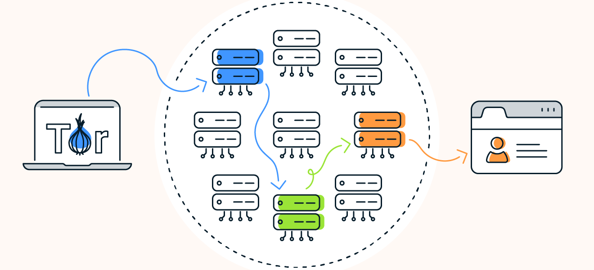
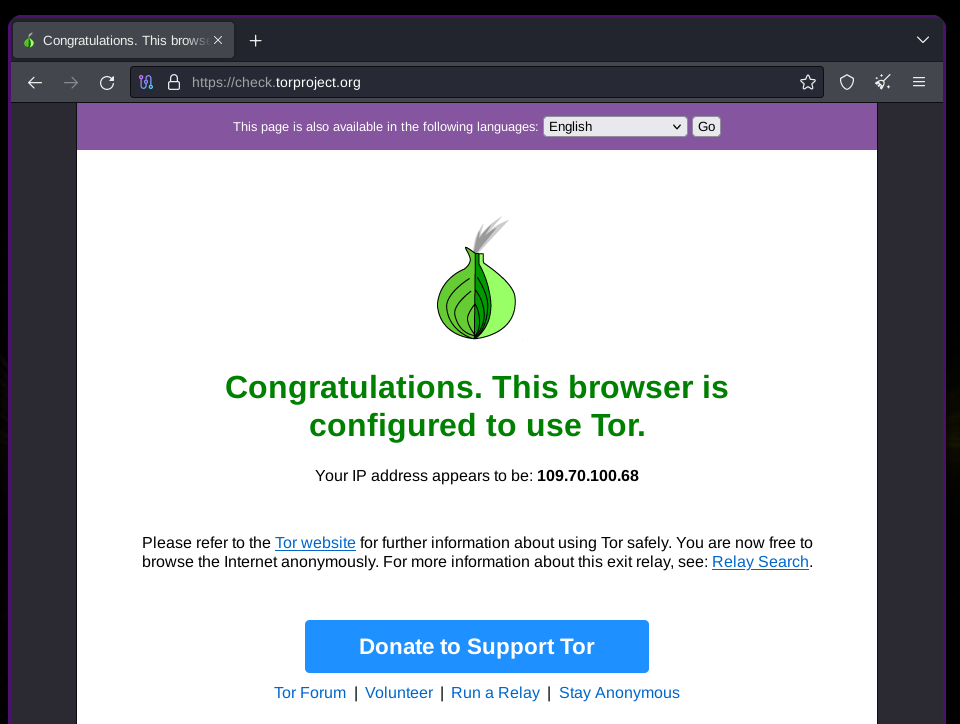
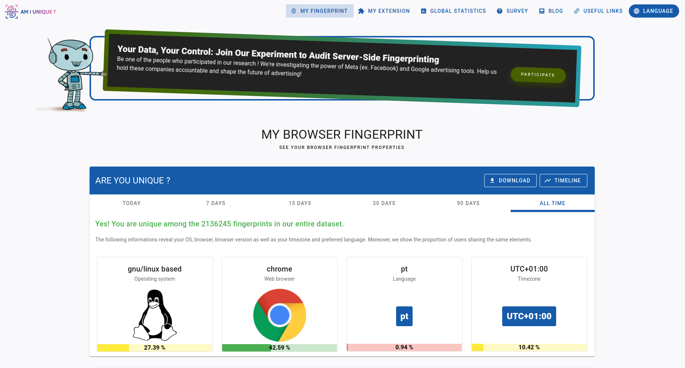
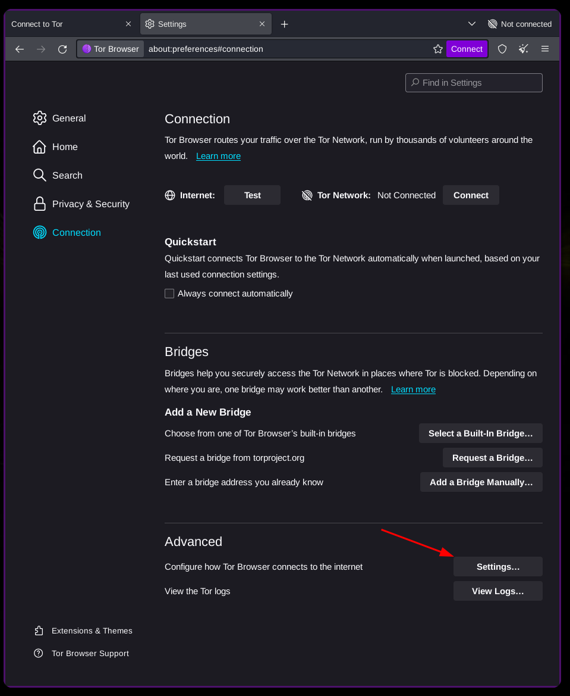
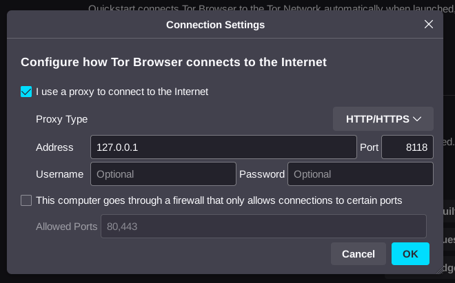

<h1> Anonimato na Internet </h1>

> Data: 22 OCT 2023

- [1. Introdução](#1-introdução)
- [2. Anonimato na internet](#2-anonimato-na-internet)
  - [2.1. Rede TOR](#21-rede-tor)
    - [2.1.1. TOR Browser](#211-tor-browser)
    - [2.1.2. Como funciona o Tor?](#212-como-funciona-o-tor)
    - [2.1.3. O navegador TOR](#213-o-navegador-tor)
    - [2.1.4. A rede TOR é segura?](#214-a-rede-tor-é-segura)
    - [2.1.5. É possível ser identificado através da rede TOR?](#215-é-possível-ser-identificado-através-da-rede-tor)
    - [2.1.6. Então porquê mesmo assim podemos não estar totalmente ocultos?](#216-então-porquê-mesmo-assim-podemos-não-estar-totalmente-ocultos)
    - [2.1.7. Como tentar ficar anónimo pela internet?](#217-como-tentar-ficar-anónimo-pela-internet)
  - [2.2. Privoxy](#22-privoxy)
  - [2.3. Sistema operacional TAILS](#23-sistema-operacional-tails)
  - [2.4. Antenas WiFi direcionais de longo alcance](#24-antenas-wifi-direcionais-de-longo-alcance)
- [3. Problemas encontrados na busca do anonimato](#3-problemas-encontrados-na-busca-do-anonimato)
  - [3.1. Rede TOR pode ser controlada](#31-rede-tor-pode-ser-controlada)
- [4. Conclusão](#4-conclusão)
- [5. Bibliografia](#5-bibliografia)

---

---

> No contexto do CTESP em cibersegurança que estou a efetuar, foi-me proposto a realização de um trabalho sobre o anonimato na internet. Este trabalho foi realizado no âmbito da unidade curricular de "Técnicas de hacking". O objetivo deste trabalho é aprofundar os conhecimentos sobre o anonimato na internet, e sobre as ferramentas que permitem que os utilizadores possam navegar na internet de forma anónima.
>
> Enunciado:
>
> Aceder à rede Tor é hoje uma tarefa bastante simples. Para isso basta que usem o Tor Browser, que inclui nativamente todas as configurações necessárias.
>
> No entanto, quem pretender usar outros browsers pode sempre configurar um proxy na própria máquina.
>
> -- OBJETIVOS DO TRABALHO --
>
> Para este trabalho pretende-se que os alunos instalem e configurem o cliente TOR e o proxy Privoxy.
>
> Como resultado devem verificar se o tráfego está a ser encaminhado pela rede TOR. Para isso verifiquem a configuração através deste site: https://check.torproject.org/
>
> Indiquem também qual o IP atribuído e a área geográfica a qual o mesmo pertence.

---

# 1. Introdução

Neste trabalho, iremos desenvolver um relatório sobre o anonimato na internet. Iremos tratar de entender o que é a rede TOR, como usar o Privoxy, iremos ainda falar sobre o sistema operativo TAILS e por fim, passando ainda por discutir sobre a importância do anonimato para o black hat hacker, as dificuldades que enfrentam as autoridades contra o anonimato e sobre a importância da coordenação e cooperação internacional para combater o cibercrime.

# 2. Anonimato na internet

O anonimato na internet é um assunto muito importante, pois permite que os utilizadores possam navegar na internet sem que sejam identificados. É um assunto muito relevante para quem se preocupa com a sua privacidade e segurança, mas é primordial para pessoas que vivem em países onde a liberdade de expressão é limitada. É ainda crítico para pessoas que trabalham em áreas sensíveis, como jornalistas, ativistas, denunciantes, etc. E claro, para quem pratica atividades ilegais, como o cibercrime.

## 2.1. Rede TOR

A rede TOR (The Onion Router) é uma rede de computadores que permite que os utilizadores possam navegar na internet de forma anónima. A rede TOR é composta por milhares de servidores, chamados de relays, que são mantidos por voluntários. Estes servidores são responsáveis por encaminhar o tráfego dos utilizadores, de forma a que o seu endereço IP não seja revelado. Como aceder à rede TOR?

### 2.1.1. TOR Browser

O TOR Browser é o browser mais conhecido e desenvolvido para aceder à rede TOR, de código aberto. É um browser baseado no Firefox, que permite que os utilizadores possam navegar na internet de forma anónima. O Tor Browser oculta o endereço IP e a atividade de navegação redirecionando o tráfego da web por uma série de roteadores diferentes, conhecidos como nós. Além disso, o tráfego da web é criptografado com um tipo de criptografia especial originalmente desenvolvida pela Marinha dos EUA para ajudar a proteger as comunicações de inteligência americanas.

Além de ser um browser "normal", o Tor também fornece serviços onion por meio de sua rede onion para permitir o anonimato de sites e servidores. Um endereço web **_".onion"_**, acessível exclusivamente através do navegador Tor, protege a identidade do site e dos visitantes.

Com uma conexão complexa e criptografada que oferece anonimato para hosts e visitantes, o Tor é frequentemente usado para criar e acessar a dark web. Como tal, o Tor é a própria definição de um navegador da dark web.

### 2.1.2. Como funciona o Tor?

O Tor funciona em 3 fases:

1.  Nó de entrada/guarda: O utilizador liga-se a um servidor aleatório de entrada, também chamado de nó de entrada. Este servidor é responsável por encriptar o tráfego do utilizador e introduzir o tráfego na rede TOR. A informação é encapsulada em várias camadas de criptografia, daí o nome "The Onion Router" que irão ser descascadas à medida que o tráfego é encaminhado para o nó de saída.
2.  Nós intermediários: O tráfego é então encaminhado de forma totalemnte criptografados por vários servidores, chamados de nós intermediários. Estes servidores são responsáveis descascar uma camada por nó e por encaminhar o tráfego para o nó de saída.
3.  Nó de saída: O tráfego é então encaminhado para o nó de saída que encaminha o tráfego para o destino.

<center>

</center>
<div class='legend'>
    <b>Figura 1:</b> Funcionamento da rede TOR <br>
    <b>Fonte:</b> <a href='https://www.avast.com/pt-br/c-tor-dark-web-browser'>www.avast.com/pt-br/c-tor-dark-web-browser</a>
</div>

### 2.1.3. O navegador TOR

Apesar de todo este processo ser complexo, o utilizador não precisa de saber como funciona a rede TOR para a usar. Ele é um browser baseado no Firefox que permite que os utilizadores possam navegar na internet de forma anónima e já vem configurado e pronto a usar. O TOR Browser é um browser de código aberto, que pode ser descarregado em [https://www.torproject.org/](https://www.torproject.org/).

<center>

</center>
<div class='legend'>
    <b>Figura 2:</b> Home page do website do TOR <br>
    <b>Fonte:</b> Screenshot da página de internet <a href='https://www.torproject.org/'>www.torproject.org</a>
</div>

Pode ainda ser instalado pela linha de comando, em sistemas Linux, como o Ubuntu, com o seguinte comando:

```bash
sudo apt install torbrowser-launcher
torbrowser-launcher  # Para instalar o TOR Browser pela primeira vez, e para o iniciar depois
```

Para verificar que estamos devidamente conectados à rede TOR, basta aceder ao site [https://check.torproject.org/](https://check.torproject.org/).

<center>

</center>
<div class='legend'>
    <b>Figura 3:</b> Página de internet para verificar conectividade TOR <br>
    <b>Fonte:</b> Screenshot da página de internet <a href='https://check.torproject.org/'>check.torproject.org</a>
</div>

### 2.1.4. A rede TOR é segura?

Bem, a rede em si é criptografada. Mas criptografia não significa segurança. Significa simplesmente que, neste caso, o transporte e as comunicações entre nós são cifradas, ou seja, ilegíveis sem as chaves para as decifrar. De facto, se o utilizador clicar num link malicioso, ou se o site que o utilizador está a visitar tiver código malicioso, o utilizador será comprometido da mesma forma que num browser "normal". O TOR não é um escudo, mas é uma ferramenta muito útil para quem se preocupa com a sua privacidade.

### 2.1.5. É possível ser identificado através da rede TOR?

Resposta curta: SIM! Existe diversos pontos a ter em conta ao usar a internet em geral. Por exemplo, se usar uma conta pessoal, dados pessoais, etc, não importa usar a rede TOR ou não, porque estarão a identificar-se no ponto de chegada da comunicação. Mesmo que não use nenhum dado pessoal, existem dois pontos fracos neste tipo de rede: O nó de entrada (que contém toda a informação sobre IP e os dados que se quer acessar), e o de saída (onde até poderá ser intercetado). Mas existe ainda mais um recurso que se pode usar para resolver o problema do nó de entrada. Poderá usar uma VPN-over-TOR. A VPN tratará de criptografar a informação inicial antes de chegar ao primeiro nó de entrada da rede TOR.

No entanto, mesmo assim, podemos afirmar que não estamos 100% anónimos. Isto porque existe ainda uma falha de privacidade na internet que não podemos controlar. Os IPS (provedores de internet) são os primeiros a receber os dados que o nosso router de casa envia, ou de qualquer router por onde estejamos diretamente conectados. E assim para todas as pessoas do mundo que tem internet. Alguma empresa está a fornecer a internet, e será então essa empresa o primeiro ponto de passagem. Posto isso, podemos concluir que, como essas empresas são obrigadas a conhecer um IP de origem e um IP de destino, poderá facilmente reconstruir-se o caminho todo por onde um pacote circula. Teoricamente, sim. Mas ao analisar, vemos que aí reside a força desta rede!

Como a rede TOR faz questão de enviar o trafego por vários nós, ficamos assim quase totalmente oculos na internet pelo seguinte motivo: O trafego passa por diversos países. Países alguns que nem legislação tem. Isso traz grandes dificuldades em pedir registo de lOGS dos provedores de internet desses países. Além disso, a cooperação entre países é muitas vezes complicada, e torna complicado recolher todos os lOGS necessários á reconstrução do caminho de tráfego. E outro ponto importante também, as autoridades demoram a responder, a burocracia é penosa, e demora-se meses até conseguir talvez o primeiro LOG, para saber o nó seguinte e fazer novos pedidos e assim por diante. A grande maioria das vezes, quando não há falta de lOGS, há falta de tempo, e os crimes prescrevem.

### 2.1.6. Então porquê mesmo assim podemos não estar totalmente ocultos?

Existe outras formas de saber quem somos pela internet sem metermos os nosso dados. Existem dados nosso sobre tudo o que possamos imaginar e o que não imaginamos gravados na internet Um expert em OSINT consegue fazer ligações inimagináveis para determinar com um grau de certezas muito elevado que foi tal ou tal pessoa a fazer algo pela internet. Exemplos:

Existem diversos dados que enviamos através do nosso browser que nos identificam, e outros que são acessíveis por código javascript que o nosso browser executa. Dados como:

-   tamanho do ecrã
-   tamanho usável do browser
-   user-agent
-   Do Not Track header
-   Timezone
-   Content language
-   layout de teclado
-   Lista de fontes instaladas
-   Lista de plugins instalados
-   WebGL Renderer
-   permissões do browser
-   e muitos outros

<center>

</center>
<div class='legend'>
   <b>Figura 4:</b> Página de internet <a href='https://amiunique.org/fingerprint'> amiunique.org/fingerprint</a><br>
   <b>Fonte:</b> Screenshot da página de internet <a href='https://amiunique.org/fingerprint'> amiunique.org/fingerprint</a>
</div>

No meu caso em particular, sou único. totalmente identificável pela internet... Também posso dizer que talvez me ponho a jeito. Teclado e linguagem em Portugues, computador Linux, fontes (tipos de letras) como "_firacode_" entre outras coisas fazem que não haja outra configuração igual.

E no caso de usar TOR? De certeza que não iria ser possível obter tanta informação, mas mesmo assim, seriam perfeitamente suficientes para me identificarem.

### 2.1.7. Como tentar ficar anónimo pela internet?

Vimos anteriormente várias falhas no anonimato perfeito... Mas vamos tentar otimizar tudo para ficarmos o mais anónimos possível. Vimos que o nosso sistema fala para a internet. Isso é um problema para quem quiser ficar anónimo. Temos então que usar, para além do TOR e de uma VPN-over-TOR, podemos usar uma ferramenta que irá alterar todos esses elementos identificáveis do browser. Essa ferramenta é o privoxy.

## 2.2. Privoxy

O privoxy é uma simples proxy, mas que pode ser configurado para mudar elementos que se enviam para os diferentes servidores WEB. Pode-se controlar que HEADERS se irão enviar, entre muitas outras coisas.

A sua instalação é básica:

```bash
sudo apt install privoxy
```

O seu ficheiro de configurações tem mais de duas mil linhas, com explicações de cada função. É por si só um manual e o ficheiro de configurações. Está localizado em **/etc/privoxy/config**

Para emparelhar o TOR e o privoxy, teremos de iniciar o serviço privoxy:

```bash
sudo systemctl start privoxy.service
```

Termos ainda que informar ao TOR Browser (ou outro browser) que queremos primeiro passar por um proxy, e só depois continuar a circular a informação normalmente pela rede TOR. Para isso, temos de saber onde está o nosso servidor proxy:

```bash
cat config | grep -v "^#" | grep listen-address
    listen-address  127.0.0.1:8118
    listen-address  [::1]:8118
```

A seguir, adicionamos as informações ao TOR browser

<center>

</center>
<div class='legend'>
    <b>Figura 5:</b> Configurações do TOR Browser<br>
    <b>Fonte:</b> Screenshot do TOR Browser mediante o sistema operacional Linux Arch.
</div>

<br>
<br>

<center>

</center>

<div class='legend'>
    <b>Figura 6:</b> Configurações do TOR Browser<br>
    <b>Fonte:</b> Screenshot do TOR Browser mediante o sistema operacional Linux Arch.
</div>

Agora que temos tudo configurado, estamos prontos para navegar na internet de forma praticamente anónima. Mas todo esse processo é demorado. Poderiamos criar um script para automatizar todo esse processo. Mas existe ainda melhor. O sistema operacional TAILS.

## 2.3. Sistema operacional TAILS

O TAILS é um sistema operacional baseado em Debian - Linux. Ele é um sistema operacional que pode ser executado a partir de um pendrive, sem necessidade de instalação. É um sistema que já vem configurado com tudo o que for melhor para permitir que os utilizadores possam navegar na internet de forma anónima. O TAILS é um sistema operacional de código aberto, que pode ser descarregado em [https://tails.boum.org/](https://tails.boum.org/).

O TAILS é um sistema amnésico, pois tudo roda na memória RAM, e não guarda nada na pendrive, nem no disco do computador onde rodar o TAILS. Permite criar persistência criptografada, mas aí ja demos assas ao erro, pelo que se recomenda usar e desligar. Toda a informação da sessão será perdida.

Esse sistema é o melhor do mercado, mas ainda assim, não resolvemos o problema do nosso IPS. Para isso, para quem seja vital o seu anonimato na internet, temos ainda soluções! No próximo capítulo iremos falar sobre como desaparecer por completo.

## 2.4. Antenas WiFi direcionais de longo alcance

Para quem quer desaparecer por completo, temos de nos afastar da nossa casa, do nosso IPS, e de tudo o que nos possa identificar. Para isso, podemos usar uma antena WiFi direcional de longo alcance. Essas antenas são capazes de se ligar a redes WiFi a quilómetros de distância. Podemos então ligar-nos a uma rede WiFi pública, e usar o TAILS para navegar na internet. Assim, não só estamos a usar o TAILS e todas as suas ferramentas de anonimato, como estamos a usar uma rede WiFi pública, que não tem nada a ver connosco, e uma distância que permite nos afastar o máximo possível desta rede. Assim, podemos dizer que estamos o mais anónimos possível. Mas mesmo assim, se continuarmos a publicar no facebook que compramos uma antena nova para hackear a NASA, não há anonimato que nos salve.

<center>

</center>
<div class='legend'>
   <b>Figura 7:</b> Antena WiFi direcional de longo alcance<br>
   <b>Fonte:</b> <a href='https://pt.aliexpress.com/item/1005005309375919.html'>aliexpress</a>
</div>

# 3. Problemas encontrados na busca do anonimato

Todo estes procedimentos são complexos, mas necessários para estar o mais anónimo possível. E certas organizações entenderam o perigo que isso representa. Por exemplo, o FBI, a NSA, a CIA, etc. Essas organizações têm como objetivo proteger os cidadãos, mas também têm como objetivo proteger o país. E estar totalmente anónimo para cibercriminoso ou um ciberterrorista é perigoso para as populações. Já houve, então, tentativas de contornar algumas dessas ferramentas.

## 3.1. Rede TOR pode ser controlada

Já não é a primeira vez que a rede TOR se encontra nas mãos da Agência de Segurança Nacional (NSA) dos Estados Unidos. A notícia mais falada sobre este assunto foi em 2013. Mas o rasto deste artigos são complexas de encontrar na internet. O que é certo é que já não é a primeira vez que a rede TOR é comprometida, e não será certamente a última. Num desses controlos consistia em comprar os nós TOR para ter o controlo e efetuar um monitoramento Man-In-The-Middle.

> [Notícia: NSA targeting Tor users](https://www.wired.co.uk/article/nsa-targeting-tor-users)

Além do controlo dos nós, o próprio browser já sofreu ataques. Para além de que sempre houve e haverá novos zero-days no firefox. O TOR Browser é um projeto open source, pelo que o código é revisto por milhares de pessoas que dependem do anonimato que o TOR oferece. Mas nunca se sabe. Já não é a primeira vez que se ataca os desenvolvedores de uma dada ferramenta para esconder backdoors no código-fonte sem que ninguém se aperceba

# 4. Conclusão

O anonimato na internet é um assunto muito importante, pois permite que os utilizadores possam navegar na internet sem que sejam identificados. É um assunto muito relevante para quem se preocupa com a sua privacidade e segurança, mas é primordial para pessoas que vivem em países onde a liberdade de expressão é limitada. É ainda crítico para pessoas que trabalham em áreas sensíveis, como jornalistas, ativistas, denunciantes, etc. E claro, para quem pratica atividades ilegais, como o cibercrime.

A forma mais fácil de ficar anónimo é usando o sistema operacional TAILS. Mas para quem quer estar minimamente anónimo, basta usar o TOR e o privoxy. As sua ferramentas juntas já trazem um nível de anonimato excecional.

Todas as técnicas aqui referidas foram para tratar a anonimidade na internet. Não confundir estar anónimo com estar livre de malwares, vírus, etc. Além disso, essas técnicas são inúteis se o utilizador não tiver cuidado com o que faz na internet. Se o utilizador usar a sua conta pessoal do facebook, e publicar X ou Y coisa, sim a comunicação até aos servidores do facebook são anónimas, sim é muito dificil (praticamente impossível) reconstruir o caminho que cada pacote usou, mas não importa ter tido o cuidado de usar a rede TOR ou o TAILS, pois toda a gente sabe que ele publicou X ou Y coisa.

# 5. Bibliografia

-   [https://www.torproject.org/](https://www.torproject.org/)
-   [https://www.avast.com/pt-br/c-tor-dark-web-browser](https://www.avast.com/pt-br/c-tor-dark-web-browser)
-   [Notícia: NSA targeting Tor users](https://www.wired.co.uk/article/nsa-targeting-tor-users)

