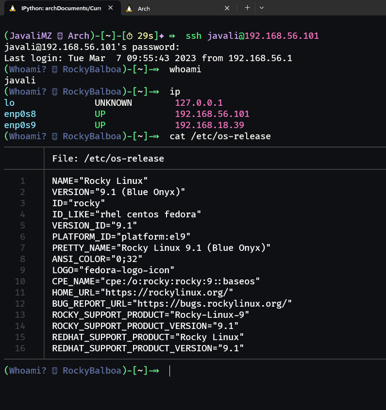
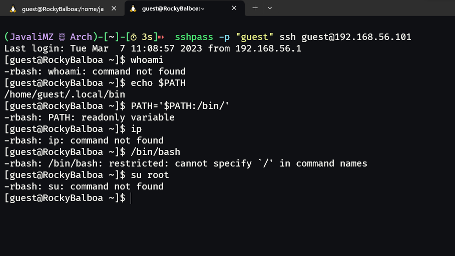
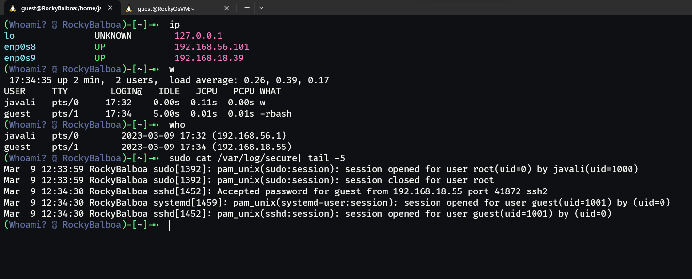
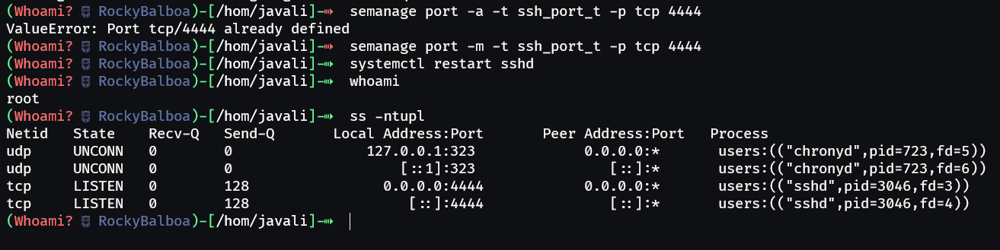
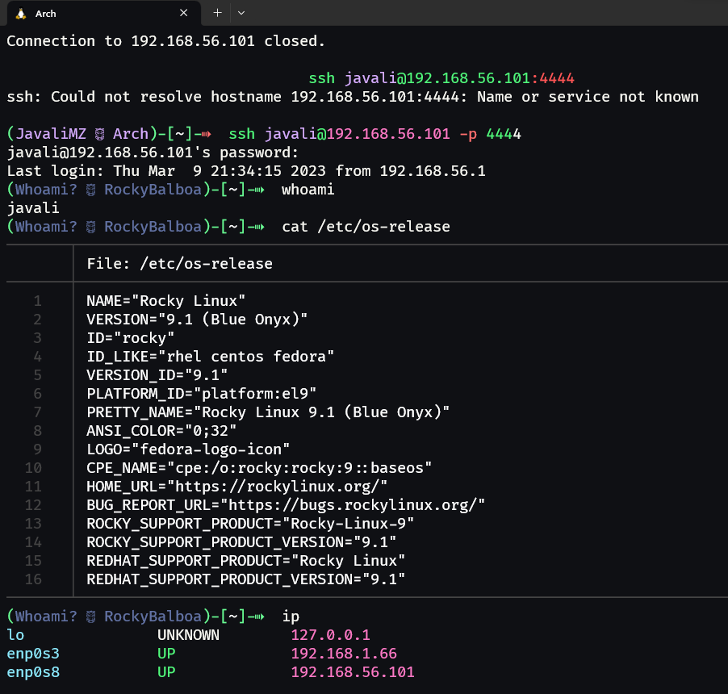

<h1> T02 - Acesso Remoto (SSH)</h1>

- [1. Instalação do OpenSSH do cliente](#1-instalação-do-openssh-do-cliente)
- [2. Instalação do OpenSSH do lado do servidor](#2-instalação-do-openssh-do-lado-do-servidor)
- [3. Ligação entre o cliente e o servidor](#3-ligação-entre-o-cliente-e-o-servidor)
- [4. Execução de comandos no servidor](#4-execução-de-comandos-no-servidor)
- [5. Criação de um utilizador no servidor](#5-criação-de-um-utilizador-no-servidor)
- [6. Acesso ao servidor através do utilizador criado](#6-acesso-ao-servidor-através-do-utilizador-criado)
- [7. Acesso de utilizadores guest por parte dos camaradas de curso](#7-acesso-de-utilizadores-guest-por-parte-dos-camaradas-de-curso)
- [8. Mudar o porto lógico de acesso do servidor](#8-mudar-o-porto-lógico-de-acesso-do-servidor)
- [9. Verificação do acesso ao servidor SSH](#9-verificação-do-acesso-ao-servidor-ssh)
- [10. Conclusão](#10-conclusão)

## 1. Instalação do OpenSSH do cliente

Para este trabalho, iremos usar o Arch(Linux) por WSL2 do Windows. Para instalar o OpenSSH, basta executar o seguinte comando:

```bash
yay openssh   # O Yay é um AUR Helper. É necessário selecionar a opção respetiva do OpenSSH para instalá-lo.
```

Neste momento, já se pode usar o comando **ssh** enquanto cliente para nos conectarmos a um servidor SSH, sem mais configurações.

## 2. Instalação do OpenSSH do lado do servidor

O OpenSSH no sistema RockyOS vem instalado por defeito. Inclusive, o servidor inicia automaticamente com o sistema.

No entanto, caso o software não estiver instalado, basta executar o seguinte comando:

```bash
sudo yum install openssh
```

Além de o instalar, será necessário ativar o serviço do OpenSSH. Para isso, basta executar o seguinte comando:

```bash
systemctl start sshd  # Inicia o serviço do OpenSSH
systemctl enable sshd # Indica ao sistema para iniciar o serviço do OpenSSH sempre que o sistema iniciar
```

## 3. Ligação entre o cliente e o servidor

Por fim, para ligar o cliente ao servidor, basta executar o seguinte comando:

```bash
# Do lado do cliente (Arch)
ssh javali@192.168.56.101  # ssh <username>@<ip> (porto lógico 22 por defeito)
```

<center>

</center>
## 4. Execução de comandos no servidor

Após a ligação ser estabelecida, é possível executar comandos arbitrários diretamente no servidor. Conforme o exercício pede, executamos o comando **"w"**. Em vez de **"w"**, costumo usar o comando **"who"**, por permitir ver o IP de origem do terminal (quando não aparece o IP, significa que o terminal está local).

<center>

</center>
## 5. Criação de um utilizador no servidor

Em Linux, criar um utilizador é bastante simples. Basta executar o seguinte comando em root:

```bash
useradd -m -s /bin/bash <username>  # useradd -m -s <shell> <username>
```

Este utilizador terá um diretório home (parâmetro **-m**) e uma shell atribuida (parâmetro **-s**). Neste caso, a shell atribuida é o Bash.

Este utilizador irá ter demasiados privilégios para dar-mos o acesso à nossa máquina dentro do nosso curso. E como estamos em Cibersegurança, irei criar um utilizador que unicamente será capaz de executar o comando **"ls"**.

Para limitar os privilégios, podemos lhe dar uma shell restrita. O Bash tem uma shell restrita, e é possível chamá-lo através do comando **bash -r**. Porém, o ficheiro **"/etc/passwd"** não permite que seja dada um parâmetro à shell. Para contornar este problema, podemos criar um link simbólico para o Bash, e dar-lhe o nome de "rbash". O software "bash" entende que, se o seu nome for "rbash", significa que terá de se iniciar em modo restrito.

Para limitar ainda mais o acesso aos convidados, podemos limitar a _variável de ambiente_ **"$PATH"**, para que a shell não consiga encontrar os comandos normais do Linux. Irei criar uma pasta para colocar os **links simbólicos** dos comandos que o utilizador poderá executar.

Afim de controlar o utilizador, irei bloquear a escrita nos seus ficheiros de configuração, para que não possa alterar a sua "$PATH" e reentrar numa nova sessão com acesso aos novos comandos. Além disso, o **rbash** impede de que as variáveis de ambiente sejam alteradas (apenas leitura).

<div style="page-break-after: always;"></div>

```bash
# Criar o utilizador e atribuir uma password
useradd -m guest
passwd guest  # password = guest

# Criar o link para o Bash restrito
ln -s /bin/bash /bin/rbash

# Atribuir a shell restrita ao utilizador
usermod -s /bin/rbash <username>

# Criar a pasta para os links simbólicos e adicionar os comandos que o utilizador poderá executar
mkdir -R /home/guest/.local/bin
ln -s /bin/ls /home/guest/.local/bin/ls

# Criar o ficheiro .bashrc em branco e limitar a variável de ambiente "$PATH"
echo "export PATH=/home/guest/.local/bin" > /home/guest/.bashrc

# Bloquear a escrita nos ficheiros de configuração
cd /home/guest
chmod 444 .* -R  # 444 = read-only .* para todos os ficheiros e diretórios ocultos e -R para recursivo

```

## 6. Acesso ao servidor através do utilizador criado

Desta vez, iremos ligar-nos ao servidor através do utilizador que criámos. Irei usar uma ferramenta chamada **sshpass** para dar a password ao comando **ssh**. Esta ferramenta é boa para ganhar tempo, mas não é recomendada para ser usada com utilizadores reais, pois a password fica visível no histórico do terminal.

```bash
sshpass -p "guest" ssh guest@192.168.56.101
```

<center>

</center>

## 7. Acesso de utilizadores guest por parte dos camaradas de curso



## 8. Mudar o porto lógico de acesso do servidor

O OpenSSH usa o porto lógico 22 por defeito para estabelecer ligações, por ser um porto conhecido. Isto significa que, pessoas mal intencionadas podem tentar conectar-se por esse porto através de bots automatizados. É evidente que um escaneamento exaustivo dos 65535 portos lógicos permita descobrir em que porto o servidor SSH está a correr, mas teria de ser feito manualmente e seria claramente um ataque visado.

Para alterar o porto lógico de acesso ao servidor SSH, bast editar o ficheiro de configurações do OpenSSH, localizado em /etc/ssh/sshd_config. Neste ficheiro, basta alterar a linha "#Port 22" para "Port 4444" (conforme se é pedido no exercício. Poderia ser qualquer porto disponível).

<div style="page-break-after: always;"></div>

```bash
# Alterar o porto lógico de acesso do servidor SSH
sed -i 's/#Port 22/Port 4444/g' /etc/ssh/sshd_config
cat /etc/ssh/sshd_config | grep Port
        Port 4444
        #GatewayPorts no

# Reiniciar o serviço do OpenSSH
systemctl restart sshd
        Job for sshd.service failed because the control process exited with error code.
        See "systemctl status sshd.service" and "journalctl -xeu sshd.service" for details.

# Verificar os logs:
journalctl -xeu sshd.service
        ...
        Mar 09 20:30:30 RockyBalboa sshd[2425]: error: Bind to port 4444 on 0.0.0.0 failed: Permission denied.
        Mar 09 20:30:30 RockyBalboa sshd[2425]: error: Bind to port 4444 on :: failed: Permission denied.
        Mar 09 20:30:30 RockyBalboa sshd[2425]: fatal: Cannot bind any address.
        Mar 09 20:30:30 RockyBalboa systemd[1]: sshd.service: Main process exited, code=exited, status=255/EXCEPTION
        ...
```

<center>

</center>

> O servidor SSH não consegue iniciar! O erro informa que não temos permissões. Mas como é que isto é possível? Estou a executar os comandos enquanto **root**...

Após alguma pesquisa, percebi que o sistema operativo Rocky, derivado de RedHat, tem por defeito um mecanismo para atribuir portos a serviços, certamente para impedir que outros portos sejam usados indevidamente.

Para resolver o problema das permissões, precisamos indicar ao sistema que o serviço daemon do SSH irá passar a usar o porto 4444. Precisaremos de uma nova ferramenta, que não vem por defeito no Rocky minimal, e que a sua instalação não é intuitiva, pois a ferramenta pertence a um conjunte de ferramentas chamada policycoreutils-python-utils.

```bash
# Instalar a ferramenta semanage
yum install policycoreutils-python-utils
yum provides /usr/sbin/semanage
semanage port -a -t ssh_port_t -p tcp 4444
semanage port -m -t ssh_port_t -p tcp 4444

# Reiniciar o serviço do OpenSSH
systemctl restart sshd
```

<center>

</center>

Agora parece estar tudo certo. Mas ao sair e voltar a entrar, não me é possível aceder ao servidor SSH. Além de ter políticas, o Rocky também tem um firewall por defeito, que está a bloquear o acesso ao porto 4444.

```bash
# Verificar o estado do firewall
firewall-cmd --state
        running

# Alterar as regras do firewall
firewall-cmd --permanent --remove-service=ssh
firewall-cmd --permanent --add-port=4444/tcp

# Reiniciar o firewall
firewall-cmd --reload
```

<div style="page-break-after: always;"></div>

## 9. Verificação do acesso ao servidor SSH

> Após mudar o porto lógico de acesso pelo /etc/ssh/sshd_config para 4444, ter definido as políticas de segurança que o servidor irá trabalhar pelo porto 4444 e ter alterado as regras do firewall para permitir o acesso ao porto 4444, é possível aceder ao servidor SSH com o respetivo parametro **-p**.

<center>

</center>

<div style="page-break-after: always;"></div>

## 10. Conclusão

Neste trabalho, demonstrei como é possível limitar um utilizador a uns meros comandos, como instalar e habilitar um servidor SSH, como alterar o porto lógico de acesso ao mesmo. Deparei-me com um problema de permissões devido a políticas de segurança do sistema operativo Rocky e aprendi a resolve-lo, com a ajuda do **journal**, assim como alterar as regras do firewall também instalado por defeito neste sistema.

-   Fontes úteis:
    -   https://serverfault.com/questions/998399/how-to-create-a-very-limited-linux-user
    -   https://docs.rackspace.com/support/how-to/change-the-ssh-port-in-centos-and-redhat/
    -   https://www.digitalocean.com/community/tutorials/additional-recommended-steps-for-new-centos-7-servers

<center >
<image src='./Assets/Coding-bro.svg' width=50%>
</center>
