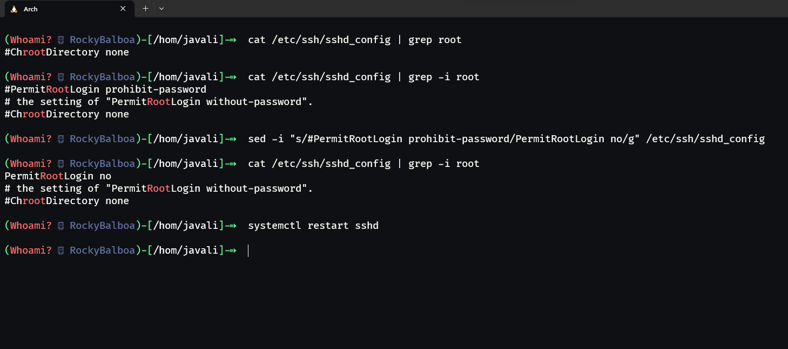

<h1> T03 - Configuração avançada de um servidor SSH</h1>

1. [T03 - Configuração avançada de um servidor SSH](#t03---configuração-avançada-de-um-servidor-ssh)
    1. [1. Não permitir autenticação com utilizador root](#1-não-permitir-autenticação-com-utilizador-root)
    2. [2. Desativar acesso sem password](#2-desativar-acesso-sem-password)
    3. [3. Criar um Banner com msg "Bem-vindo ao SSH de ARS! CUIDADO!"](#3-criar-um-banner-com-msg-bem-vindo-ao-ssh-de-ars-cuidado)
    4. [4. Mudar porto lógico para 5555](#4-mudar-porto-lógico-para-5555)
    5. [5. Mudar número de tentativas de ligação para 2](#5-mudar-número-de-tentativas-de-ligação-para-2)
    6. [6. Mudar tempo de espera para autenticação para 5 segundos](#6-mudar-tempo-de-espera-para-autenticação-para-5-segundos)
    7. [7. Permitir apenas a autenticação de 2 utilizadores (criados no sistema)](#7-permitir-apenas-a-autenticação-de-2-utilizadores-criados-no-sistema)
    8. [8. Permitir apenas a autenticação de 2 endereços IP](#8-permitir-apenas-a-autenticação-de-2-endereços-ip)
2. [Outras configurações que podem ser feitas](#outras-configurações-que-podem-ser-feitas)
    1. [9. Desativar o acesso por password](#9-desativar-o-acesso-por-password)
    2. [10. Ficheiro de logs](#10-ficheiro-de-logs)
    3. [11. Impedir PortForwarding](#11-impedir-portforwarding)
3. [Resumo:](#resumo)
    1. [Fontes:](#fontes)

> Para este trabalho, foi pedido que fosse configurado um servidor SSH da seguinte forma:
>
> -   Não permitir autenticação com utilizador root
> -   Desativar acesso sem password
> -   Criar um Banner com msg "Bem-vindo ao SSH de ARS! CUIDADO!"
> -   Mudar porto lógico para 5555
> -   Mudar número de tentativas de ligação para 2
> -   Mudar tempo de espera para autenticação para 5 segundos
> -   Permitir apenas a autenticação de 2 utilizadores (criados no sistema)
> -   Permitir apenas a autenticação de 2 endereços IP

## 0.1. Não permitir autenticação com utilizador root

De facto, esta configuração é bastante pertinente, pois, como sabemos, o utilizador root é o utilizador com mais privilégios no sistema. Se por algum motivo, as credenciais deste utilizador forem roubadas, o atacante continuará a não poder aceder à máquina mesmo que o serviço SSH esteja aberto. Terá de roubar 2 credenciais no mínimo (utilizador normal para aceder ao SSH e utilizador root para escalar privilégios), o que é mais difícil...

Para fazer esta configuração, iremos informar o servidor **sshd** de que o root não pode efetuar login da seguinte forma:

<center>

<br>
<br>
<br>

</center>

(As cores do terminal estão um pouco estranhas, mas é tema do zsh e das suas extensões...)

:exclamation: Um ponto importante: O root já não tem acesso, mas pede na mesma a password, e leva o seu tempo a verificar a mesma. Faz exatamente o mesmo com outro nome de utilizador que nem sequer existe. Isso é muito bom, pois é uma forma de evitar enumerar utilizadores da máquina por mudanças de comportamento no tempo de resposta do servidor SSH. :exclamation:

## 0.2. Desativar acesso sem password

Esta configuração é bastante simples, basta apenas adicionar/descomentar a linha do ficheiro de configuração do **sshd** que menciona a autenticação sem password:

```bash
cat /etc/ssh/sshd_config | grep -i empty
        #PermitEmptyPasswords no

sed -i 's/#PermitEmptyPasswords no/PermitEmptyPasswords no/g' /etc/ssh/sshd_config
cat /etc/ssh/sshd_config | grep -i empty
        PermitEmptyPasswords no
```

<div style="page-break-after: always;"></div>

## 0.3. Criar um Banner com msg "Bem-vindo ao SSH de ARS! CUIDADO!"

Para esta configuração, iremos criar um ficheiro de texto com a mensagem que queremos que apareça no banner, e depois iremos indicar ao **sshd** onde está esse ficheiro:

```bash
echo "Bem-vindo ao SSH de ARS! CUIDADO\!" > /etc/ssh/banner.txt
cat /etc/ssh/banner.txt
        Bem-vindo ao SSH de ARS! CUIDADO!

cat /etc/ssh/sshd_config | grep -i banner
        # no default banner path
        #Banner none

sed -i 's/#Banner none/Banner \/etc\/ssh\/banner.txt/g' /etc/ssh/sshd_config
cat /etc/ssh/sshd_config | grep -i banner
        Banner /etc/ssh/banner.txt
```

## 0.4. Mudar porto lógico para 5555

Para esta configuração, iremos replicar o que fizemos no trabalho anterior. A recordar, o processo foi mais complexo do que apenas mudar o ficheiro /etc/ssh/sshd_config, pois tivemos de alterar as **políticas** e a **firewall** para se adequar ao novo porto lógico.

```bash
# Alteração da porta lógica no ficheiro de configuração do sshd
cat /etc/ssh/sshd_config | grep 4444
        Port 4444

sed -i 's/4444/5555/g' /etc/ssh/sshd_config
cat /etc/ssh/sshd_config | grep 5555
        Port 5555

# Alteração da porta lógica nas políticas do sistema
semanage port -a -t ssh_port_t -p tcp 5555
semanage port -m -t ssh_port_t -p tcp 5555
semanage port -l | grep ssh
        ssh_port_t                    tcp      22, 4444, 5555

# Eliminar a porta antiga
semanage port -d -t ssh_port_t -p tcp 4444
semanage port -l | grep ssh
        ssh_port_t                    tcp      22, 5555

# Alteração da porta lógica na firewall
firewall-cmd --state
firewall-cmd --permanent --remove-service=ssh
firewall-cmd --permanent --add-port=5555/tcp
firewall-cmd --reload

# Reiniciar o serviço sshd
systemctl restart sshd
```

## 0.5. Mudar número de tentativas de ligação para 2

Para esta configuração, iremos apenas adicionar/descomentar a linha do ficheiro de configuração do **sshd** que menciona o número de tentativas de login:

```bash
cat /etc/ssh/sshd_config | grep -i max
        #MaxAuthTries 6
        #MaxSessions 10
        #ClientAliveCountMax 3
        #MaxStartups 10:30:100
sed -i 's/#MaxAuthTries 6/MaxAuthTries 2/g' /etc/ssh/sshd_config
cat /etc/ssh/sshd_config | grep -i max
        MaxAuthTries 2
        #MaxSessions 10
        #ClientAliveCountMax 3
        #MaxStartups 10:30:100
```

## 0.6. Mudar tempo de espera para autenticação para 5 segundos

Para esta configuração, iremos apenas adicionar/descomentar a linha do ficheiro de configuração do **sshd** que menciona o tempo de espera para autenticação:

```bash
cat /etc/ssh/sshd_config | grep -i LoginGraceTime
        #LoginGraceTime 2m
sed -i 's/#LoginGraceTime 2m/LoginGraceTime 5/g' /etc/ssh/sshd_config
cat /etc/ssh/sshd_config | grep -i LoginGraceTime
        LoginGraceTime 5
```

## 0.7. Permitir apenas a autenticação de 2 utilizadores (criados no sistema)

Este passo consiste em limitar o nome de utilizadores que se podem autenticar ao servidor SSH. Até agora, criei de forma voluntária 2 utilizadores, que são "javali" e "guest". Para informar o **sshd** que só estes 2 utilizadores podem aceder ao servidor, iremos adicionar as seguintes configurações ao ficheiro de configuração do **sshd**:

```bash
cat /etc/ssh/sshd_config | grep -i AllowUsers
echo "AllowUsers javali guest" >> /etc/ssh/sshd_config

cat /etc/ssh/sshd_config | grep -i AllowUsers
        AllowUsers javali guest
```

## 0.8. Permitir apenas a autenticação de 2 endereços IP

Esta configuração permite reduzir os riscos de ataques a quase zero, pois só permitimos que 2 endereços IP (controlados pela organização) se autentiquem ao servidor SSH. Apesar da ideia ser muito boa, não encontrei nenhuma maneira simples de a fazer dentro do **sshd_config**. Poderia tratar de fazer isto com a firewall, mas como o trabalho consiste em configurar o SSH, e que provavelmente iremos ter outro trabalho sobre como configurar a firewall, vou tratar de resolver o problema pelo lado do SSH.

A configuração anterior permitiu-nos restringir o acesso a apenas 2 utilizadores através da configuração chamada de **"AllowUsers"**. Segundo a documentação do **sshd_config**, esta configuração pode ser usada para restringir não só o utilizador, mas também o endereço IP que o utilizador está a usar. Para isso, irei alterar a configuração anterior para:

```bash
# As duas primeiras linhas irei indicar todos os endereços que vem da mesma rede interna, como se fosse dentro de uma empresa por exemplo
# As ultimas linhas serão para um endereço de fora da rede interna, como se fosse um IP público de casa por exemplo.

sed -i 's/AllowUsers javali guest/AllowUsers javali@192.168.1.*/g' /etc/ssh/sshd_config
echo "AllowUsers guest@192.168.1.*" >> /etc/ssh/sshd_config
echo "AllowUsers javali@<ip address especifico>" >> /etc/ssh/sshd_config
echo "AllowUsers guest@<ip address especifico>" >> /etc/ssh/sshd_config

cat /etc/ssh/sshd_config | grep -i AllowUsers
        AllowUsers javali@192.168.1.*
        AllowUsers guest@192.168.1.*
        AllowUsers javali@<ip address especifico>
        AllowUsers guest@<ip address especifico>

```

<div style="page-break-after: always;"></div>

# 1. Outras configurações que podem ser feitas

## 1.1. Desativar o acesso por password

Esta configuração tem como objetivo desativar o acesso por password. Isso traz mais uma segurança ao sistema, pois mesmo que haja uma fuga de informação, só será possível aceder ao sistema com uma chave privada. Poderá adicionar-se uma passfrase à chave privada, que iria aumentar ainda mais a segurança.

Para esta configuração, teremos de fazer duas coisas. A configuração em si é só uma, mas para conseguirmos ligar-nos ao servidor SSH novamente, teremos de criar uma chave pública e privada do lado do cliente, adicionar a chave pública ao ficheiro que iremos criar chamado authorized_keys.

```bash
# --- Cliente ---
# Criar uma chave pública e privada
ssh-keygen
        Generating public/private rsa key pair.
        Enter file in which to save the key (/home/<username>/.ssh/id_rsa):
        Created directory '/home/<username>/.ssh'.
        Enter passphrase (empty for no passphrase):
        Enter same passphrase again:
        Your identification has been saved in /home/<username>/.ssh/id_rsa
        Your public key has been saved in /home/<username>/.ssh/id_rsa.pub
        The key fingerprint is:
        SHA256:2+brO2aThilvxP2FKI/Trjt162qA/AggBgV1KgdWEWU <username>@RockyBalboa
        The key s randomart image is:
        +---[RSA 3072]----+
        |o=++=E           |
        |o. o.            |
        |o o              |
        |.+.              |
        |.. . . oS. . .   |
        |    . o =o+ o .  |
        |     . +.Xo+ o   |
        |      o Oo@ o    |
        |       ++%BB.    |
        +----[SHA256]-----+

# Copiar a chave pública para o servidor SSH com o nome authorized_keys
scp -P 5555 id_rsa.pub <username>@192.168.56.101:~/.ssh/authorized_keys

# Se já houver uma chave pública no servidor SSH, terá de adicionar a nova chave pública ao ficheiro authorized_keys sem apagar a chave pública anterior
# --- Cliente ---
scp -P 5555 id_rsa.pub <username>@192.168.56.101:~/.ssh/new_authorized_key
# --- Servidor ---
cat ~/.ssh/new_authorized_key >> ~/.ssh/authorized_keys

```

Com a chave pública no servidor SSH, podemos desativar o acesso por password no ficheiro de configuração do **sshd** sem perder o acesso ao servidor SSH:

```bash
# --- Servidor ---
# Desativar o acesso por password
cat /etc/ssh/sshd_config | grep PasswordAuthentication
        #PasswordAuthentication yes
sed -i 's/#PasswordAuthentication yes/PasswordAuthentication no/g' /etc/ssh/sshd_config
cat /etc/ssh/sshd_config | grep PasswordAuthentication
        PasswordAuthentication no

# Reiniciar o serviço sshd
systemctl restart sshd
```

A partir de agora, para nos ligarmos a este servidor SSH, teremos de usar a chave privada que criámos no cliente:

```bash
# --- Cliente ---
# Verificar permissões da chave privada
ls -l id_rsa
chmod 400 id_rsa  # Se as permissões não estiverem corretas (600 também é aceite)

# Usar a chave privada para nos ligarmos ao servidor SSH
ssh -i id_rsa -p 5555 <username>@<ip>
```

<div style="page-break-after: always;"></div>

## 1.2. Ficheiro de logs

O ficheiro de logs do SSH é o **/var/log/secure**. Este ficheiro contém todos os logs de autenticação do SSH, como por exemplo, quando um utilizador se autentica com sucesso, quando um utilizador falha a autenticação, quando um utilizador tenta aceder ao servidor SSH com uma chave privada errada, etc.

Consoante as permissões que o ficheiro de logs tenha, um atacante que por uma razão qualquer tenha capacidade de LFI (Local File Inclusion), dependendo do serviço que for, poderá tentar executar comandos através de LogPoisoning. Exemplo concreto:

O servidor SSH está numa máquina que serve uma página web. Um atacante conseguiu encontrar uma falha de segurança no servidor web e conseguiu ler o ficheiro de logs do SSH pelo browser através da falha LFI. Ele sabe que o serviço web executa comando PHP por exemplo. Ele poderá tentar executar comandos através do LogPoisoning da seguinte forma:

```bash
# --- Atacante ---
# LogPoisoning
echo ssh "<?php system($_GET['cmd']); ?>"@<ip da máquina> -p 5555
```

A partir deste momento, quando o atacante ler o arquivo **/var/log/secure** através da LFI, poderá adicionar um parâmetro **cmd** à URL e executar comandos remotamente (RCE).

Para evitar este tipo de ataque, o ficheiro de logs do SSH deverá ter as seguintes permissões:

```bash
# --- Servidor ---
ls -l /var/log/secure
-rw-------. 1 root root 0 Jul  1 15:00 /var/log/secure  # Permissões corretas
```

Estas serão as permissões corretas, mas se o serviço web estiver mal configurado e estiver a correr com o utilizador root, o ficheiro de logs poderá ser visto através da LFI...

> Para resumir: Mesmo que o servidor SSH esteja perfeitamente configurado com as mais altas medidas de segurança, outros serviços podem aproveitar funções do SSH bem configurado para comprometer a máquina.

## 1.3. Impedir PortForwarding

O PortForwarding é uma funcionalidade do SSH que permite que um utilizador possa aceder a um serviço que esteja em rede privada através de um servidor SSH que esteja em rede pública. Por exemplo, um utilizador que esteja em casa e que queira aceder ao seu servidor web da rede privada, poderá aceder ao servidor web através do servidor SSH da máquina. O servidor SSH irá fazer o PortForwarding e o utilizador irá aceder ao servidor web através do servidor SSH.

Isso é muito bom e útil para muitas coisas, mas também para pessoas mal intencionadas. Um hacker que tenha credenciais de acesso válidas via SSH poderá fazer PortForwarding para um serviço que esteja em rede privada ou local, e poderá aceder a esse serviço. Por exemplo, um atacante está na máquina por SSH. Identificou um serviço web/sql que está a correr na máquina, mas apenas acessível localmente. Ele faz PortForwarding para esse serviço e consegue aceder ao serviço web/sql. A partir daí, poderá encontrar outras falhas, ou extrair informações/passwords, etc...

Existe ainda o X11Forwarding que permite que um utilizador possa aceder a uma aplicação gráfica que esteja em rede privada através de um servidor SSH que esteja em rede pública. Mas hacker que é hacker só usa uma tela preta com letras verdes :sunglasses:.

Para impedir o PortForwarding e X11Forwarding, devemos adicionar as seguintes linhas ao ficheiro de configuração do SSH:

```bash
# --- Servidor ---
# Impedir PortForwarding
cat /etc/ssh/sshd_config | grep Forwarding
        #AllowTcpForwarding yes
        #X11Forwarding no

sed -i 's/#AllowTcpForwarding yes/AllowTcpForwarding no/g' /etc/ssh/sshd_config
sed -i 's/#X11Forwarding no/X11Forwarding no/g' /etc/ssh/sshd_config

cat /etc/ssh/sshd_config | grep Forwarding
        AllowTcpForwarding no
        X11Forwarding no
```

<div style="page-break-after: always;"></div>

# 2. Resumo:

As configurações que foram efetuadas neste artigo foram as seguinte:

<center>

</center>

## 2.1. Fontes:

-   [SSH - Wikipedia](https://en.wikipedia.org/wiki/Secure_Shell)
-   man sshd_config (comando para ver a documentação do ficheiro de configuração do SSH)
-   [Documentação RedHat - SSH ](https://access.redhat.com/documentation/en-us/red_hat_enterprise_linux/7/html/system_administrators_guide/ch-openssh#doc-wrapper)
-   [Hacktricks - pentesting-ssh](https://book.hacktricks.xyz/network-services-pentesting/pentesting-ssh)

<center>

</center>
