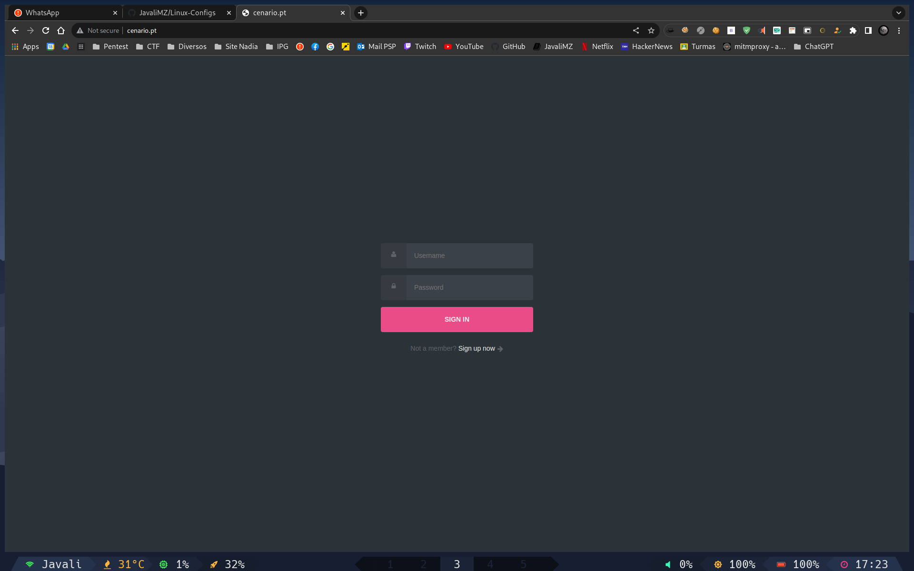
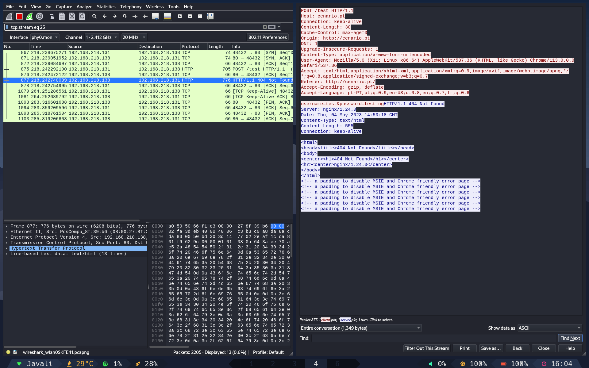
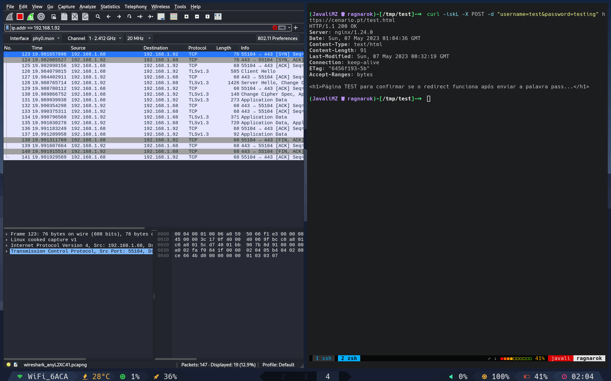
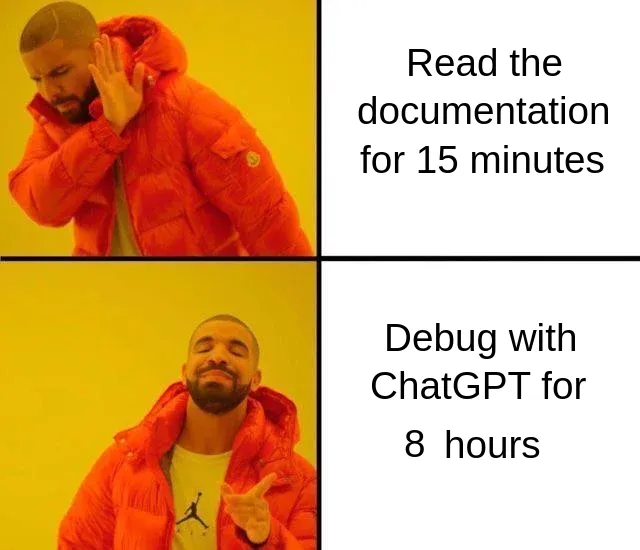

1. [Trabalho n.º 9 - SSL](#trabalho-nº-9---ssl)
   1. [O que é SSL (ou TLS)?](#o-que-é-ssl-ou-tls)
   2. [Criar um site de login simples sem TLS](#criar-um-site-de-login-simples-sem-tls)
      1. [Configura o NGINX](#configura-o-nginx)
      2. [Verificar as comunicações com a ferramenta WireShark (HTTP)](#verificar-as-comunicações-com-a-ferramenta-wireshark-http)
   3. [Adicionar o protocolo de segurança TLS ao servidor](#adicionar-o-protocolo-de-segurança-tls-ao-servidor)
      1. [Verificar as comunicações com a ferramenta WireShark (HTTPS)](#verificar-as-comunicações-com-a-ferramenta-wireshark-https)
2. [Conclusão](#conclusão)
3. [Referências](#referências)

# Trabalho n.º 9 - SSL

> Nos dias que correm, é importante que todos os dados sensíveis transacionados entre um cliente e um servidor sejam cifrados de modo a que estes não possam ser entendidos por terceiros. Na prática, quando acedemos a um serviço online que nos solicita dados pessoais ou credenciais de acesso (ex. sites de bancos) é importante que a toda a informação passada seja cifrada de modo a tornar-se ilegível. No caso dos > servidores Web (entre outros serviços de uma rede), uma das formas de proceder à cifra dos dados é recorrendo ao protocolo SSL
>
> A chave pública, que está presente no certificado digital, é usada para cifrar os dados a serem enviados ao para o servidor. Já a chave privada, que só o dono do certificado conhece, serve para decifrar a informação que foi cifrada com a sua chave pública.
>
> Um certificado é um documento digital que contém informação acerca de quem o possui, nome, morada, localidade, e-mail, duração do certificado, domínio (Common Name) e nome da entidade que assina o certificado. Contém ainda uma chave pública e um hash que permite verificar a integridade do próprio certificado (i.e se um certificado foi alterado). Um certificado assenta numa estrutura hierárquica de confiança, cujo topo é pertença de uma Entidade Certificadora (CA Root Certificate). Esta entidade certificadora confirma que o possuidor do certificado é quem afirma ser, e assina o certificado, impossibilitando desta forma a sua modificação. Em Portugal, como entidade certificadora temos como exemplo a multicert.
>
> O protocolo SSL – Secure Socket Layer é um protocolo que foi desenvolvido pela Netscape com o objetivo de garantir transações seguras entre um servidor web e um browser. O protocolo utiliza uma entidade certificadora para identificar o servidor ou o servidor e o cliente.
>
> O OpenSSL é uma implementação em código aberto dos protocolos SSL e TLS. Uma das funcionalidades consiste na criação de certificados X.509 que permitem confidencialidade em ligações com SSL (HTTPS) entre outros serviços. Os certificados digitais X.509 representam para o utilizador, o mecanismo de segurança mais visível no âmbito da certificação digital.
>
> Depois de aprendermos alguns conceitos associados à certificação digital, num próximo artigo iremos aprender como criar certificados digitais para servidores e também para utilizadores. Estejam atentos.
>
> Pretende-se com este trabalho que o aluno configurar num site um certificado SSL para garantir a segurança do site. Devem publicar no Medium todos os passos necessários para criar e configurar um certificado SSL.

## O que é SSL (ou TLS)?

O SSL (secure sockets layer) é um protocolo de segurança que permite a encriptação de dados entre o servidor e o cliente. Este protocolo é usado para proteger a comunicação entre o servidor e o cliente, evitando que os dados sejam lidos por terceiros. No entanto, esta tecnologia já evoluiu para _TLS_ (transport layer security), que é a versão mais recente do SSL. Iremos usar o TLS neste trabalho.

## Criar um site de login simples sem TLS

Para este trabalho, iremos recuperar o nosso servidor _NGINX_ previamente criado e alterar o que for necessário para alojar um site de login simples. Iremos usar exatamente a mesma página de login, na mesma localização, mas iremos alterar o ficheiro de configurações do NGINX para que o site seja servido com e sem TLS consoante os portos lógicos a serem usados, a saber, o porto 80 para HTTP (sem TLS) e o porto 443 para HTTPS (com TLS), que são os portos chamados de _"Well-Known Ports"_.

A página de login que iremos usar utiliza apenas HTML e CSS, e pode ser encontrada [aqui](./Assets/index.html). O CSS está embutido no HTML, pelo que não é necessário criar um ficheiro CSS separado.

Esta página contém um simples FORM que irá enviar os dados para o servidor por POST para a página _"test.html"_. Esta página de teste não server para nada, apenas para testar se a página é redirecionada para lá.

<div style="page-break-after: always;"></div>

### Configura o NGINX

Iremos agora configura o servidor, como fizemos no trabalho anterior sobre NGINX e virtual hosting. Iremos mexer apenas no ficheiro de configuração do server block, que se encontra em **/etc/nginx/conf.d/javali.conf**.

```conf
server {
    listen 80;
    server_name cenario.pt;

    # Root and index for regular HTTP requests
    root /var/www/html;
    index index.html;

    error_page 500 502 503 504 /50x.html;
    location = /50x.html {
        root /usr/share/nginx/html;
    }

    access_log /var/log/nginx/cenario.pt.access.log;
    error_log /var/log/nginx/cenario.pt.error.log;
}
```

```bash
# Reiniciar o NGINX
systemctl restart nginx
```

As configurações conforme estão no ficheiro significam que temos um server block que irá servir o site **cenario.pt** no porto 80. O root do site está localizado na pasta **/var/www/html** e tem no seu interior como página principal o **index.html**. O ficheiro de erro **50x.html** está na pasta **/usr/share/nginx/html** e os logs de acesso e de erro estão em **/var/log/nginx**.

Assim, o site está configurado para servir o site **cenario.pt** no porto 80, sem TLS.

Para testar, podemos tratar de adicionar o site ao ficheiro **/etc/hosts** (caso o nosso computador seja um Linux) ou ao ficheiro **C:\Windows\System32\drivers\etc\hosts** (caso seja um Windows) para que o nosso computador saiba que o site **cenario.pt** está localizado no IP que lhe indicáramos. Para isso, basta adicionar a seguinte linha ao ficheiro:

```bash
# PC servidor - Descobrir o IP
ip -c add

# PC cliente - Adicionar o IP e nome de domínio ao ficheiro hosts
# Caso seja um Linux
echo -e "192.168.1.50\tcenario.pt" >> /etc/hosts
# Caso seja um Windows
echo -e "192.168.1.50\tcenario.pt" >> C:\Windows\System32\drivers\etc\hosts
```

Depois, basta abrir o browser e aceder ao site **cenario.pt**. Se tudo estiver bem configurado, deverá aparecer a página de login.

<center>

</center>

### Verificar as comunicações com a ferramenta WireShark (HTTP)

Para verificar as comunicações, iremos usar a ferramenta WireShark. Esta ferramenta permite-nos ver o tráfego de rede que passa pela nossa placa de rede. Para isso, basta abrir a ferramenta e selecionar a placa de rede que queremos monitorizar. Em Linux, temos a possibilidade de monitorizar todas as placas de rede, mas em Windows, apenas podemos monitorizar uma placa de rede de cada vez.

Iremos adicionar um filtro para que apenas sejam mostrados os pacotes que tenham como destino o nosso servidor. Para isso, basta adicionar o filtro **"ip.dst == 192.168.1.50"**. Este filtro irá mostrar apenas os pacotes que tenham como destino o IP. Além disso, irei filtrar por **"http"** para que apenas sejam mostrados os pacotes HTTP. Para termos o filtro completo, podemos concatenar ambos os filtro com a palavra chave _and_. O filtro completo ficará assim:

> ip.dst == 192.168.1.50 and http

<center>

</center>

Como podemos ver, o tráfego é todo feito em texto plano, pelo que qualquer pessoa que esteja a monitorizar a rede pode ver os dados que estão a ser enviados. Isto é um problema de segurança, pois os dados podem ser roubados por terceiros. Neste caso, capturámos que o utilizador **test** enviou a password **testing** para o servidor.

## Adicionar o protocolo de segurança TLS ao servidor

A partir de agora importa salientar que qualquer pessoa pode criar os seus certificados. Esse certificados terão de passar por uma entidade que lhe dará credibilidade. Essa entidade é chamada de **CA** (certificate authority). No entanto, para efeitos de teste, iremos criar os nossos próprios certificados sem passar por essas entidade (que são pagas...). Esses certificados sempre irão soar alarmes nos browser, a indicar que os certificados não são de confiança. Mas para um ambiente de testes, é mais do que suficiente. Esses certificados são chamados de **self-signed certificates**.

Para criar um **self-signed certificate**, iremos usar a ferramenta **openssl**. Esta ferramenta é extremamente poderosa e completa, e permite criar certificados, chaves privadas e públicas, assinar certificados, e isso para vários protocolos, como TLS, SSH, etc...

Iremos criar um certificado para o nosso servidor. Para isso, iremos usar o seguinte comando:

```bash
# Instalar o openssl
sudo yum install openssl

# Criação de uma pasta para os certificados, dentro da pasta dos TLS
mkdir /etc/ssl/cenario.pt
cd /etc/ssl/cenario.pt

# Criar uma chave privada e pública ao mesmo tempo, com o algoritmo RSA e com 2048 bits
site="cenario.pt"
openssl req -newkey rsa:2048 -nodes -keyout $site.key -x509 -days 365 -out $site.crt -subj "/CN=$site"
```

Em termos de certificados, estamos prontos. Temos tudo o que necessitamos. O proximo passo, é indicar ao NGINX que queremos usar o certificado que criámos. Para isso, iremos alterar o ficheiro de configurações do NGINX, e adicionar as seguintes linhas ao bloco server:

```conf
server {
    listen 80;
    listen 443 ssl;
    server_name cenario.pt;

    ssl_certificate /etc/ssl/cenario.pt/cenario.pt.crt;
    ssl_certificate_key /etc/ssl/cenario.pt/cenario.pt.key;

    # SSL configuration
    ssl_protocols TLSv1.2 TLSv1.3;
    ssl_prefer_server_ciphers on;
    ssl_session_cache shared:SSL:10m;
    ssl_session_timeout 10m;
    ssl_ciphers ECDHE-RSA-AES256-GCM-SHA512:DHE-RSA-AES256-GCM-SHA512:ECDHE-RSA-AES256-GCM-SHA384:DHE-RSA-AES256-GCM-SHA384;

    # Root and index for regular HTTP requests
    root /var/www/html;
    index index.html;

    error_page 500 502 503 504 /50x.html;
    location = /50x.html {
        root /usr/share/nginx/html;
    }

    # Allow POST requests
    error_page  405     =200 $uri;


    access_log /var/log/nginx/cenario.pt.access.log;
    error_log /var/log/nginx/cenario.pt.error.log;
}
```

```bash
# Reiniciar o NGINX
systemctl restart nginx
```

O que fizemos foi adicionar o porto 443 ao mesmo bloco server indicando que este porto iria ser para SSL, e indicar ao NGINX onde estão os certificados. Além disso, adicionámos algumas configurações de segurança para o TLS, como o protocolo a usar, o tempo de timeout, etc... _Atenção a mais um pormenor:_ adicionei uma linha que permite que o NGINX aceite pedidos POST, pois em http, o servidor funcionou corretamente, mas em https, o servidor não conseguia redirecionar para a página de teste após o enviou dos dados do formulário.

A partir de agora, o servidor serve tanto pelo port 80 em HTTP como pelo porto 443 em HTTPS (aparece HTTPS no url do browser, mas aparece TLS no wireshark).

Para antecipar possíveis problemas de permissões, foi solicitado ao SELinux para que validasse as permissões de todo o computador, e permitir conexões tcp pelo porto 443. Para isso, basta executar os seguintes comandos:

```bash
restorecon -Rv /
semanage port -a -t http_port_t -p tcp 443
```

Foi ainda necessário adicionar o porto 443 ao firewall do Rocky Linux:

```bash
firewall-cmd --permanent --add-port=443/tcp
firewall-cmd --reload
```

### Verificar as comunicações com a ferramenta WireShark (HTTPS)

Desta vez, ao verificar as comunicações pelo WireShark, não podemos filtrar por HTTP, mas sim por TLS. Para isso, basta adicionar o filtro **"tls"**. O filtro completo ficará assim: **"ip.dst == 192.168.1.50 and tls"**.

Desta forma, podemos ver que os dados são encriptados, e que não é possível ver o que está a ser enviado.

<center>
<br><br>

</center>

<div style="page-break-after: always;"></div>

# Conclusão

Este trabalho foi bastante interessante, foi demoroso pois a preguiça de ler a documentação oficial das ferramentas é sempre grande!!

<center>

</center>

Mas foi bastante interessante, pois aprendi a configurar um servidor para usar TLS, e a usar a ferramenta WireShark para verificar as comunicações. Aprendi também a criar certificados e a configurar o NGINX para usar esses certificados.

# Referências

-   [Criação de um certificado auto-firmado](https://devopscube.com/create-self-signed-certificates-openssl/)
-   [NGINX documentação https](http://nginx.org/en/docs/http/configuring_https_servers.html)
-   [Configuração do NGINX (by JavaliMZ)](https://javalimz.github.io/CursoCiberSeguranca/Trabalho5/Trabalho5.html)
-   [SELinux - configurações básicas (by JavaliMZ)](https://javalimz.github.io/CursoCiberSeguranca/SELinux/TrabalhoSELinux.html)
-   [Configurar o firewall-cmd](https://www.digitalocean.com/community/tutorials/how-to-set-up-a-firewall-using-firewalld-on-centos-7)
